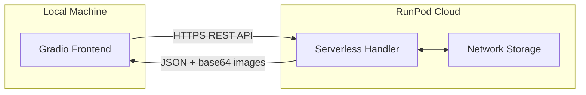
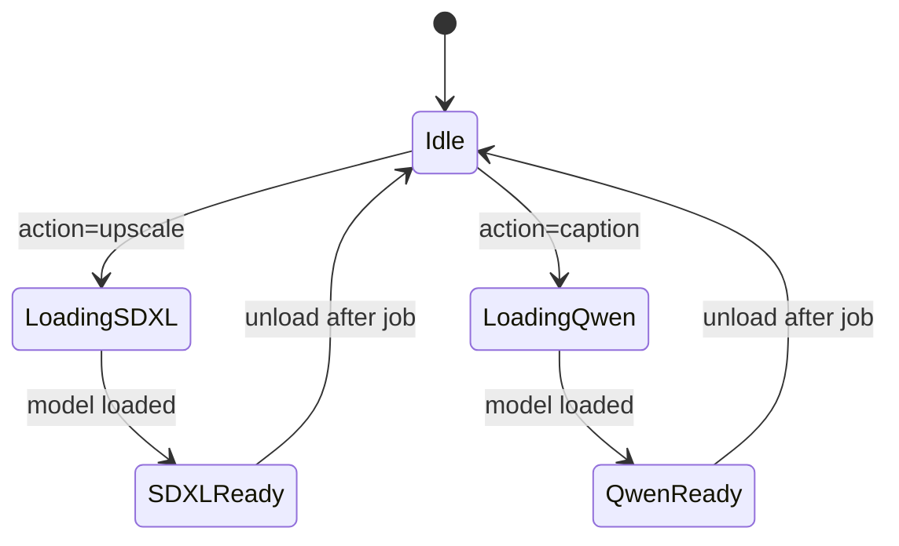
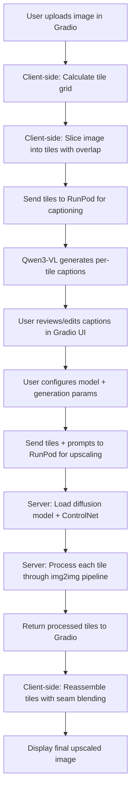
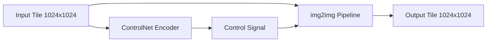
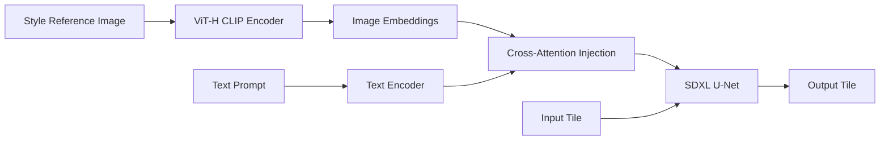

# AI Assets Toolbox — Architecture Document

## Table of Contents

1. [System Overview](#1-system-overview)
2. [VRAM Budget](#2-vram-budget)
3. [Model Management](#3-model-management)
4. [API Design](#4-api-design)
5. [Tile Processing Pipeline](#5-tile-processing-pipeline)
6. [Project Structure](#6-project-structure)
7. [Qwen Image Capabilities](#7-qwen-image-capabilities)
8. [Technology Stack](#8-technology-stack)
9. [ControlNet Integration](#9-controlnet-integration)
10. [IP-Adapter Style Transfer](#10-ip-adapter-style-transfer)
11. [Seam Fix — Grid Offset Pass](#11-seam-fix--grid-offset-pass)

---

## 1. System Overview

The system consists of two components: a **Gradio frontend** running locally on the user's machine, and a **RunPod serverless backend** running on a GPU-equipped worker.



### Communication Flow

1. The Gradio frontend sends JSON requests to the RunPod serverless endpoint via HTTPS
2. Requests include an `action` field to route to the correct processing pipeline
3. Images are transferred as **base64-encoded strings** within JSON payloads
4. Large images (up to 8K) are compressed client-side before upload; tiles are processed server-side
5. RunPod returns job results via polling or webhook

### Authentication

- RunPod API key stored in a local `.env` file
- All requests authenticated via `Authorization: Bearer <RUNPOD_API_KEY>` header

---

## 2. VRAM Budget

### Target GPU: NVIDIA A100 80GB SXM

| Model | Precision | VRAM (Inference) | Notes |
|-------|-----------|-----------------|-------|
| Illustrious-XL (SDXL base) | fp16 | ~7–8 GB | Pre-cached in Docker image; always loaded |
| SDXL ControlNet (Tile) | fp16 | ~1.5 GB | Loaded alongside SDXL base |
| IP-Adapter (ViT-H SDXL) | fp16 | ~1.6 GB | Optional; loaded when IP-Adapter is enabled |
| LoRA adapters (stacked) | fp16 | ~0.3 GB | Negligible; merged into base weights |
| SDXL VAE (fp16-fix) | fp16 | ~0.3 GB | Pre-cached; replaces default VAE |
| Qwen3-VL-8B (captioning) | fp16 | ~16–18 GB | Vision encoder + LLM decoder |

### Peak VRAM Scenarios (Dynamic Loading)

Only one diffusion model + one utility model loaded at a time:

| Scenario | Models Loaded | Peak VRAM | Fits A100 80GB? |
|----------|--------------|-----------|-----------------|
| SDXL upscale (no IP-Adapter) | Illustrious-XL + ControlNet + LoRA + VAE | ~11 GB | ✅ Yes |
| SDXL upscale (with IP-Adapter) | + IP-Adapter ViT-H | ~13 GB | ✅ Yes |
| Tile captioning | Qwen3-VL-8B | ~18 GB | ✅ Yes |
| SDXL + captioning (sequential) | Swap between them | ~18 GB peak | ✅ Yes |

### GPU Tier Justification

| GPU | VRAM | Viable? | Notes |
|-----|------|---------|-------|
| RTX 3090 / 4090 | 24 GB | ⚠️ Tight | SDXL upscale works; captioning requires careful swapping |
| RTX A5000 / L40 | 24–48 GB | ✅ Good | All scenarios fit; IP-Adapter adds headroom requirement |
| **A100 80GB SXM** | **80 GB** | **✅ Recommended** | Comfortable headroom for all models with dynamic loading |
| H100 80GB | 80 GB | ✅ Overkill | Higher cost, marginal benefit for this workload |

**Decision: A100 80GB** — provides sufficient headroom for dynamic model loading and is the most cost-effective option on RunPod for this workload.

---

## 3. Model Management

### Precaching Strategy

The primary models are **pre-downloaded into the Docker image** during the build step, eliminating cold-start delays:

| Model | HF Repo | Precache Method |
|-------|---------|-----------------|
| Illustrious-XL | `OnomaAIResearch/Illustrious-xl-early-release-v0` | `snapshot_download` in Dockerfile |
| ControlNet Tile SDXL | `xinsir/controlnet-tile-sdxl-1.0` | `snapshot_download` in Dockerfile |
| Qwen3-VL-8B | `Qwen/Qwen3-VL-8B-Instruct` | `snapshot_download` in Dockerfile |
| IP-Adapter SDXL | `h94/IP-Adapter` (sdxl_models subfolder) | `snapshot_download` in Dockerfile |
| SDXL VAE fp16-fix | `madebyollin/sdxl-vae-fp16-fix` | `snapshot_download` in Dockerfile |

LoRA adapters remain on the **RunPod Network Volume** and are loaded dynamically at runtime.

### Dynamic Loading Strategy

Models are loaded on-demand and unloaded when switching tasks. The handler maintains a `ModelManager` singleton:



### Model Manager Behavior

1. **Check if requested model is already loaded** — skip loading if so
2. **Unload current model** — call `del model; torch.cuda.empty_cache(); gc.collect()`
3. **Load requested model** from the pre-cached HuggingFace cache path
4. **Cache strategy**: Keep the most recently used model in VRAM; unload only when a different model is needed
5. **IP-Adapter**: Loaded on-demand alongside the SDXL pipeline when `ip_adapter_enabled=True`

### RunPod Network Storage

- LoRA adapters stored on RunPod **Network Volume** mounted at `/runpod-volume/`
- Directory structure on network storage:

```
/runpod-volume/
├── models/
│   └── loras/
│       └── sdxl/                 # SDXL-compatible LoRA files (.safetensors)
└── outputs/                      # Temporary output storage
```

### LoRA Upload/Delete

- Frontend **LoRA Manager** tab allows uploading and deleting LoRA adapters
- Upload flow: Gradio → base64 upload → RunPod handler writes to `/runpod-volume/models/loras/sdxl/`
- Delete flow: RunPod handler removes the file from network storage

---

## 4. API Design

All requests go through a single RunPod serverless handler. The `action` field in the input determines the operation.

### 4.1 Caption Tiles

Generate captions for image tiles using Qwen3-VL-8B.

**Request:**
```json
{
  "input": {
    "action": "caption",
    "tiles": [
      {
        "tile_id": "0_0",
        "image_b64": "<base64 encoded tile image>"
      }
    ],
    "caption_params": {
      "system_prompt": "Describe this image section in detail for use as a Stable Diffusion prompt.",
      "max_tokens": 200
    }
  }
}
```

**Response:**
```json
{
  "output": {
    "captions": [
      {
        "tile_id": "0_0",
        "caption": "A detailed forest scene with tall pine trees..."
      }
    ]
  }
}
```

### 4.2 Upscale Tiles

Process tiles through the Illustrious-XL img2img pipeline.

**Request:**
```json
{
  "input": {
    "action": "upscale",
    "tiles": [
      {
        "tile_id": "0_0",
        "image_b64": "<base64 encoded tile>",
        "prompt_override": null,
        "model": "illustrious-xl",
        "loras": [{"name": "detail-enhancer", "weight": 0.7}],
        "global_prompt": "masterpiece, best quality, highly detailed",
        "negative_prompt": "blurry, low quality, artifacts",
        "controlnet_enabled": true,
        "conditioning_scale": 0.6,
        "strength": 0.35,
        "steps": 30,
        "cfg_scale": 7.0,
        "seed": 42,
        "ip_adapter_enabled": false
      },
      {
        "tile_id": "0_1",
        "image_b64": "<base64 encoded tile>",
        "prompt_override": "A close-up of a stone wall with moss",
        "model": "illustrious-xl",
        "loras": [],
        "global_prompt": "masterpiece, best quality, highly detailed",
        "negative_prompt": "blurry, low quality, artifacts",
        "controlnet_enabled": true,
        "conditioning_scale": 0.6,
        "strength": 0.35,
        "steps": 30,
        "cfg_scale": 7.0,
        "seed": 42,
        "ip_adapter_enabled": true,
        "ip_adapter_scale": 0.6,
        "ip_adapter_image": "<base64 encoded style reference image>"
      }
    ]
  }
}
```

**Response:**
```json
{
  "output": {
    "tiles": [
      {
        "tile_id": "0_0",
        "image_b64": "<base64 encoded result tile>",
        "seed_used": 42
      },
      {
        "tile_id": "0_1",
        "image_b64": "<base64 encoded result tile>",
        "seed_used": 42
      }
    ]
  }
}
```

### 4.3 List Models

List available models and LoRAs on network storage.

**Request:**
```json
{
  "input": {
    "action": "list_models",
    "model_type": "lora",
    "base_model_filter": "sdxl"
  }
}
```

**Response:**
```json
{
  "output": {
    "models": [
      {
        "name": "detail-enhancer",
        "path": "loras/sdxl/detail-enhancer.safetensors",
        "size_mb": 145,
        "base_model": "sdxl"
      }
    ]
  }
}
```

### 4.4 Upload Model

Upload a model file to network storage.

**Request:**
```json
{
  "input": {
    "action": "upload_model",
    "filename": "my-lora.safetensors",
    "model_type": "lora",
    "base_model": "sdxl",
    "file_b64": "<base64 encoded file>",
    "chunk_index": 0,
    "total_chunks": 1
  }
}
```

**Response:**
```json
{
  "output": {
    "status": "complete",
    "path": "loras/sdxl/my-lora.safetensors",
    "size_mb": 145
  }
}
```

### 4.5 Delete Model

**Request:**
```json
{
  "input": {
    "action": "delete_model",
    "path": "loras/sdxl/my-lora.safetensors"
  }
}
```

### 4.6 Health Check

**Request:**
```json
{
  "input": {
    "action": "health",
  }
}
```

**Response:**
```json
{
  "output": {
    "status": "ok",
    "gpu": "A100-SXM4-80GB",
    "vram_total_gb": 80,
    "vram_used_gb": 0.5,
    "loaded_model": null,
    "network_storage_available_gb": 450
  }
}
```

---

## 5. Tile Processing Pipeline

### End-to-End Flow



### Step 1: Tile Grid Calculation (Client-Side)

Given input image dimensions and target resolution:

- **Tile size**: 1024×1024 pixels (native SDXL/Flux resolution)
- **Overlap**: Configurable, default 128 pixels (12.5% of tile)
- **Upscale factor**: 2× or 4× (user-selectable)
- **Grid calculation**:
  - First upscale the input image to target resolution using simple bicubic interpolation
  - Then slice the upscaled image into overlapping tiles
  - `stride = tile_size - overlap` (e.g., 1024 - 128 = 896)
  - `num_tiles_x = ceil((width - overlap) / stride)`
  - `num_tiles_y = ceil((height - overlap) / stride)`

### Step 2: Auto-Captioning (Server-Side)

- Each tile is sent to Qwen3-VL-8B with a system prompt tuned for SD prompt generation
- Captions describe visual content suitable for use as diffusion prompts
- Batch processing: multiple tiles captioned in a single job to amortize model loading

### Step 3: User Review (Client-Side)

- Gradio displays the tile grid as a clickable mosaic
- Each tile shows its auto-generated caption
- User can:
  - Edit individual tile captions
  - Set a global style prompt prepended to all tile captions
  - Select specific tiles to process (or all)
  - Adjust denoising strength per-tile or globally

### Step 4: Diffusion Processing (Server-Side)

For each tile:

1. Load base model + ControlNet + LoRAs (if not already loaded)
2. Prepare the prompt: `global_prompt + ", " + tile_caption`
3. Feed the tile image as both:
   - **img2img input** (with configurable denoising strength)
   - **ControlNet conditioning** (tile ControlNet preserves structure)
4. Run the diffusion pipeline
5. Return the processed tile

### Step 5: Seam Blending (Client-Side)

- Overlap regions between adjacent tiles are blended using **linear gradient feathering**
- Blend mask: linear ramp from 0→1 across the overlap zone
- For corner overlaps (4 tiles meeting), bilinear interpolation is used
- The blending is performed in linear color space to avoid gamma artifacts

### Tile Coordinate System

```
┌──────────┬──overlap──┬──────────┐
│ Tile 0,0 │           │ Tile 0,1 │
│          │  blended  │          │
│          │  region   │          │
├──overlap─┼───────────┼──overlap─┤
│          │           │          │
│ Tile 1,0 │  blended  │ Tile 1,1 │
│          │  region   │          │
└──────────┴───────────┴──────────┘
```

---

## 6. Project Structure

```
ai-assets-toolbox/
├── README.md
├── LICENSE
├── .gitignore
├── .env.example                    # Template for environment variables
├── docs/
│   ├── ARCHITECTURE.md             # This document
│   └── REDESIGN_PLAN.md            # Design decisions and implementation notes
│
├── backend/                        # RunPod serverless worker
│   ├── Dockerfile                  # Container build — pre-caches all primary models
│   ├── requirements.txt            # Python dependencies
│   ├── handler.py                  # RunPod handler entry point
│   ├── model_manager.py            # Dynamic model loading/unloading + IP-Adapter
│   ├── start.sh                    # Container startup script
│   ├── pipelines/
│   │   ├── __init__.py
│   │   ├── sdxl_pipeline.py        # SDXL img2img + ControlNet + IP-Adapter
│   │   └── qwen_pipeline.py        # Qwen3-VL-8B captioning
│   ├── actions/
│   │   ├── __init__.py
│   │   ├── upscale.py              # Tile upscale action handler
│   │   ├── upscale_regions.py      # Region upscale action handler
│   │   ├── caption.py              # Caption action handler
│   │   └── models.py               # List/upload/delete LoRA actions
│   └── utils/
│       ├── __init__.py
│       ├── image_utils.py          # Base64 encode/decode, image transforms
│       └── storage.py              # Network volume file operations
│
├── frontend/                       # Gradio application
│   ├── requirements.txt            # Python dependencies
│   ├── app.py                      # Gradio app entry point + CSS theme
│   ├── api_client.py               # RunPod API client wrapper
│   ├── config.py                   # Configuration loader (env vars, tile defaults)
│   ├── tiling.py                   # Tile slicing, grid calculation, seam blending, offset pass
│   └── tabs/
│       ├── __init__.py
│       ├── upscale_tab.py          # Tab 1: Tile-based upscaling UI (main workflow)
│       ├── spritesheet_tab.py      # Tab 2: Spritesheet animation (coming soon)
│       └── model_manager_tab.py    # Tab 3: LoRA Manager
│
└── scripts/
    ├── deploy.sh                   # Deploy backend to RunPod (Linux/macOS)
    └── deploy.ps1                  # Deploy backend to RunPod (Windows)
```

---

## 7. Qwen Image Capabilities — Research Findings

### Qwen3-VL (Vision-Language)

- **Type**: Vision-language understanding model
- **Capabilities**: Image captioning, visual Q&A, OCR, object detection with bounding boxes
- **Cannot**: Generate or edit images
- **Role in this project**: Auto-captioning tiles for prompt generation

### Qwen-Image (20B)

- **Type**: Diffusion-based image generation/editing foundation model
- **Architecture**: Frozen Qwen3-VL encoder + hybrid VAE + diffusion transformer
- **Capabilities**:
  - Text-to-image generation
  - Image-to-image editing
  - Multi-image composition and blending
- **VRAM**: ~40 GB in fp16 (20B parameters)
- **Relevance**: Could theoretically be used for tile refinement, but very large

### Qwen-Image-Edit

- **Type**: Specialized image editing model built on Qwen-Image
- **Capabilities**:
  - Semantic editing (object changes while preserving identity)
  - Appearance editing (style transfer, color/texture changes)
  - Text editing (bilingual text modification)
  - Native ControlNet support (depth, edge, keypoint maps)
- **VRAM**: ~40 GB in fp16; ~12 GB quantized (Q4_K)
- **Relevance**: Strong candidate for tile refinement if quality improvements justify the VRAM cost

### Recommendation

**For v1, use Qwen3-VL-8B for captioning only.** The SDXL/Flux img2img pipeline with ControlNet provides sufficient tile refinement quality. Qwen-Image-Edit could be added as a future enhancement for semantic tile refinement, but at 40 GB fp16 it would require careful VRAM orchestration even on A100 80GB. A quantized Q4_K variant (~12 GB) is viable as a future addition.

---

## 8. Technology Stack

### Backend (RunPod Worker)

| Component | Library | Version | Purpose |
|-----------|---------|---------|---------|
| Runtime | Python | 3.10+ | Base runtime |
| Serverless SDK | runpod | latest | Handler framework |
| Diffusion | diffusers | 0.31+ | SDXL and Flux pipelines |
| ML Framework | torch | 2.2+ | GPU inference |
| Transformers | transformers | 4.45+ | Qwen3-VL model loading |
| Image Processing | Pillow | 10.0+ | Image manipulation |
| ControlNet | diffusers (built-in) | — | ControlNet integration via diffusers |
| Model Format | safetensors | 0.4+ | Safe model weight loading |
| Acceleration | accelerate | 0.30+ | Model loading optimization |
| PEFT | peft | 0.12+ | LoRA adapter loading |
| Container | Docker | — | RunPod deployment |
| Base Image | runpod/pytorch:2.2-py3.10-cuda12.1 | — | CUDA-enabled base |

### Frontend (Local Gradio App)

| Component | Library | Version | Purpose |
|-----------|---------|---------|---------|
| Runtime | Python | 3.10+ | Base runtime |
| UI Framework | gradio | 4.0+ | Web UI |
| HTTP Client | httpx | 0.27+ | Async RunPod API calls |
| Image Processing | Pillow | 10.0+ | Tiling, blending, display |
| Array Operations | numpy | 1.26+ | Seam blending math |
| Config | python-dotenv | 1.0+ | Environment variable loading |

---

## 9. ControlNet Integration

### Purpose

Tile ControlNet preserves the structural composition of each tile during the img2img diffusion process. Without it, the diffusion model may hallucinate new structures or drift from the original content, especially at higher denoising strengths.

### How Tiled ControlNet Works



1. The **input tile** is fed to both the ControlNet and the img2img pipeline
2. The **Tile ControlNet** extracts structural features (edges, textures, spatial layout)
3. These features are injected as **conditioning signals** into the U-Net/DiT at each denoising step
4. The `conditioning_scale` parameter (0.0–1.5) controls how strongly the original structure is preserved:
   - **0.3–0.5**: Light guidance, allows more creative freedom
   - **0.5–0.8**: Balanced — recommended for upscaling
   - **0.8–1.2**: Strong guidance, very faithful to original

### SDXL ControlNet Model

- **xinsir/controlnet-tile-sdxl-1.0** — Community tile ControlNet for SDXL
- Pre-cached in the Docker image
- Loaded via `diffusers.ControlNetModel.from_pretrained()`
- Integrated into `StableDiffusionXLControlNetImg2ImgPipeline`

### Pipeline Integration

```python
# Pseudocode for Illustrious-XL + ControlNet tile upscaling
controlnet = ControlNetModel.from_pretrained(
    "xinsir/controlnet-tile-sdxl-1.0", torch_dtype=torch.float16
)
pipe = StableDiffusionXLControlNetImg2ImgPipeline.from_pretrained(
    "OnomaAIResearch/Illustrious-xl-early-release-v0",
    controlnet=controlnet,
    torch_dtype=torch.float16,
)
pipe.load_lora_weights("path/to/lora.safetensors")

result = pipe(
    prompt=global_prompt + ", " + tile_caption,
    negative_prompt=negative_prompt,
    image=input_tile,
    control_image=input_tile,  # Same image as control input
    controlnet_conditioning_scale=0.6,
    strength=0.35,  # Denoising strength
    num_inference_steps=30,
)
```

### Key Parameters for Upscaling Quality

| Parameter | Recommended Range | Effect |
|-----------|------------------|--------|
| `strength` (denoising) | 0.25–0.45 | Lower = more faithful to original; higher = more detail added |
| `controlnet_conditioning_scale` | 0.5–0.8 | Structural preservation strength |
| `cfg_scale` | 5.0–8.0 | Prompt adherence |
| `num_inference_steps` | 25–40 | Quality vs speed tradeoff |

---

## 10. IP-Adapter Style Transfer

### Purpose

IP-Adapter allows a **style reference image** to guide the diffusion process, ensuring consistent visual style across all tiles. This is useful when upscaling game assets that should match a specific art style.

### Implementation

- **Model**: `h94/IP-Adapter` — `ip-adapter_sdxl_vit-h.bin` (ViT-H CLIP encoder)
- Pre-cached in the Docker image
- Loaded on-demand alongside the SDXL pipeline when `ip_adapter_enabled=True`
- Adds approximately **1.6 GB VRAM** when active

### How It Works



1. The style reference image is encoded by the ViT-H CLIP image encoder
2. Image embeddings are injected into the U-Net cross-attention layers alongside text embeddings
3. The `ip_adapter_scale` parameter (0.0–1.0) controls the blend between text and image guidance
4. The style reference is resized to 224×224 before encoding (ViT-H expected input size)

### Frontend Usage

In the **IP-Adapter · Style Transfer** accordion in the upscale tab:
- Upload a style reference image
- Enable the checkbox
- Adjust the scale (0.4–0.7 recommended)
- The style reference is applied to all tiles during upscaling

---

## 11. Seam Fix — Grid Offset Pass

### Problem

When tiles are processed independently, visible seams can appear at tile boundaries in the assembled result. This happens because the diffusion model has no context about adjacent tiles.

### Solution: Grid Offset Pass

A second upscale pass is run with the tile grid **shifted by half a stride** in both X and Y directions:

```
Pass 1 grid:          Pass 2 (offset) grid:
┌────┬────┬────┐      ┌──┬────┬────┬──┐
│ 0  │ 1  │ 2  │      │  │ A  │ B  │  │
├────┼────┼────┤      ├──┼────┼────┼──┤
│ 3  │ 4  │ 5  │      │  │ C  │ D  │  │
├────┼────┼────┤      ├──┼────┼────┼──┤
│ 6  │ 7  │ 8  │      │  │ E  │ F  │  │
└────┴────┴────┘      └──┴────┴────┴──┘
```

Each offset tile (A, B, C…) straddles the seam boundaries of Pass 1, so the diffusion model sees the seam area as the **centre of a tile** — giving it full context from both sides.

### Blending

The offset tiles are blended back onto the Pass 1 result using a **feathered gradient mask**:
- The blend zone width is controlled by `feather_size` (default 32px)
- A linear ramp from 0→1 is applied across the feather zone
- This effectively hides visible seams between tiles

### Implementation

- `calculate_offset_tiles()` in [`tiling.py`](../frontend/tiling.py) — computes the offset tile grid
- `extract_tile()` — extracts each offset tile from the Pass 1 result
- `blend_offset_pass()` — blends processed offset tiles back onto the result
- The seam fix pass uses a lower `strength` (default 0.35) to preserve Pass 1 detail

### Frontend Usage

In the **Seam Fix · Grid Offset Pass** accordion in the upscale tab:
- Enable the checkbox to activate the second pass
- Adjust **Seam Fix Denoise Strength** (0.3–0.4 recommended)
- Adjust **Feather / Blend Size** (larger = smoother transition, default 32px)
- Only applies to **Upscale All Tiles** — not single-tile upscale
