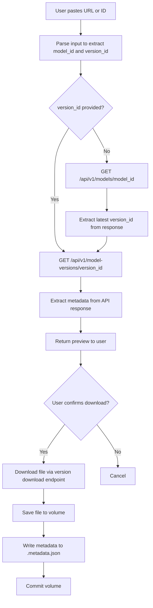
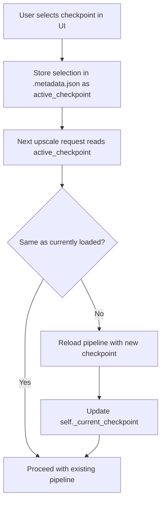

# Enhanced Model Manager Design

> **Status:** Draft  
> **Date:** 2026-02-22  
> **Scope:** LoRAs + Checkpoints management with CivitAI integration

---

## 1. Executive Summary

The current app has a basic LoRA manager tab that can list, upload, and delete LoRA files from a Modal Volume. LoRA metadata (trigger words, filenames) is hardcoded in both [`HARDCODED_LORAS`](src/gpu/upscale.py:85) (GPU side) and [`HARDCODED_LORAS`](src/ui/gradio_app.py:83) (UI side).

This design extends the model manager to:

1. **Manage both LoRAs AND checkpoints** (SDXL-compatible base models)
2. **Download by CivitAI URL or model ID** with automatic metadata extraction
3. **Store metadata** (trigger words, recommended settings, model type) in JSON sidecar files
4. **Auto-inject trigger words** into prompts when LoRAs are selected
5. **Support checkpoint switching** at runtime (with container restart)
6. **Provide a unified browse/search UI** for all managed models

---

## 2. Current Architecture Analysis

### 2.1 What Exists Today

| Component | File | Purpose |
|-----------|------|---------|
| `HARDCODED_LORAS` | [`src/gpu/upscale.py:85`](src/gpu/upscale.py:85) | Maps display names → CivitAI IDs, filenames, trigger words |
| `HARDCODED_LORAS` | [`src/ui/gradio_app.py:83`](src/ui/gradio_app.py:83) | Duplicate of above for UI-side trigger injection |
| [`_inject_trigger_words()`](src/gpu/upscale.py:1032) | `src/gpu/upscale.py` | Server-side trigger word injection into prompts |
| [`_inject_trigger_words()`](src/ui/gradio_app.py:172) | `src/ui/gradio_app.py` | Client-side trigger word injection (duplicate logic) |
| [`_apply_loras()`](src/gpu/upscale.py:1048) | `src/gpu/upscale.py` | Loads LoRA weights into the diffusers pipeline |
| [`list_models()`](src/gpu/upscale.py:740) | `src/gpu/upscale.py` | Lists `.safetensors` files in `/vol/loras` |
| [`upload_model()`](src/gpu/upscale.py:773) | `src/gpu/upscale.py` | Saves uploaded bytes to `/vol/loras` |
| [`delete_model()`](src/gpu/upscale.py:845) | `src/gpu/upscale.py` | Removes a file from `/vol/loras` |
| [`download_lora()`](src/services/download.py:344) | `src/services/download.py` | Downloads from CivitAI by model version ID |
| [`_build_model_manager_tab()`](src/ui/gradio_app.py:1560) | `src/ui/gradio_app.py` | Gradio UI for LoRA management |
| [`ModelEntry`](src/services/model_registry.py:38) | `src/services/model_registry.py` | Dataclass for HuggingFace base models |

### 2.2 Key Pain Points

1. **Metadata is hardcoded** — adding a new LoRA requires code changes in two files
2. **No checkpoint management** — only one base model (Illustrious-XL) is supported
3. **No CivitAI metadata extraction** — trigger words must be manually looked up
4. **Duplicate trigger injection logic** — exists in both GPU and UI modules
5. **LoRA naming is opaque** — files are stored as `lora_929497.safetensors` with no human-readable metadata
6. **No search/browse** — users must know exact CivitAI model IDs

---

## 3. Storage Design

### 3.1 Volume Layout

Keep the existing two-volume architecture but add a `checkpoints/` subdirectory to the LoRA volume (renamed conceptually to "user models volume"):

```
/vol/loras/                          ← lora_volume (ai-toolbox-loras)
├── .metadata.json                   ← unified metadata index
├── loras/                           ← LoRA files
│   ├── lora_929497.safetensors
│   ├── lora_1231943.safetensors
│   └── my_custom_lora.safetensors
└── checkpoints/                     ← SDXL checkpoint files
    ├── noobaiXL_v10.safetensors
    └── animagine_xl_v3.safetensors

/vol/models/                         ← models_volume (ai-toolbox-models)
├── .manifest.json                   ← existing download manifest
├── illustrious-xl/                  ← default base model (always present)
├── controlnet-tile/
├── sdxl-vae/
├── ip-adapter/
├── clip-vit-h/
└── qwen3-vl-2b/
```

**Rationale for same volume:**
- LoRAs and user-uploaded checkpoints are both "user content" — they share the same lifecycle (user adds/removes them)
- The `models_volume` is for infrastructure models managed by the setup wizard
- Avoids creating a third Modal Volume (cost/complexity)
- Subdirectories keep things organized

### 3.2 Metadata Storage: `.metadata.json`

A single JSON file at the root of the lora volume acts as the metadata index for all user-managed models:

```json
{
  "version": 1,
  "models": {
    "lora_929497.safetensors": {
      "type": "lora",
      "display_name": "Aesthetic Quality Modifiers - Masterpiece",
      "short_name": "Aesthetic Quality",
      "source": "civitai",
      "civitai_model_id": 929497,
      "civitai_version_id": 2247497,
      "civitai_url": "https://civitai.com/models/929497?modelVersionId=2247497",
      "trigger_words": ["masterpiece", "best quality", "very aesthetic"],
      "recommended_weight": 1.0,
      "base_model": "illustrious-xl",
      "tags": ["aesthetic", "quality"],
      "description": "Improves overall aesthetic quality of generated images",
      "file_size_bytes": 184549376,
      "added_at": "2026-02-20T12:00:00Z",
      "sha256": "abc123..."
    },
    "noobaiXL_v10.safetensors": {
      "type": "checkpoint",
      "display_name": "NoobAI XL v1.0",
      "short_name": "NoobAI XL",
      "source": "civitai",
      "civitai_model_id": 833294,
      "civitai_version_id": 1456732,
      "civitai_url": "https://civitai.com/models/833294",
      "trigger_words": [],
      "recommended_weight": null,
      "base_model": "sdxl",
      "tags": ["anime", "sdxl"],
      "description": "SDXL-based anime model",
      "file_size_bytes": 6938000000,
      "added_at": "2026-02-21T15:30:00Z",
      "sha256": "def456..."
    }
  }
}
```

**Why a single index file instead of per-model sidecars:**
- Atomic reads/writes — no risk of orphaned sidecar files
- Easier to list all models with metadata in one read
- Simpler volume commit pattern (one file to track)
- Small file size even with hundreds of models

---

## 4. CivitAI API Integration

### 4.1 API Endpoints

CivitAI provides a public REST API. The key endpoints:

| Endpoint | Purpose |
|----------|---------|
| `GET /api/v1/models/{modelId}` | Get model info (name, description, type, tags) |
| `GET /api/v1/model-versions/{versionId}` | Get version info (files, trigger words, base model) |
| `GET /api/v1/model-versions/{versionId}/download` | Download the model file (requires auth for some) |

### 4.2 URL Parsing

Users can provide input in multiple formats. The service must parse all of these:

| Input Format | Example | Extracted IDs |
|-------------|---------|---------------|
| Full URL with version | `https://civitai.com/models/929497?modelVersionId=2247497` | model=929497, version=2247497 |
| Full URL without version | `https://civitai.com/models/929497` | model=929497, version=latest |
| Model ID only | `929497` | model=929497, version=latest |
| Version ID only | `v:2247497` | version=2247497 (resolve model from API) |

### 4.3 Metadata Extraction Flow



### 4.4 API Response Mapping

From the CivitAI model-versions API response, extract:

```python
# From GET /api/v1/model-versions/{versionId}
metadata = {
    "display_name": response["model"]["name"],        # e.g. "Aesthetic Quality Modifiers"
    "civitai_model_id": response["modelId"],
    "civitai_version_id": response["id"],
    "trigger_words": response.get("trainedWords", []), # CivitAI provides this!
    "base_model": response.get("baseModel", ""),       # e.g. "SDXL 1.0", "Illustrious"
    "type": _map_civitai_type(response["model"]["type"]),  # "LORA" → "lora", "Checkpoint" → "checkpoint"
    "description": response["model"].get("description", ""),
    "tags": response["model"].get("tags", []),
    "files": response.get("files", []),                # download URLs, sizes, hashes
}
```

### 4.5 Authentication

- CivitAI API token is required for downloading files (some models are gated)
- Token is already collected in the setup wizard and stored as a Modal Secret
- The `download_lora()` method already uses `Authorization: Bearer {civitai_token}`
- For metadata-only queries (no download), the API is public — no token needed

### 4.6 Rate Limits

- CivitAI API has no published rate limits for authenticated requests
- Implement a simple retry with exponential backoff (3 retries, 1s/2s/4s delays)
- Cache metadata responses in memory during a session to avoid redundant calls

---

## 5. New Service: `CivitAIService`

### 5.1 Location

New file: `src/services/civitai.py`

### 5.2 Responsibilities

- Parse CivitAI URLs and model IDs
- Fetch model metadata from the CivitAI API
- Download model files (LoRAs and checkpoints)
- Map CivitAI model types to internal types

### 5.3 Interface

```python
@dataclass
class CivitAIModelInfo:
    """Parsed metadata from CivitAI API."""
    model_id: int
    version_id: int
    display_name: str
    short_name: str
    model_type: str              # "lora" | "checkpoint" | "textual_inversion" | ...
    base_model: str              # "SDXL 1.0" | "Illustrious" | ...
    trigger_words: list[str]
    recommended_weight: float | None
    description: str
    tags: list[str]
    download_url: str
    file_name: str
    file_size_bytes: int
    sha256: str | None


class CivitAIService:
    """Stateless service for CivitAI API interactions."""

    def parse_input(self, user_input: str) -> tuple[int | None, int | None]:
        """Parse URL, model ID, or version ID from user input."""
        ...

    def fetch_model_info(
        self,
        model_id: int | None = None,
        version_id: int | None = None,
    ) -> CivitAIModelInfo:
        """Fetch metadata from CivitAI API."""
        ...

    def download_model(
        self,
        info: CivitAIModelInfo,
        dest_dir: str,
        civitai_token: str,
        on_progress: Callable[[float], None] | None = None,
    ) -> str:
        """Download model file to dest_dir. Returns the saved file path."""
        ...
```

---

## 6. Enhanced Metadata Manager

### 6.1 Location

New file: `src/services/model_metadata.py`

### 6.2 Responsibilities

- Read/write `.metadata.json` on the lora volume
- CRUD operations for model metadata entries
- Provide lookup by filename, display name, model type, or tags
- Replace the hardcoded `HARDCODED_LORAS` dicts in both files

### 6.3 Interface

```python
@dataclass
class UserModelEntry:
    """Metadata for a user-managed model on the lora volume."""
    filename: str
    type: str                    # "lora" | "checkpoint"
    display_name: str
    short_name: str
    source: str                  # "civitai" | "upload" | "huggingface"
    trigger_words: list[str]
    recommended_weight: float | None
    base_model: str
    tags: list[str]
    description: str
    file_size_bytes: int
    added_at: str                # ISO 8601
    civitai_model_id: int | None
    civitai_version_id: int | None
    civitai_url: str | None
    sha256: str | None


class ModelMetadataManager:
    """Manages .metadata.json on the lora volume."""

    def __init__(self, volume_path: str = LORAS_MOUNT_PATH):
        ...

    def list_all(self) -> list[UserModelEntry]:
        """List all models with metadata."""
        ...

    def list_by_type(self, model_type: str) -> list[UserModelEntry]:
        """List models filtered by type."""
        ...

    def get(self, filename: str) -> UserModelEntry | None:
        """Get metadata for a specific model file."""
        ...

    def add(self, entry: UserModelEntry) -> None:
        """Add or update metadata for a model."""
        ...

    def remove(self, filename: str) -> None:
        """Remove metadata entry and optionally the file."""
        ...

    def search(self, query: str) -> list[UserModelEntry]:
        """Search models by name, tags, or trigger words."""
        ...

    def get_trigger_words(self, filename: str) -> list[str]:
        """Get trigger words for a model."""
        ...
```

---

## 7. Checkpoint Switching

### 7.1 The Challenge

The current pipeline is loaded once at container startup in [`load_models()`](src/gpu/upscale.py:155). The checkpoint path is hardcoded to `Illustrious-XL-v0.1.safetensors`. Switching checkpoints requires reloading the entire pipeline (~15-20 seconds on A10G).

### 7.2 Approach: Active Checkpoint Selection



**Implementation details:**

1. Add an `active_checkpoint` field to `.metadata.json`:
   ```json
   {
     "version": 1,
     "active_checkpoint": "illustrious-xl",
     "models": { ... }
   }
   ```

2. The value `"illustrious-xl"` refers to the default base model on the models volume. User-uploaded checkpoints use their filename as the key (e.g., `"noobaiXL_v10.safetensors"`).

3. In [`UpscaleService`](src/gpu/upscale.py:117), add a `_ensure_checkpoint()` method:
   ```python
   def _ensure_checkpoint(self) -> None:
       """Reload the pipeline if the active checkpoint has changed."""
       metadata = ModelMetadataManager(LORAS_DIR)
       desired = metadata.get_active_checkpoint()  # reads .metadata.json
       if desired == self._current_checkpoint:
           return
       # Reload pipeline with new checkpoint
       self._reload_pipeline(desired)
       self._current_checkpoint = desired
   ```

4. Call `_ensure_checkpoint()` at the start of [`upscale_tiles()`](src/gpu/upscale.py:117) and `upscale_regions()`.

### 7.3 Checkpoint Resolution

| `active_checkpoint` value | Resolution |
|--------------------------|------------|
| `"illustrious-xl"` (default) | `/vol/models/illustrious-xl/Illustrious-XL-v0.1.safetensors` |
| `"noobaiXL_v10.safetensors"` | `/vol/loras/checkpoints/noobaiXL_v10.safetensors` |

### 7.4 Performance Considerations

- Pipeline reload takes ~15-20 seconds — acceptable for checkpoint switching (infrequent operation)
- LoRA loading/unloading remains fast (~1-2 seconds per LoRA)
- The container keeps the last-loaded checkpoint in VRAM until switched
- No need for multi-checkpoint caching (A10G has only 24GB VRAM)

---

## 8. Trigger Word Injection (Enhanced)

### 8.1 Current Problem

Trigger words are hardcoded in two places and only work for the two built-in LoRAs. The [`_inject_trigger_words()`](src/ui/gradio_app.py:172) function in the UI and the [`_inject_trigger_words()`](src/gpu/upscale.py:1032) function in the GPU module both maintain separate copies of the same logic.

### 8.2 New Design

**Single source of truth:** Trigger words come from `.metadata.json` via `ModelMetadataManager`.

**Injection happens server-side only** (in [`src/gpu/upscale.py`](src/gpu/upscale.py)):

```python
def _inject_trigger_words(global_prompt: str, loras: list[dict], loras_dir: str) -> str:
    """Inject trigger words from metadata for active LoRAs."""
    metadata_mgr = ModelMetadataManager(loras_dir)
    injected: list[str] = []

    for lora in loras:
        name = lora.get("name", "")
        # Look up metadata by display name or filename
        entry = metadata_mgr.get_by_name_or_filename(name)
        if entry is None:
            continue
        for trigger in entry.trigger_words:
            if trigger.lower() not in global_prompt.lower() and trigger not in injected:
                injected.append(trigger)

    if injected:
        trigger_text = ", ".join(injected)
        global_prompt = f"{trigger_text}, {global_prompt}" if global_prompt else trigger_text
    return global_prompt
```

**UI-side preview:** The UI can still show trigger words to the user (fetched from metadata), but the actual injection into the prompt happens only on the GPU side to avoid duplication.

### 8.3 Dynamic LoRA Controls in the Upscale Tab

Currently the upscale tab has hardcoded checkboxes for two LoRAs. The enhanced design:

1. On tab load, fetch the list of available LoRAs from metadata
2. Render a dynamic list of LoRA controls (checkbox + weight slider + trigger word display)
3. When a LoRA is toggled on, show its trigger words as a preview below the prompt
4. The actual trigger injection happens server-side when the upscale request is sent

---

## 9. Enhanced Download Service

### 9.1 Changes to [`DownloadService`](src/services/download.py:159)

Add a new method that combines CivitAI metadata fetch + download + metadata storage:

```python
@modal.method()
def download_civitai_model(
    self,
    user_input: str,
    civitai_token: str,
) -> dict:
    """
    Download a model from CivitAI by URL or model ID.

    1. Parse user_input to extract model_id / version_id
    2. Fetch metadata from CivitAI API
    3. Determine model type (lora vs checkpoint)
    4. Download to appropriate subdirectory
    5. Write metadata to .metadata.json
    6. Commit volume

    Returns metadata dict on success.
    """
    ...
```

### 9.2 Changes to Existing `download_lora()`

The existing [`download_lora()`](src/services/download.py:344) method downloads by version ID only and saves as `lora_{id}.safetensors`. It should be:

- **Deprecated** in favor of `download_civitai_model()`
- Kept for backward compatibility but internally delegates to the new method
- The new method uses the actual filename from CivitAI API instead of `lora_{id}.safetensors`

---

## 10. UI Design

### 10.1 Tab Restructure

Rename the tab from "🎛️ LoRA Manager" to "🎛️ Model Manager" and reorganize:

```
┌─────────────────────────────────────────────────────────┐
│  🎛️ Model Manager                                       │
├─────────────────────────────────────────────────────────┤
│                                                         │
│  ┌─── Download from CivitAI ──────────────────────────┐ │
│  │ [URL or Model ID input_______________] [Fetch Info] │ │
│  │                                                     │ │
│  │ Preview:                                            │ │
│  │   Name: Aesthetic Quality Modifiers                 │ │
│  │   Type: LoRA                                        │ │
│  │   Base: Illustrious XL                              │ │
│  │   Triggers: masterpiece, best quality               │ │
│  │   Size: 176 MB                                      │ │
│  │                                                     │ │
│  │ [⬇️ Download]                                       │ │
│  └─────────────────────────────────────────────────────┘ │
│                                                         │
│  ┌─── Installed Models ───────────────────────────────┐ │
│  │ Filter: [All ▾] [LoRAs] [Checkpoints]  [🔍 Search] │ │
│  │                                                     │ │
│  │ ┌─────────────────────────────────────────────────┐ │ │
│  │ │ Name          │ Type  │ Size   │ Triggers       │ │ │
│  │ ├───────────────┼───────┼────────┼────────────────┤ │ │
│  │ │ Aesthetic Q.  │ LoRA  │ 176 MB │ masterpiece... │ │ │
│  │ │ Detailer IL   │ LoRA  │ 92 MB  │ Jeddtl02       │ │ │
│  │ │ NoobAI XL     │ Ckpt  │ 6.4 GB │ —              │ │ │
│  │ └─────────────────────────────────────────────────┘ │ │
│  │                                                     │ │
│  │ [🗑️ Delete Selected]  [📋 View Details]             │ │
│  └─────────────────────────────────────────────────────┘ │
│                                                         │
│  ┌─── Active Checkpoint ──────────────────────────────┐ │
│  │ Current: Illustrious-XL v0.1 (default)             │ │
│  │ [Switch to: ▾ dropdown of installed checkpoints]    │ │
│  │ ⚠️ Switching requires pipeline reload (~15-20s)     │ │
│  └─────────────────────────────────────────────────────┘ │
│                                                         │
│  ┌─── Upload Local File ──────────────────────────────┐ │
│  │ [Select file (.safetensors, .pt, .bin)]             │ │
│  │ Type: [LoRA ▾ / Checkpoint]                         │ │
│  │ Display Name: [________________]                    │ │
│  │ Trigger Words: [________________] (comma-separated) │ │
│  │ [⬆️ Upload]                                         │ │
│  └─────────────────────────────────────────────────────┘ │
│                                                         │
└─────────────────────────────────────────────────────────┘
```

### 10.2 Upscale Tab LoRA Controls (Dynamic)

Replace the hardcoded LoRA checkboxes with a dynamic list:

```
┌─── LoRA Controls ─────────────────────────────────────┐
│                                                       │
│ ☑ Aesthetic Quality    [weight: 1.0 ═══════●═══]     │
│   triggers: masterpiece, best quality, very aesthetic  │
│                                                       │
│ ☑ Detailer IL          [weight: 1.0 ═══════●═══]     │
│   triggers: Jeddtl02                                  │
│                                                       │
│ ☐ My Custom LoRA       [weight: 0.8 ══════●════]     │
│   triggers: custom_trigger_word                       │
│                                                       │
│ [🔄 Refresh LoRA List]                                │
└───────────────────────────────────────────────────────┘
```

---

## 11. Migration Strategy

### 11.1 Backward Compatibility

The `HARDCODED_LORAS` dict must continue to work during migration:

1. **Phase 1:** Add `.metadata.json` support alongside `HARDCODED_LORAS`
   - On first run, seed `.metadata.json` with entries from `HARDCODED_LORAS`
   - Both systems read from metadata; `HARDCODED_LORAS` becomes the fallback
2. **Phase 2:** Remove `HARDCODED_LORAS` from both files
   - All metadata comes from `.metadata.json`
   - The seeding logic ensures existing LoRA files get proper metadata

### 11.2 File Rename Migration

Existing files like `lora_929497.safetensors` in `/vol/loras/` need to be moved to `/vol/loras/loras/`:

```python
def _migrate_flat_loras(volume_path: str) -> None:
    """Move LoRA files from volume root to loras/ subdirectory."""
    loras_subdir = os.path.join(volume_path, "loras")
    os.makedirs(loras_subdir, exist_ok=True)
    for entry in os.scandir(volume_path):
        if entry.is_file() and entry.name.endswith((".safetensors", ".pt", ".bin")):
            shutil.move(entry.path, os.path.join(loras_subdir, entry.name))
```

This migration runs automatically on first access after the update.

---

## 12. File Changes Summary

### New Files

| File | Purpose |
|------|---------|
| `src/services/civitai.py` | CivitAI API client — URL parsing, metadata fetch, download |
| `src/services/model_metadata.py` | `.metadata.json` CRUD manager, `UserModelEntry` dataclass |

### Modified Files

| File | Changes |
|------|---------|
| [`src/gpu/upscale.py`](src/gpu/upscale.py) | Remove `HARDCODED_LORAS`; update `_inject_trigger_words()` and `_apply_loras()` to use `ModelMetadataManager`; add `_ensure_checkpoint()`; update `list_models()` to return metadata; update paths for subdirectory layout |
| [`src/ui/gradio_app.py`](src/ui/gradio_app.py) | Remove `HARDCODED_LORAS`; rewrite `_build_model_manager_tab()` with new UI; make upscale tab LoRA controls dynamic; remove UI-side `_inject_trigger_words()` |
| [`src/services/download.py`](src/services/download.py) | Add `download_civitai_model()` method; deprecate `download_lora()` |
| [`src/app_config.py`](src/app_config.py) | Add `requests` to `download_image` pip deps (if not already present) |
| [`src/services/model_registry.py`](src/services/model_registry.py) | No changes needed — this manages infrastructure models, not user models |

---

## 13. Implementation Plan

### Phase 1: Metadata Foundation
- [ ] Create `src/services/model_metadata.py` with `UserModelEntry` and `ModelMetadataManager`
- [ ] Create `src/services/civitai.py` with URL parsing and API client
- [ ] Add migration logic to move flat LoRA files into `loras/` subdirectory
- [ ] Seed `.metadata.json` from existing `HARDCODED_LORAS` on first run

### Phase 2: Download Integration
- [ ] Add `download_civitai_model()` to `DownloadService`
- [ ] Implement metadata extraction from CivitAI API responses
- [ ] Support both LoRA and checkpoint downloads with type auto-detection
- [ ] Add progress tracking for CivitAI downloads

### Phase 3: GPU Service Updates
- [ ] Update `_inject_trigger_words()` in `upscale.py` to use `ModelMetadataManager`
- [ ] Update `_apply_loras()` to resolve paths from metadata
- [ ] Update `list_models()` to return metadata-enriched results
- [ ] Remove `HARDCODED_LORAS` from `upscale.py`
- [ ] Add `_ensure_checkpoint()` for checkpoint switching

### Phase 4: UI Overhaul
- [ ] Rewrite `_build_model_manager_tab()` with CivitAI download form, model table, checkpoint selector, and upload form
- [ ] Make upscale tab LoRA controls dynamic (fetch from metadata)
- [ ] Remove `HARDCODED_LORAS` and `_inject_trigger_words()` from `gradio_app.py`
- [ ] Add trigger word preview in upscale tab

### Phase 5: Testing and Polish
- [ ] Test CivitAI URL parsing with various input formats
- [ ] Test download flow end-to-end (metadata fetch → download → metadata save)
- [ ] Test checkpoint switching (default → user checkpoint → back to default)
- [ ] Test trigger word injection with metadata-sourced trigger words
- [ ] Test migration of existing flat LoRA files
- [ ] Test backward compatibility during migration period

---

## 14. Open Questions

1. **Checkpoint file size limits** — SDXL checkpoints are ~6-7 GB. Should we warn users about volume storage costs? The current lora volume may need size monitoring.

2. **CivitAI model type filtering** — Should we restrict downloads to only LoRA and Checkpoint types, or also support TextualInversion, Hypernetwork, etc.?

3. **Offline metadata editing** — Should users be able to manually edit trigger words and metadata for uploaded models (not from CivitAI)?

4. **Multiple checkpoint preloading** — For faster switching, should we support keeping 2 checkpoints in VRAM on larger GPUs (A100)? This is a future optimization.
