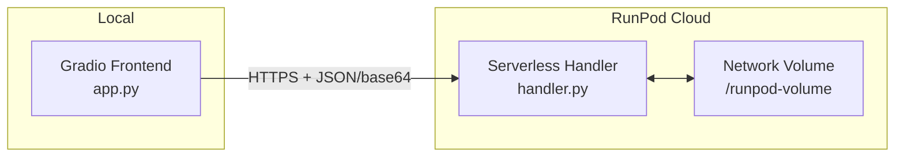
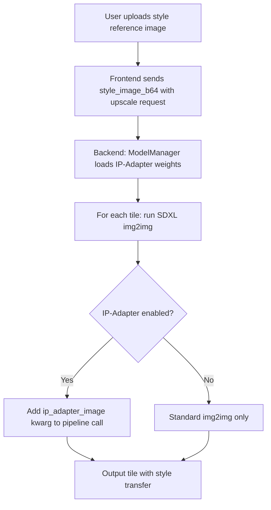
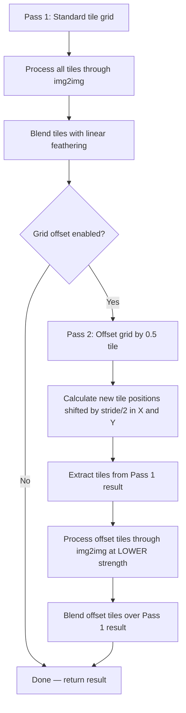
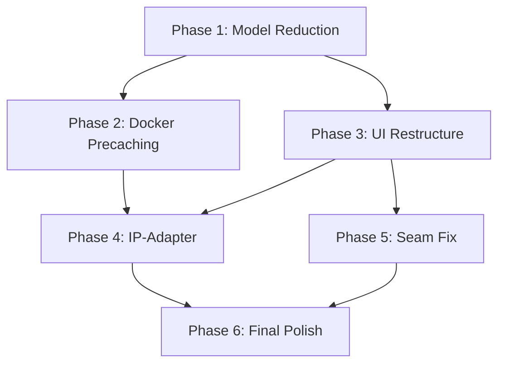

# AI Assets Toolbox — Redesign Plan

## Table of Contents

1. [Current Architecture Summary](#1-current-architecture-summary)
2. [Change 1: UI Overhaul — Unified Tile Selector](#2-change-1-ui-overhaul--unified-tile-selector)
3. [Change 2: Model Reduction & Docker Precaching](#3-change-2-model-reduction--docker-precaching)
4. [Change 3: IP-Adapter for Style Transfer](#4-change-3-ip-adapter-for-style-transfer)
5. [Change 4: Seam Removal via Grid Offset](#5-change-4-seam-removal-via-grid-offset)
6. [Change 5: General UI Polish](#6-change-5-general-ui-polish)
7. [File-by-File Change List](#7-file-by-file-change-list)
8. [New Dockerfile Strategy](#8-new-dockerfile-strategy)
9. [Implementation Order](#9-implementation-order)

---

## 1. Current Architecture Summary

### System Layout

The project is a **Gradio frontend** + **RunPod serverless backend** for AI-powered tile-based image upscaling, focused on game asset tiles.



### Frontend Structure

| File | Purpose |
|------|---------|
| [`app.py`](../frontend/app.py) | Entry point — builds `gr.Blocks` with 3 tabs |
| [`tabs/upscale_tab.py`](../frontend/tabs/upscale_tab.py) | Main UI — 1138 lines, single-column layout with controls, gallery, region selection |
| [`tiling.py`](../frontend/tiling.py) | Client-side tile grid calculation, extraction, blending with linear gradient feathering |
| [`api_client.py`](../frontend/api_client.py) | `RunPodClient` — wraps `/runsync` and `/run` + polling for all actions |
| [`config.py`](../frontend/config.py) | Env vars, tile defaults: 1024px tiles, 128px overlap |

### Backend Structure

| File | Purpose |
|------|---------|
| [`handler.py`](../backend/handler.py) | RunPod entry — routes `action` field to handlers |
| [`model_manager.py`](../backend/model_manager.py) | Singleton `ModelManager` — dynamic load/unload of SDXL, Flux, Qwen, ControlNet, LoRA |
| [`actions/upscale.py`](../backend/actions/upscale.py) | Tile-based upscale — loads model, iterates tiles, runs img2img |
| [`actions/upscale_regions.py`](../backend/actions/upscale_regions.py) | Region-based upscale — extracts padded regions, runs img2img per region |
| [`actions/caption.py`](../backend/actions/caption.py) | Qwen3-VL captioning — loads Qwen, generates per-tile captions |
| [`actions/models.py`](../backend/actions/models.py) | CRUD for models on network volume |
| [`pipelines/sdxl_pipeline.py`](../backend/pipelines/sdxl_pipeline.py) | `SDXLPipeline` wrapper — plain or ControlNet img2img |
| [`pipelines/flux_pipeline.py`](../backend/pipelines/flux_pipeline.py) | `FluxPipeline` wrapper — **TO BE REMOVED** |
| [`pipelines/qwen_pipeline.py`](../backend/pipelines/qwen_pipeline.py) | `QwenPipeline` wrapper — Qwen3-VL-8B captioning |

### Current Models

| Model | HF Repo | Type | Status |
|-------|---------|------|--------|
| z-image-xl | `stabilityai/stable-diffusion-xl-base-1.0` | SDXL checkpoint | Keep |
| pony-v6 | `AstraliteHeart/pony-diffusion-v6-xl` | SDXL checkpoint | Keep |
| illustrious-xl | `OnomaAIResearch/Illustrious-xl-early-release-v0` | SDXL checkpoint | **Primary — precache** |
| flux-dev | `black-forest-labs/FLUX.1-dev` | Flux checkpoint | **REMOVE** |
| sdxl-tile | `xinsir/controlnet-tile-sdxl-1.0` | ControlNet | Keep |
| flux-tile | `jasperai/Flux.1-dev-Controlnet-Upscaler` | ControlNet | **REMOVE** |
| Qwen3-VL-8B | `Qwen/Qwen3-VL-8B-Instruct` | VLM | Keep |

### Current UI Problems

1. **Overwhelming single-column layout** — all controls, gallery, region tools, and previews stacked vertically in one column
2. **Separate tile gallery** — `gr.Gallery` component is disconnected from the grid preview; user must mentally map gallery thumbnails to grid positions
3. **Too many exposed parameters** — tile size, overlap, CFG, steps, strength, ControlNet scale, seed all visible at once
4. **Region selection is complex** — drawing mode toggle, pending region state, add/cancel buttons
5. **No progressive disclosure** — everything shown at once regardless of workflow stage

---

## 2. Change 1: UI Overhaul — Unified Tile Selector

### Goal

Replace the separate grid preview + gallery with a **single unified tile view**: a clickable tile grid on top where clicking a tile selects it, and the selected tile details displayed below.

### Current Flow

```
Grid Preview Image (static, shows overlay)
    ↓
Tile Gallery (gr.Gallery, 4 columns, click to select)
    ↓
Selected Tile Info + Prompt + Original/Processed previews
```

### New Flow

```
┌─────────────────────────────────────────────────┐
│  Clickable Tile Grid                            │
│  ┌────┬────┬────┬────┬────┬────┬────┬────┐      │
│  │ 0  │ 1  │ 2  │ 3  │ 4  │ 5  │ 6  │ 7  │     │
│  ├────┼────┼────┼────┼────┼────┼────┼────┤      │
│  │ 8  │ 9  │[10]│ 11 │ 12 │ 13 │ 14 │ 15 │     │
│  ├────┼────┼────┼────┼────┼────┼────┼────┤      │
│  │ 16 │ 17 │ 18 │ 19 │ 20 │ 21 │ 22 │ 23 │     │
│  └────┴────┴────┴────┴────┴────┴────┴────┘      │
│  [10] = selected tile, highlighted in blue       │
├─────────────────────────────────────────────────┤
│  Selected Tile #10                               │
│  ┌──────────────┐  ┌──────────────┐             │
│  │  Original     │  │  Processed   │             │
│  │  Tile Image   │  │  Tile Image  │             │
│  └──────────────┘  └──────────────┘             │
│  Prompt: [editable textbox]                      │
│  [Upscale This Tile] [Caption This Tile]         │
└─────────────────────────────────────────────────┘
```

### Implementation Approach

**Option A: `gr.Gallery` with grid layout** — Use `gr.Gallery` configured with `columns` matching the tile grid columns, `allow_preview=False`, and `height` set to show the full grid. On `.select()`, update the selected tile details below. This is the simplest approach and uses existing Gradio components.

**Option B: HTML + JavaScript clickable grid** — Render the tile grid as an HTML `<div>` with CSS grid layout. Each cell is a `<div>` with a thumbnail and click handler that calls a Gradio callback via `gr.HTML` + JavaScript. More control over appearance but more complex.

**Recommended: Option A** — Use `gr.Gallery` as the primary tile selector, but configure it to visually represent the grid layout. The gallery already supports `.select()` events. The key change is:

1. Remove the separate `grid_preview` image component
2. Make the `gr.Gallery` the primary visual — set `columns` to match the actual grid column count dynamically
3. Generate gallery images that include tile index overlays and status indicators — colored borders for selected, green tint for processed
4. Below the gallery, show the selected tile detail panel

### Tile Grid Image Generation

Instead of plain tile crops in the gallery, generate **annotated tile thumbnails**:
- Each thumbnail is the tile crop with a semi-transparent overlay showing tile index
- Processed tiles get a green border/tint
- Selected tile gets a blue highlight
- This replaces the need for a separate grid overlay image

### State Changes

Current state in [`upscale_tab.py`](../frontend/tabs/upscale_tab.py:464):
```python
tiles_state = gr.State(value=[])           # per-tile data
selected_idx_state = gr.State(value=-1)    # selected tile index
original_img_state = gr.State(value=None)  # full upscaled image
```

New state — same structure, but the gallery becomes the primary selector:
```python
tiles_state = gr.State(value=[])           # unchanged
selected_idx_state = gr.State(value=-1)    # unchanged
original_img_state = gr.State(value=None)  # unchanged
grid_cols_state = gr.State(value=1)        # NEW: track grid column count for gallery layout
```

### UI Component Changes

**Remove:**
- `grid_preview` — the `gr.Image` at line 588 showing the grid overlay
- `tile_info_text` — the textbox at line 605

**Modify:**
- `tile_gallery` — change from secondary display to primary selector; set `columns` dynamically based on grid calculation; increase `height`
- `tile_orig_preview` / `tile_proc_preview` — move below the gallery in a detail panel

**Add:**
- Dynamic column count update when image is uploaded
- Annotated thumbnail generation function

---

## 3. Change 2: Model Reduction & Docker Precaching

### Goal

1. Remove Flux pipeline entirely
2. Keep only Illustrious-XL as the primary SDXL model, plus Qwen for captioning
3. Pre-download Illustrious into the Docker image using `precached_model`
4. Pre-download all auxiliary models into the Docker image

### Models to Keep

| Model | HF Repo | Precache Strategy |
|-------|---------|-------------------|
| Illustrious-XL | `OnomaAIResearch/Illustrious-xl-early-release-v0` | **`precached_model` in Dockerfile** — primary model, always loaded |
| ControlNet Tile SDXL | `xinsir/controlnet-tile-sdxl-1.0` | Pre-download in Docker build |
| Qwen3-VL-8B | `Qwen/Qwen3-VL-8B-Instruct` | Pre-download in Docker build |
| IP-Adapter SDXL | `h94/IP-Adapter` subfolder `sdxl_models` | Pre-download in Docker build |
| SDXL VAE | `madebyollin/sdxl-vae-fp16-fix` | Pre-download in Docker build |

### Models to Remove

| Model | Reason |
|-------|--------|
| flux-dev | User request — not needed |
| flux-tile ControlNet | Depends on Flux |
| z-image-xl | Consolidating to Illustrious only |
| pony-v6 | Consolidating to Illustrious only |

### LoRA Support

LoRA loading capability is **kept**. LoRAs remain on the network volume at `/runpod-volume/models/loras/` and are loaded dynamically at runtime. The multi-LoRA UI in the frontend is preserved.

### Backend Changes

**[`model_manager.py`](../backend/model_manager.py):**
- Remove `CHECKPOINT_MODELS` entries for `z-image-xl`, `pony-v6`, `flux-dev`
- Remove `CONTROLNET_MODELS` entry for `flux-tile`
- Remove `_is_flux_model()` helper
- Remove `_load_flux()` method
- Simplify `load_diffusion_model()` — no Flux branch
- Add `load_ip_adapter()` method
- Add IP-Adapter model path constants

**[`actions/upscale.py`](../backend/actions/upscale.py):**
- Remove `_run_flux()` function
- Remove `is_flux` branching logic
- Remove `model_type` parameter handling
- Add `ip_adapter_image_b64` optional parameter
- Add IP-Adapter kwargs to `_run_sdxl()`

**[`actions/upscale_regions.py`](../backend/actions/upscale_regions.py):**
- Same changes as `upscale.py` — remove Flux, add IP-Adapter support

**[`pipelines/flux_pipeline.py`](../backend/pipelines/flux_pipeline.py):**
- **DELETE** this file entirely

**[`pipelines/sdxl_pipeline.py`](../backend/pipelines/sdxl_pipeline.py):**
- Add IP-Adapter loading method
- Add `ip_adapter_image` parameter to `generate()`

### Frontend Changes

**[`tabs/upscale_tab.py`](../frontend/tabs/upscale_tab.py:72):**
- Remove `MODEL_CHOICES` list — replace with single model or simplified dropdown
- Remove `model_dd` dropdown or simplify to just show the active model
- Remove `model_type` logic in upscale handlers
- Update `_upscale_tiles_batch()` — remove `model_type` parameter

**[`api_client.py`](../frontend/api_client.py:213):**
- Remove `model_type` from `upscale_tiles()` payload
- Remove `model_type` from `upscale_regions()` payload
- Simplify `model_config` construction

---

## 4. Change 3: IP-Adapter for Style Transfer

### Goal

Add optional IP-Adapter support for style transfer on tiles. The user uploads a **style reference image**, and IP-Adapter conditions the diffusion process to match that style.

### How IP-Adapter Works

IP-Adapter is a lightweight adapter that enables image prompting for Stable Diffusion. It uses a CLIP image encoder to extract features from a reference image, then injects those features into the cross-attention layers of the diffusion model alongside the text prompt features.

For SDXL, the official models are at `h94/IP-Adapter` in the `sdxl_models` subfolder:
- `ip-adapter_sdxl.safetensors` — standard IP-Adapter for SDXL
- `ip-adapter_sdxl_vit-h.safetensors` — uses ViT-H image encoder
- `ip-adapter-plus_sdxl_vit-h.safetensors` — enhanced version

### Integration Architecture



### Frontend UI Addition

Add to the controls panel, inside an `gr.Accordion` for progressive disclosure:

```
### 🎨 Style Transfer (Optional)
┌─────────────────────────────────────┐
│ [x] Enable IP-Adapter               │
│                                     │
│ Style Reference Image:              │
│ ┌───────────────┐                   │
│ │  [Upload]     │                   │
│ └───────────────┘                   │
│                                     │
│ IP-Adapter Scale: [====|====] 0.6   │
└─────────────────────────────────────┘
```

### API Changes

**Request payload addition** for both `upscale` and `upscale_regions` actions:

```json
{
    "model_config": {
        "base_model": "illustrious-xl",
        "ip_adapter": {
            "enabled": true,
            "image_b64": "<base64 style reference>",
            "scale": 0.6
        }
    }
}
```

### Backend Implementation

**[`model_manager.py`](../backend/model_manager.py):**

```python
IP_ADAPTER_REPO = "h94/IP-Adapter"
IP_ADAPTER_SUBFOLDER = "sdxl_models"
IP_ADAPTER_FILENAME = "ip-adapter_sdxl_vit-h.safetensors"

def load_ip_adapter(self) -> None:
    if self._diffusion_pipe is None:
        raise RuntimeError("No diffusion model loaded")
    self._diffusion_pipe.load_ip_adapter(
        IP_ADAPTER_REPO,
        subfolder=IP_ADAPTER_SUBFOLDER,
        weight_name=IP_ADAPTER_FILENAME,
    )

def unload_ip_adapter(self) -> None:
    if self._diffusion_pipe is not None:
        self._diffusion_pipe.unload_ip_adapter()
```

**Pipeline call with IP-Adapter:**

```python
# In _run_sdxl():
if ip_adapter_image is not None:
    kwargs["ip_adapter_image"] = ip_adapter_image
    pipe.set_ip_adapter_scale(ip_adapter_scale)
```

### VRAM Impact

| Component | VRAM |
|-----------|------|
| IP-Adapter weights | ~0.1 GB |
| CLIP image encoder | ~1.5 GB |
| **Total additional** | **~1.6 GB** |

This fits comfortably within the A100 80GB budget alongside SDXL + ControlNet.

---

## 5. Change 4: Seam Removal via Grid Offset

### Goal

Implement an optional second pass with the tile grid shifted by half a tile in both X and Y directions. This causes the second pass to straddle the seams from the first pass, effectively blending them away.

### Algorithm Description



### Detailed Algorithm

**Pass 1 — Standard Grid:**
- Grid with `tile_size=1024`, `overlap=128`, `stride=896`
- Tiles at positions: `(0,0)`, `(896,0)`, `(1792,0)`, ...
- Process through img2img at user-specified strength
- Blend with existing linear gradient feathering

**Pass 2 — Offset Grid:**
- Shift the entire grid by `stride/2 = 448` pixels in both X and Y
- New tile positions: `(448,448)`, `(1344,448)`, `(2240,448)`, ...
- Edge tiles that extend beyond the image boundary are clamped
- Process through img2img at **reduced strength** — typically `strength * 0.5` or a user-configurable seam fix strength
- Blend offset tiles over the Pass 1 result using the same linear gradient feathering

**Why this works:**
- Pass 1 seams occur at tile boundaries: `x=896`, `x=1792`, etc.
- Pass 2 tiles are centered on those seam lines, so the diffusion model sees the seam area as the middle of a tile — where it has full context from both sides
- The lower strength in Pass 2 preserves the detail from Pass 1 while smoothing transitions

### Implementation in [`tiling.py`](../frontend/tiling.py)

Add a new function:

```python
def calculate_offset_tiles(
    image_size: Tuple[int, int],
    tile_size: int = 1024,
    overlap: int = 128,
) -> List[TileInfo]:
    """Calculate a half-stride offset tile grid for seam removal pass."""
    stride = tile_size - overlap
    offset = stride // 2
    # Same logic as calculate_tiles but with (offset, offset) origin
    ...
```

### Frontend UI Addition

Add a checkbox and strength slider inside the Tile Settings accordion:

```
### ⚙️ Tile Settings
Tile Size: [1024]  Overlap: [128]

[x] Enable Seam Fix (Grid Offset Pass)
    Seam Fix Strength: [====|====] 0.25
```

### Processing Flow Change

The upscale workflow becomes:

1. **Pass 1**: Standard tile grid → process all tiles → blend → intermediate result
2. **Pass 2** (if enabled): Offset tile grid → extract from intermediate → process at lower strength → blend over intermediate → final result

This means the backend processes **two batches** of tiles when seam fix is enabled. The frontend orchestrates this by:
1. Calling `upscale_tiles` for Pass 1
2. Assembling the intermediate result
3. Re-slicing with offset grid
4. Calling `upscale_tiles` for Pass 2 with reduced strength
5. Assembling the final result

### API Impact

No new backend action needed. The frontend simply makes two sequential `upscale` calls with different tile coordinates and strength values. The offset grid calculation and re-slicing happen client-side.

---

## 6. Change 5: General UI Polish

### Goal

Make the UI less intimidating by using progressive disclosure, better grouping, and a cleaner layout.

### Layout Redesign

**Current:** Single column with everything stacked vertically — 1138 lines of UI code.

**New:** Two-column layout with progressive disclosure via `gr.Accordion`.

```
┌─────────────────────────────────────────────────────────────────┐
│  🎨 AI Assets Toolbox — Tile Upscale                           │
├──────────────────────┬──────────────────────────────────────────┤
│  LEFT COLUMN         │  RIGHT COLUMN                           │
│  (Controls)          │  (Preview + Results)                    │
│                      │                                         │
│  📁 Upload Image     │  Clickable Tile Grid                   │
│  [Image Upload]      │  ┌──┬──┬──┬──┬──┬──┬──┬──┐             │
│                      │  │  │  │  │  │  │  │  │  │             │
│  Target Resolution   │  ├──┼──┼──┼──┼──┼──┼──┼──┤             │
│  [Dropdown]          │  │  │  │##│  │  │  │  │  │             │
│                      │  ├──┼──┼──┼──┼──┼──┼──┼──┤             │
│  ▶ Model & LoRAs     │  │  │  │  │  │  │  │  │  │             │
│    [Accordion]       │  └──┴──┴──┴──┴──┴──┴──┴──┘             │
│                      │                                         │
│  ▶ Prompts           │  Selected Tile Detail                   │
│    [Accordion]       │  ┌─────────┐ ┌─────────┐               │
│                      │  │Original │ │Processed│               │
│  ▶ Generation        │  └─────────┘ └─────────┘               │
│    Settings           │  Prompt: [___________]                 │
│    [Accordion]       │                                         │
│                      │  ─────────────────────                  │
│  ▶ Style Transfer    │                                         │
│    [Accordion]       │  Final Result                           │
│                      │  ┌───────────────────┐                  │
│  ▶ Advanced          │  │                   │                  │
│    [Accordion]       │  │  Upscaled Image   │                  │
│                      │  │                   │                  │
│  ─────────────       │  └───────────────────┘                  │
│  🚀 Actions          │                                         │
│  [Caption All]       │  Status: ✅ Ready                       │
│  [Upscale All]       │                                         │
│  [Upscale Selected]  │                                         │
├──────────────────────┴──────────────────────────────────────────┤
│  Progress Bar / Status                                          │
└─────────────────────────────────────────────────────────────────┘
```

### Accordion Groups

| Accordion | Contents | Default State |
|-----------|----------|---------------|
| **Model & LoRAs** | Model info display, LoRA add/remove | Collapsed |
| **Prompts** | Global prompt, negative prompt, caption system prompt | Open |
| **Generation Settings** | Strength, steps, CFG, seed | Collapsed — show defaults |
| **Style Transfer** | IP-Adapter enable, reference image, scale | Collapsed |
| **Advanced** | Tile size, overlap, ControlNet toggle, conditioning scale, seam fix | Collapsed |
| **Region Selection** | Region drawing tools, region list | Collapsed |

### Specific Polish Items

1. **Remove model dropdown** — Since we only have Illustrious-XL, show it as a static label instead of a dropdown
2. **Smart defaults** — Pre-fill strength=0.35, steps=30, CFG=7.0, seed=-1 and hide behind accordion
3. **Action buttons prominence** — Make "Upscale All" the primary CTA, large and prominent
4. **Status bar** — Move to bottom, make it a persistent progress indicator
5. **Tooltips** — Add `info=` parameter to sliders and inputs explaining what each does
6. **Theme** — Keep `gr.themes.Soft()` but add custom CSS for better spacing

### CSS Additions

```css
.gradio-container { max-width: 1400px; margin: auto; }
footer { display: none !important; }
/* Tile grid gallery */
.tile-grid-gallery .gallery-item { border: 2px solid transparent; border-radius: 4px; }
.tile-grid-gallery .gallery-item.selected { border-color: #0064ff; }
/* Action buttons */
.action-buttons .primary { font-size: 1.1em; padding: 12px 24px; }
```

---

## 7. File-by-File Change List

### Files to CREATE

| File | Purpose |
|------|---------|
| `frontend/tile_grid.py` | New module: annotated tile thumbnail generation, grid layout helpers |

### Files to MODIFY

| File | Changes |
|------|---------|
| **`frontend/tabs/upscale_tab.py`** | Major rewrite: two-column layout, accordion groups, remove gallery+grid_preview in favor of unified tile grid, add IP-Adapter UI, add seam fix UI, remove Flux/model_type references, remove model dropdown |
| **`frontend/tiling.py`** | Add `calculate_offset_tiles()` for seam fix pass, add `generate_tile_thumbnail()` for annotated gallery images |
| **`frontend/api_client.py`** | Remove `model_type` from payloads, add `ip_adapter` config to `upscale_tiles()` and `upscale_regions()`, add `style_image_b64` parameter |
| **`frontend/app.py`** | Minor — update CSS, possibly adjust theme |
| **`frontend/config.py`** | Add `SEAM_FIX_DEFAULT_STRENGTH`, `IP_ADAPTER_DEFAULT_SCALE` defaults |
| **`backend/model_manager.py`** | Remove Flux entries from `CHECKPOINT_MODELS` and `CONTROLNET_MODELS`, remove `_is_flux_model()`, remove `_load_flux()`, add `load_ip_adapter()` / `unload_ip_adapter()`, add IP-Adapter constants, remove z-image-xl and pony-v6 from registry |
| **`backend/actions/upscale.py`** | Remove `_run_flux()`, remove Flux branching, add `ip_adapter_image` parameter to `_run_sdxl()`, parse `ip_adapter` config from request |
| **`backend/actions/upscale_regions.py`** | Same as `upscale.py` — remove Flux, add IP-Adapter support |
| **`backend/pipelines/sdxl_pipeline.py`** | Add `load_ip_adapter()` method, add `ip_adapter_image` and `ip_adapter_scale` params to `generate()` |
| **`backend/pipelines/qwen_pipeline.py`** | No changes needed |
| **`backend/Dockerfile`** | Major rewrite — add model pre-download steps, use `precached_model` for Illustrious |
| **`backend/start.sh`** | Minor — adjust directory creation for new model layout |
| **`backend/requirements.txt`** | Ensure `ip-adapter` or compatible diffusers version is included |
| **`docs/ARCHITECTURE.md`** | Update to reflect new architecture — remove Flux references, add IP-Adapter, add seam fix |

### Files to DELETE

| File | Reason |
|------|--------|
| **`backend/pipelines/flux_pipeline.py`** | Flux pipeline removed entirely |

---

## 8. New Dockerfile Strategy

### Current Dockerfile

The current [`Dockerfile`](../backend/Dockerfile) is minimal — it installs Python deps and copies source code. All model weights are downloaded at runtime from HuggingFace to the network volume.

### New Dockerfile with Precaching

```dockerfile
# ============================================================
# AI Assets Toolbox — RunPod Serverless Worker (Redesigned)
# ============================================================
FROM nvidia/cuda:12.1.1-devel-ubuntu22.04

ENV DEBIAN_FRONTEND=noninteractive
RUN apt-get update && apt-get install -y \
    python3.11 python3.11-venv python3.11-dev python3-pip \
    git wget curl \
    libgl1 libglib2.0-0 \
    && ln -sf /usr/bin/python3.11 /usr/bin/python \
    && ln -sf /usr/bin/python3.11 /usr/bin/python3 \
    && pip install --upgrade pip \
    && apt-get clean && rm -rf /var/lib/apt/lists/*

WORKDIR /app
COPY requirements.txt /app/requirements.txt
RUN pip install --no-cache-dir -r requirements.txt

# -----------------------------------------------------------
# Pre-download models into the Docker image
# -----------------------------------------------------------
ENV HF_HOME=/app/hf_cache
ENV TRANSFORMERS_CACHE=/app/hf_cache

# 1. Illustrious-XL (primary diffusion model) — precached
RUN python -c "
from diffusers import StableDiffusionXLImg2ImgPipeline
import torch
pipe = StableDiffusionXLImg2ImgPipeline.from_pretrained(
    'OnomaAIResearch/Illustrious-xl-early-release-v0',
    torch_dtype=torch.float16,
    use_safetensors=True,
    variant='fp16',
)
print('Illustrious-XL downloaded successfully')
"

# 2. ControlNet Tile SDXL
RUN python -c "
from diffusers import ControlNetModel
import torch
cn = ControlNetModel.from_pretrained(
    'xinsir/controlnet-tile-sdxl-1.0',
    torch_dtype=torch.float16,
)
print('ControlNet Tile SDXL downloaded successfully')
"

# 3. Qwen3-VL-8B
RUN python -c "
from transformers import Qwen3VLForConditionalGeneration, AutoProcessor
model = Qwen3VLForConditionalGeneration.from_pretrained(
    'Qwen/Qwen3-VL-8B-Instruct',
    torch_dtype=torch.float16,
    device_map='cpu',
)
processor = AutoProcessor.from_pretrained('Qwen/Qwen3-VL-8B-Instruct')
print('Qwen3-VL-8B downloaded successfully')
"

# 4. IP-Adapter SDXL weights + CLIP image encoder
RUN python -c "
from huggingface_hub import hf_hub_download
# Download IP-Adapter weights
hf_hub_download(
    'h94/IP-Adapter',
    filename='ip-adapter_sdxl_vit-h.safetensors',
    subfolder='sdxl_models',
)
# Download CLIP image encoder
from transformers import CLIPVisionModelWithProjection
encoder = CLIPVisionModelWithProjection.from_pretrained(
    'h94/IP-Adapter',
    subfolder='models/image_encoder',
)
print('IP-Adapter downloaded successfully')
"

# 5. SDXL VAE fix
RUN python -c "
from diffusers import AutoencoderKL
import torch
vae = AutoencoderKL.from_pretrained(
    'madebyollin/sdxl-vae-fp16-fix',
    torch_dtype=torch.float16,
)
print('SDXL VAE downloaded successfully')
"

# -----------------------------------------------------------
# Copy backend source
# -----------------------------------------------------------
COPY . /app/

# At runtime, point HF_HOME to the precached location
# but allow network volume override for LoRAs
ENV HF_HOME=/app/hf_cache
ENV TRANSFORMERS_CACHE=/app/hf_cache
ENV PYTHONPATH=/app

RUN sed -i 's/\r$//' /app/start.sh && chmod +x /app/start.sh
CMD ["/app/start.sh"]
```

### Key Differences from Current Dockerfile

1. **Models downloaded during build** — Docker image is larger but cold start is near-zero
2. **`HF_HOME` points to `/app/hf_cache`** — models are baked into the image layer
3. **Network volume still used for LoRAs** — dynamic LoRA loading from `/runpod-volume/models/loras/`
4. **No runtime model downloads** — except for LoRAs uploaded by the user

### Docker Image Size Estimate

| Component | Size |
|-----------|------|
| Base CUDA image | ~5 GB |
| Python + deps | ~3 GB |
| Illustrious-XL fp16 | ~6.5 GB |
| ControlNet Tile | ~1.5 GB |
| Qwen3-VL-8B | ~14 GB |
| IP-Adapter + CLIP | ~2 GB |
| SDXL VAE | ~0.3 GB |
| **Total** | **~32 GB** |

This is large but acceptable for RunPod serverless — the tradeoff is zero cold-start model loading time.

---

## 9. Implementation Order

The changes have dependencies that dictate the implementation order:



### Phase 1: Model Reduction (Backend)

1. Delete [`backend/pipelines/flux_pipeline.py`](../backend/pipelines/flux_pipeline.py)
2. Remove Flux entries from [`model_manager.py`](../backend/model_manager.py) — `CHECKPOINT_MODELS`, `CONTROLNET_MODELS`, `_is_flux_model()`, `_load_flux()`
3. Remove z-image-xl and pony-v6 from `CHECKPOINT_MODELS`
4. Remove `_run_flux()` from [`actions/upscale.py`](../backend/actions/upscale.py) and [`actions/upscale_regions.py`](../backend/actions/upscale_regions.py)
5. Remove Flux branching logic from both action handlers
6. Update [`api_client.py`](../frontend/api_client.py) — remove `model_type` from payloads
7. Update [`upscale_tab.py`](../frontend/tabs/upscale_tab.py) — remove `MODEL_CHOICES`, remove model dropdown, remove `model_type` logic

### Phase 2: Docker Precaching

1. Rewrite [`backend/Dockerfile`](../backend/Dockerfile) with model pre-download steps
2. Update [`backend/start.sh`](../backend/start.sh) — adjust for precached model paths
3. Update [`model_manager.py`](../backend/model_manager.py) — add logic to check `/app/hf_cache` before network volume
4. Update [`backend/requirements.txt`](../backend/requirements.txt) — ensure all needed packages are listed
5. Test Docker build locally

### Phase 3: UI Restructure

1. Create [`frontend/tile_grid.py`](../frontend/tile_grid.py) — annotated thumbnail generation
2. Add `calculate_offset_tiles()` to [`tiling.py`](../frontend/tiling.py)
3. Rewrite [`upscale_tab.py`](../frontend/tabs/upscale_tab.py):
   - Two-column layout with `gr.Row` + `gr.Column`
   - Replace grid_preview + gallery with unified tile gallery
   - Group controls into `gr.Accordion` sections
   - Move action buttons to prominent position
   - Add seam fix checkbox + strength slider
4. Update [`app.py`](../frontend/app.py) — add custom CSS for tile grid styling

### Phase 4: IP-Adapter Integration

1. Add IP-Adapter constants and methods to [`model_manager.py`](../backend/model_manager.py)
2. Add `ip_adapter_image` parameter to [`sdxl_pipeline.py`](../backend/pipelines/sdxl_pipeline.py) `generate()`
3. Update [`actions/upscale.py`](../backend/actions/upscale.py) — parse IP-Adapter config, pass to pipeline
4. Update [`actions/upscale_regions.py`](../backend/actions/upscale_regions.py) — same
5. Update [`api_client.py`](../frontend/api_client.py) — add `ip_adapter` to request payloads
6. Add IP-Adapter UI to [`upscale_tab.py`](../frontend/tabs/upscale_tab.py) — accordion with enable checkbox, image upload, scale slider

### Phase 5: Seam Fix Implementation

1. Implement `calculate_offset_tiles()` in [`tiling.py`](../frontend/tiling.py)
2. Add seam fix orchestration to [`upscale_tab.py`](../frontend/tabs/upscale_tab.py):
   - After Pass 1 completes, if seam fix enabled:
   - Re-slice the intermediate result with offset grid
   - Send offset tiles for processing at reduced strength
   - Blend offset tiles over intermediate result
3. Add seam fix defaults to [`config.py`](../frontend/config.py)

### Phase 6: Final Polish

1. Add tooltips/info text to all UI controls
2. Fine-tune accordion default states
3. Update [`docs/ARCHITECTURE.md`](../docs/ARCHITECTURE.md) with new architecture
4. Test end-to-end workflow
5. Update [`README.md`](../README.md)
