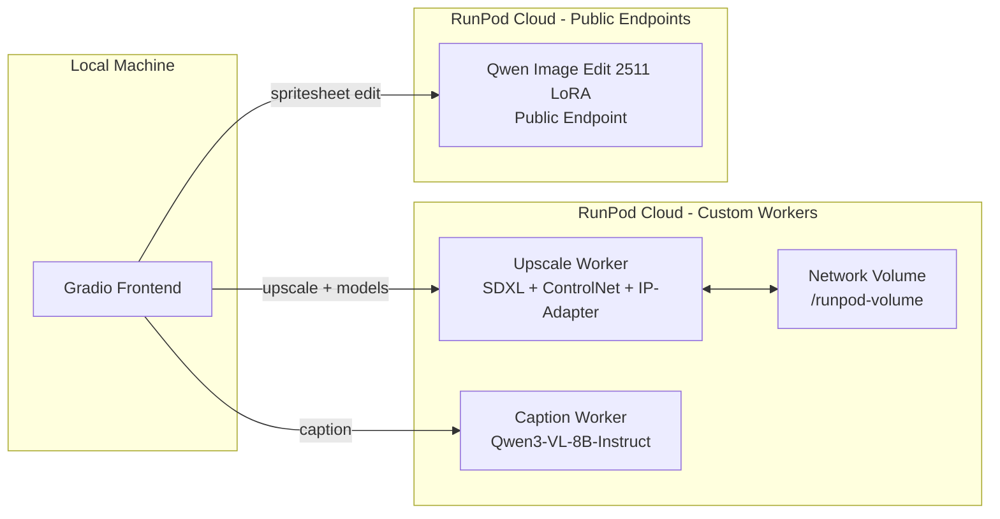

# AI Assets Toolbox — Multi-Worker Restructure Plan

## Table of Contents

1. [Overview](#1-overview)
2. [New Architecture](#2-new-architecture)
3. [New Folder Structure](#3-new-folder-structure)
4. [Upscale Worker](#4-upscale-worker)
5. [Caption Worker](#5-caption-worker)
6. [Frontend Changes](#6-frontend-changes)
7. [Model Download URLs](#7-model-download-urls)
8. [RunPod Public Endpoint Integration](#8-runpod-public-endpoint-integration)
9. [Migration Steps](#9-migration-steps)

---

## 1. Overview

The project currently runs a **single RunPod serverless worker** that handles both SDXL upscaling and Qwen3-VL-8B captioning. This creates several problems:

- **Docker image bloat**: The image must contain both SDXL (~11 GB) and Qwen (~17.5 GB) model weights
- **VRAM contention**: The worker must swap between diffusion and VLM models, adding latency
- **Scaling inflexibility**: Cannot scale captioning and upscaling independently
- **Dockerfile broken**: `huggingface-cli download` fails during RunPod Docker builds (exit code 127)

The restructure splits the backend into **two independent RunPod serverless workers** and adds support for **RunPod public endpoints** for future features.

---

## 2. New Architecture



### Endpoint Routing

| Frontend Action | Target | Endpoint Type |
|----------------|--------|---------------|
| `upscale`, `upscale_regions` | Upscale Worker | Custom serverless |
| `list_models`, `upload_model`, `delete_model` | Upscale Worker | Custom serverless |
| `health` | Upscale Worker | Custom serverless |
| `caption` | Caption Worker | Custom serverless |
| Spritesheet editing | Qwen Image Edit 2511 LoRA | RunPod public endpoint |

---

## 3. New Folder Structure

```
ai-assets-toolbox/
├── workers/
│   ├── upscale/                    # Upscale Worker (renamed from backend/)
│   │   ├── Dockerfile              # NEW: wget-based model downloads
│   │   ├── handler.py              # Stripped of caption routing
│   │   ├── model_manager.py        # Stripped of Qwen loading code
│   │   ├── requirements.txt        # No qwen-vl-utils, no sentencepiece
│   │   ├── start.sh                # Simplified startup
│   │   ├── .dockerignore
│   │   ├── actions/
│   │   │   ├── __init__.py
│   │   │   ├── upscale.py          # Unchanged
│   │   │   ├── upscale_regions.py  # Unchanged
│   │   │   └── models.py           # Unchanged
│   │   ├── pipelines/
│   │   │   ├── __init__.py
│   │   │   └── sdxl_pipeline.py    # Unchanged
│   │   └── utils/
│   │       ├── __init__.py
│   │       ├── image_utils.py      # Unchanged
│   │       └── storage.py          # Unchanged
│   │
│   └── caption/                    # Caption Worker (NEW)
│       ├── Dockerfile              # NEW: Qwen model via git lfs clone
│       ├── handler.py              # NEW: minimal handler, caption-only
│       ├── requirements.txt        # NEW: minimal deps
│       ├── start.sh                # NEW: simple startup
│       ├── .dockerignore
│       └── pipelines/
│           └── qwen_pipeline.py    # Moved from backend/pipelines/
│
├── frontend/                       # Local Gradio app
│   ├── app.py                      # Updated tab imports
│   ├── api_client.py               # REWRITTEN: multi-endpoint routing
│   ├── config.py                   # NEW env vars for caption endpoint
│   ├── tiling.py                   # Unchanged
│   ├── requirements.txt
│   └── tabs/
│       ├── __init__.py
│       ├── upscale_tab.py          # Updated to use new api_client
│       ├── model_manager_tab.py    # Unchanged
│       └── spritesheet_tab.py      # Future: uses RunPod public endpoint
│
├── scripts/
│   ├── deploy-upscale.ps1          # NEW: deploy upscale worker
│   ├── deploy-upscale.sh           # NEW: deploy upscale worker
│   ├── deploy-caption.ps1          # NEW: deploy caption worker
│   └── deploy-caption.sh           # NEW: deploy caption worker
│
├── docs/
│   ├── ARCHITECTURE.md             # Updated for multi-worker
│   ├── RESTRUCTURE_PLAN.md         # This document
│   └── REDESIGN_PLAN.md            # Previous plan (historical)
│
├── .env.example                    # Updated with new env vars
├── .gitignore
├── LICENSE
└── README.md                       # Updated
```

### Key Structural Decisions

- **`backend/` → `workers/upscale/`**: The old `backend/` directory becomes the upscale worker under a new `workers/` parent
- **`workers/caption/`**: New minimal worker for captioning only
- **Shared code**: No shared code between workers — each is a self-contained Docker image. The `utils/image_utils.py` helper for base64 decoding is duplicated into the caption worker as a single function rather than creating a shared package
- **Old `backend/` directory**: Deleted after migration is complete

---

## 4. Upscale Worker

### What Stays
- `actions/upscale.py` — tile-based SDXL img2img
- `actions/upscale_regions.py` — region-based SDXL img2img
- `actions/models.py` — LoRA CRUD on network volume
- `pipelines/sdxl_pipeline.py` — SDXL pipeline wrapper
- `utils/image_utils.py` — base64/PIL helpers
- `utils/storage.py` — network volume file operations
- `handler.py` — routes: `upscale`, `upscale_regions`, `list_models`, `upload_model`, `delete_model`, `health`

### What Gets Removed
- `actions/caption.py` — moves to caption worker
- `pipelines/qwen_pipeline.py` — moves to caption worker
- All Qwen-related code in `model_manager.py`:
  - `QWEN_MODEL_ID` constant
  - `load_qwen()` method
  - `_qwen_model`, `_qwen_processor`, `_qwen_loaded` state
  - Qwen unloading in `unload_current()`
  - Qwen info in `get_current_model_info()`
- `qwen-vl-utils` and `sentencepiece` from `requirements.txt`
- Caption import in `handler.py`

### New Dockerfile (wget-based)

The current Dockerfile uses `huggingface-cli download` which fails on RunPod builds. The new approach uses `wget` for single files and `git lfs clone` for multi-file diffusers repos.

```dockerfile
# ============================================================
# AI Assets Toolbox — Upscale Worker (RunPod Serverless)
# ============================================================
FROM nvidia/cuda:12.1.1-devel-ubuntu22.04

ENV DEBIAN_FRONTEND=noninteractive
RUN apt-get update && apt-get install -y \
    python3.11 python3.11-venv python3.11-dev python3-pip \
    git git-lfs wget curl \
    libgl1 libglib2.0-0 \
    && ln -sf /usr/bin/python3.11 /usr/bin/python \
    && ln -sf /usr/bin/python3.11 /usr/bin/python3 \
    && python -m pip install --upgrade pip \
    && git lfs install \
    && apt-get clean && rm -rf /var/lib/apt/lists/*

WORKDIR /app
COPY requirements.txt /app/requirements.txt
RUN python -m pip install --no-cache-dir -r requirements.txt

# ---------------------------------------------------------------------------
# Pre-download models via wget (no huggingface-cli needed)
# ---------------------------------------------------------------------------
ENV MODEL_DIR=/app/models

# 1. Illustrious-XL-v2.0 (single safetensors file, 6.94 GB)
RUN mkdir -p ${MODEL_DIR}/illustrious-xl && \
    wget -q --show-progress -O ${MODEL_DIR}/illustrious-xl/Illustrious-XL-v2.0.safetensors \
    "https://huggingface.co/OnomaAIResearch/Illustrious-XL-v2.0/resolve/main/Illustrious-XL-v2.0.safetensors"

# 2. ControlNet Tile SDXL (diffusers format — config.json + safetensors)
RUN mkdir -p ${MODEL_DIR}/controlnet-tile-sdxl && \
    wget -q -O ${MODEL_DIR}/controlnet-tile-sdxl/config.json \
    "https://huggingface.co/xinsir/controlnet-tile-sdxl-1.0/resolve/main/config.json" && \
    wget -q --show-progress -O ${MODEL_DIR}/controlnet-tile-sdxl/diffusion_pytorch_model.safetensors \
    "https://huggingface.co/xinsir/controlnet-tile-sdxl-1.0/resolve/main/diffusion_pytorch_model.safetensors"

# 3. SDXL VAE fp16-fix (diffusers format — config.json + safetensors)
RUN mkdir -p ${MODEL_DIR}/sdxl-vae-fp16-fix && \
    wget -q -O ${MODEL_DIR}/sdxl-vae-fp16-fix/config.json \
    "https://huggingface.co/madebyollin/sdxl-vae-fp16-fix/resolve/main/config.json" && \
    wget -q --show-progress -O ${MODEL_DIR}/sdxl-vae-fp16-fix/diffusion_pytorch_model.safetensors \
    "https://huggingface.co/madebyollin/sdxl-vae-fp16-fix/resolve/main/diffusion_pytorch_model.safetensors"

# 4. IP-Adapter SDXL weights (single safetensors, 698 MB)
RUN mkdir -p ${MODEL_DIR}/ip-adapter/sdxl_models && \
    wget -q --show-progress -O ${MODEL_DIR}/ip-adapter/sdxl_models/ip-adapter_sdxl_vit-h.safetensors \
    "https://huggingface.co/h94/IP-Adapter/resolve/main/sdxl_models/ip-adapter_sdxl_vit-h.safetensors"

# 5. IP-Adapter CLIP ViT-H image encoder (config + safetensors, 3.69 GB)
RUN mkdir -p ${MODEL_DIR}/ip-adapter/sdxl_models/image_encoder && \
    wget -q -O ${MODEL_DIR}/ip-adapter/sdxl_models/image_encoder/config.json \
    "https://huggingface.co/h94/IP-Adapter/resolve/main/sdxl_models/image_encoder/config.json" && \
    wget -q --show-progress -O ${MODEL_DIR}/ip-adapter/sdxl_models/image_encoder/model.safetensors \
    "https://huggingface.co/h94/IP-Adapter/resolve/main/sdxl_models/image_encoder/model.safetensors"

# ---------------------------------------------------------------------------
# Copy source code (after model downloads for layer caching)
# ---------------------------------------------------------------------------
COPY . /app/

ENV PYTHONPATH=/app
ENV RUNPOD_VOLUME_PATH=/runpod-volume
ENV MODEL_DIR=/app/models

RUN sed -i 's/\r$//' /app/start.sh && chmod +x /app/start.sh
CMD ["/app/start.sh"]
```

### model_manager.py Changes

The `ModelManager` must be updated to load models from the new `MODEL_DIR` flat directory structure instead of the HuggingFace cache layout:

| Current Path Resolution | New Path Resolution |
|------------------------|---------------------|
| `HF_CACHE_DIR` + `huggingface_hub.try_to_load_from_cache()` | `MODEL_DIR/illustrious-xl/Illustrious-XL-v2.0.safetensors` |
| `ControlNetModel.from_pretrained(hf_id, cache_dir=...)` | `ControlNetModel.from_pretrained(MODEL_DIR/controlnet-tile-sdxl)` |
| `AutoencoderKL.from_pretrained(hf_id, cache_dir=...)` | `AutoencoderKL.from_pretrained(MODEL_DIR/sdxl-vae-fp16-fix)` |
| `pipe.load_ip_adapter("h94/IP-Adapter", cache_dir=...)` | `pipe.load_ip_adapter(MODEL_DIR/ip-adapter, ...)` |

### requirements.txt (Upscale Worker)

```
runpod
torch>=2.2.0
diffusers>=0.31.0
transformers>=4.51.0
accelerate>=0.30.0
safetensors>=0.4.0
Pillow>=10.0.0
peft>=0.12.0
controlnet-aux
```

Removed: `huggingface_hub[cli]`, `qwen-vl-utils`, `sentencepiece`

---

## 5. Caption Worker

A minimal, self-contained worker that only runs Qwen3-VL-8B-Instruct for image captioning.

### Dockerfile

For Qwen3-VL-8B-Instruct (17.5 GB, 4 sharded safetensors + config/tokenizer files), `git lfs clone` is the most practical approach since there are many interdependent files:

```dockerfile
# ============================================================
# AI Assets Toolbox — Caption Worker (RunPod Serverless)
# ============================================================
FROM nvidia/cuda:12.1.1-devel-ubuntu22.04

ENV DEBIAN_FRONTEND=noninteractive
RUN apt-get update && apt-get install -y \
    python3.11 python3.11-venv python3.11-dev python3-pip \
    git git-lfs wget curl \
    libgl1 libglib2.0-0 \
    && ln -sf /usr/bin/python3.11 /usr/bin/python \
    && ln -sf /usr/bin/python3.11 /usr/bin/python3 \
    && python -m pip install --upgrade pip \
    && git lfs install \
    && apt-get clean && rm -rf /var/lib/apt/lists/*

WORKDIR /app
COPY requirements.txt /app/requirements.txt
RUN python -m pip install --no-cache-dir -r requirements.txt

# ---------------------------------------------------------------------------
# Pre-download Qwen3-VL-8B-Instruct via git lfs clone
# 17.5 GB — 4 sharded safetensors + config + tokenizer files
# ---------------------------------------------------------------------------
ENV MODEL_DIR=/app/models
RUN git lfs clone https://huggingface.co/Qwen/Qwen3-VL-8B-Instruct \
    ${MODEL_DIR}/Qwen3-VL-8B-Instruct \
    --depth 1

# ---------------------------------------------------------------------------
# Copy source code
# ---------------------------------------------------------------------------
COPY . /app/

ENV PYTHONPATH=/app
ENV MODEL_DIR=/app/models

RUN sed -i 's/\r$//' /app/start.sh && chmod +x /app/start.sh
CMD ["/app/start.sh"]
```

### handler.py (Caption Worker)

```python
"""
RunPod Serverless Handler — Caption Worker
Handles only the 'caption' action using Qwen3-VL-8B-Instruct.
"""
import logging
import traceback
import os
from typing import Any

import runpod

from pipelines.qwen_pipeline import QwenPipeline

logging.basicConfig(level=logging.INFO)
logger = logging.getLogger(__name__)

MODEL_DIR = os.environ.get("MODEL_DIR", "/app/models")
QWEN_PATH = os.path.join(MODEL_DIR, "Qwen3-VL-8B-Instruct")

# Global pipeline instance — loaded once at startup
pipeline: QwenPipeline = None


def handler(job: dict[str, Any]) -> dict[str, Any]:
    job_input = job.get("input", {})
    action = job_input.get("action", "caption")

    if action == "health":
        return {"status": "ok", "model": "Qwen3-VL-8B-Instruct"}

    if action != "caption":
        return {"error": f"Unknown action: '{action}'. This worker only handles 'caption'."}

    try:
        # ... caption processing logic (moved from actions/caption.py)
        pass
    except Exception as exc:
        logger.error("Caption failed: %s\n%s", exc, traceback.format_exc())
        return {"error": str(exc)}


if __name__ == "__main__":
    logger.info("Loading Qwen3-VL-8B-Instruct...")
    pipeline = QwenPipeline(model_id=QWEN_PATH)
    logger.info("Model loaded, starting handler")
    runpod.serverless.start({"handler": handler})
```

### requirements.txt (Caption Worker)

```
runpod
torch>=2.2.0
transformers>=4.51.0
accelerate>=0.30.0
Pillow>=10.0.0
qwen-vl-utils
sentencepiece
```

Minimal deps — no diffusers, no peft, no controlnet-aux.

### Key Design Decisions

- **No model swapping**: The caption worker loads Qwen once at startup and keeps it in VRAM permanently. No `ModelManager` singleton needed.
- **Smaller GPU**: Can run on a cheaper GPU (e.g., A40 48GB or even L4 24GB) since Qwen3-VL-8B in fp16 uses ~16-18 GB VRAM.
- **Independent scaling**: Caption requests can scale independently from upscale requests.

---

## 6. Frontend Changes

### 6.1 config.py — New Environment Variables

```python
# Existing
RUNPOD_API_KEY: str = os.getenv("RUNPOD_API_KEY", "")
RUNPOD_UPSCALE_ENDPOINT_ID: str = os.getenv("RUNPOD_UPSCALE_ENDPOINT_ID", "")

# New
RUNPOD_CAPTION_ENDPOINT_ID: str = os.getenv("RUNPOD_CAPTION_ENDPOINT_ID", "")

# Derived base URLs
RUNPOD_UPSCALE_BASE_URL: str = f"https://api.runpod.ai/v2/{RUNPOD_UPSCALE_ENDPOINT_ID}"
RUNPOD_CAPTION_BASE_URL: str = f"https://api.runpod.ai/v2/{RUNPOD_CAPTION_ENDPOINT_ID}"

# RunPod Public Endpoints (no custom endpoint ID needed)
RUNPOD_IMAGE_EDIT_BASE_URL: str = "https://api.runpod.ai/v2/qwen-image-edit-2511-lora"

# Backward compatibility: keep RUNPOD_ENDPOINT_ID as alias for upscale
RUNPOD_ENDPOINT_ID: str = RUNPOD_UPSCALE_ENDPOINT_ID
```

### 6.2 .env.example Update

```env
RUNPOD_API_KEY=your_api_key_here
RUNPOD_UPSCALE_ENDPOINT_ID=your_upscale_endpoint_id
RUNPOD_CAPTION_ENDPOINT_ID=your_caption_endpoint_id
```

### 6.3 api_client.py — Multi-Endpoint Architecture

The `RunPodClient` class needs to be refactored to support routing different actions to different endpoints:

```python
class RunPodClient:
    """Multi-endpoint RunPod API client."""

    def __init__(self, api_key=None):
        self.api_key = api_key or config.RUNPOD_API_KEY
        self._endpoints = {
            "upscale": config.RUNPOD_UPSCALE_BASE_URL,
            "caption": config.RUNPOD_CAPTION_BASE_URL,
            "image_edit": config.RUNPOD_IMAGE_EDIT_BASE_URL,
        }

    def _base_url_for_action(self, action: str) -> str:
        """Route action to the correct endpoint."""
        if action in ("caption",):
            return self._endpoints["caption"]
        elif action in ("image_edit",):
            return self._endpoints["image_edit"]
        else:
            # upscale, upscale_regions, list_models, upload_model,
            # delete_model, health
            return self._endpoints["upscale"]

    def _post(self, base_url, path, payload, timeout):
        url = f"{base_url}{path}"
        # ... same HTTP logic as current
```

### 6.4 Tile Grid — Custom HTML/JS Component

The current `gr.Gallery` component has UX issues:
- Tiles don't display in a proper grid matching the actual tile layout
- Slow rendering for many tiles
- No click-to-select that maps to grid position

**Approach**: Replace `gr.Gallery` with a `gr.HTML` component that renders a custom CSS grid:

- Each tile rendered as a `<div>` with `grid-column` / `grid-row` matching its position
- Click handler via `gr.HTML` + JavaScript that sends the clicked tile index back to Gradio
- Tile states shown via CSS classes: `pending`, `captioned`, `upscaled`, `selected`
- Overlay text showing tile ID and caption preview

This is a significant UI change and should be implemented as a separate task after the backend restructure is complete.

---

## 7. Model Download URLs

### 7.1 Upscale Worker Models

#### Illustrious-XL-v2.0 (single file, 6.94 GB)
```
https://huggingface.co/OnomaAIResearch/Illustrious-XL-v2.0/resolve/main/Illustrious-XL-v2.0.safetensors
```

#### ControlNet Tile SDXL (diffusers format, 2 files needed)
```
https://huggingface.co/xinsir/controlnet-tile-sdxl-1.0/resolve/main/config.json
https://huggingface.co/xinsir/controlnet-tile-sdxl-1.0/resolve/main/diffusion_pytorch_model.safetensors
```
Note: The repo also contains `guided_filter.py` and sample images — these are NOT needed for inference.

#### SDXL VAE fp16-fix (diffusers format, 2 files needed)
```
https://huggingface.co/madebyollin/sdxl-vae-fp16-fix/resolve/main/config.json
https://huggingface.co/madebyollin/sdxl-vae-fp16-fix/resolve/main/diffusion_pytorch_model.safetensors
```

#### IP-Adapter SDXL (3 files needed)
```
# IP-Adapter weights (698 MB)
https://huggingface.co/h94/IP-Adapter/resolve/main/sdxl_models/ip-adapter_sdxl_vit-h.safetensors

# CLIP ViT-H image encoder config (2 kB)
https://huggingface.co/h94/IP-Adapter/resolve/main/sdxl_models/image_encoder/config.json

# CLIP ViT-H image encoder weights (3.69 GB)
https://huggingface.co/h94/IP-Adapter/resolve/main/sdxl_models/image_encoder/model.safetensors
```

**Total upscale worker image model size**: ~14.3 GB

### 7.2 Caption Worker Model

#### Qwen3-VL-8B-Instruct (17.5 GB, many files)

Due to the number of files (4 sharded safetensors + config + tokenizer + chat template), use `git lfs clone` instead of individual wget:

```bash
git lfs clone https://huggingface.co/Qwen/Qwen3-VL-8B-Instruct --depth 1
```

Individual files for reference:
```
# Config files
https://huggingface.co/Qwen/Qwen3-VL-8B-Instruct/resolve/main/config.json
https://huggingface.co/Qwen/Qwen3-VL-8B-Instruct/resolve/main/generation_config.json
https://huggingface.co/Qwen/Qwen3-VL-8B-Instruct/resolve/main/chat_template.json
https://huggingface.co/Qwen/Qwen3-VL-8B-Instruct/resolve/main/preprocessor_config.json
https://huggingface.co/Qwen/Qwen3-VL-8B-Instruct/resolve/main/video_preprocessor_config.json

# Tokenizer files
https://huggingface.co/Qwen/Qwen3-VL-8B-Instruct/resolve/main/tokenizer.json
https://huggingface.co/Qwen/Qwen3-VL-8B-Instruct/resolve/main/tokenizer_config.json
https://huggingface.co/Qwen/Qwen3-VL-8B-Instruct/resolve/main/merges.txt
https://huggingface.co/Qwen/Qwen3-VL-8B-Instruct/resolve/main/vocab.json

# Model weights (sharded safetensors)
https://huggingface.co/Qwen/Qwen3-VL-8B-Instruct/resolve/main/model.safetensors.index.json
https://huggingface.co/Qwen/Qwen3-VL-8B-Instruct/resolve/main/model-00001-of-00004.safetensors  # 4.9 GB
https://huggingface.co/Qwen/Qwen3-VL-8B-Instruct/resolve/main/model-00002-of-00004.safetensors  # 4.92 GB
https://huggingface.co/Qwen/Qwen3-VL-8B-Instruct/resolve/main/model-00003-of-00004.safetensors  # 5 GB
https://huggingface.co/Qwen/Qwen3-VL-8B-Instruct/resolve/main/model-00004-of-00004.safetensors  # 2.72 GB
```

**Total caption worker image model size**: ~17.5 GB

---

## 8. RunPod Public Endpoint Integration

### Qwen Image Edit 2511 LoRA

This is a RunPod-hosted public endpoint — no custom worker needed. The frontend calls it directly.

**Endpoint URL**: `https://api.runpod.ai/v2/qwen-image-edit-2511-lora`

**Authentication**: Same `RUNPOD_API_KEY` used for custom endpoints.

### Request Format

```json
{
    "input": {
        "prompt": "Text instructions describing the desired edits",
        "images": ["https://example.com/image1.png"],
        "loras": [
            {"path": "lora-name", "scale": 0.8}
        ],
        "size": "1024*1024",
        "seed": -1,
        "output_format": "png"
    }
}
```

| Parameter | Type | Required | Description |
|-----------|------|----------|-------------|
| `prompt` | string | Yes | Text instructions for the edit |
| `images` | array of URLs | Yes | 1-3 image URLs to edit |
| `loras` | array | No | LoRA configs with `path` and `scale` |
| `size` | string | No | Output size. Options: 1024*1024, 1024*1280, 1280*1024, 1280*1280, 1280*1536, 1536*1080 |
| `seed` | integer | No | Default: -1 for random |
| `output_format` | string | No | jpeg, png, or webp. Default: jpeg |

### Response Format

```json
{
    "status": "COMPLETED",
    "output": {
        "image_url": "https://...",
        "cost": 0.025
    }
}
```

**Cost**: $0.025 per image edited.

### Frontend Integration Notes

- Images must be provided as **URLs**, not base64. The frontend will need to upload images to a temporary hosting service or use RunPod's file upload before calling this endpoint.
- The `image_url` in the response expires after 7 days.
- This endpoint uses `/runsync` for synchronous calls and `/run` + `/status/{id}` for async.

### api_client.py Addition

```python
def edit_image(
    self,
    prompt: str,
    image_urls: list[str],
    size: str = "1024*1024",
    output_format: str = "png",
    seed: int = -1,
) -> dict:
    """Call RunPod Qwen Image Edit public endpoint."""
    payload = {
        "input": {
            "prompt": prompt,
            "images": image_urls,
            "size": size,
            "seed": seed,
            "output_format": output_format,
        }
    }
    base_url = self._endpoints["image_edit"]
    response = self._post(base_url, "/runsync", payload, timeout=120)
    return self._extract_output(response)
```

---

## 9. Migration Steps

### Phase 1: Backend Restructure

1. Create `workers/` directory structure
2. Copy `backend/` contents to `workers/upscale/`
3. Remove Qwen-related code from `workers/upscale/`:
   - Strip `actions/caption.py`
   - Strip `pipelines/qwen_pipeline.py`
   - Remove Qwen code from `model_manager.py` (remove `load_qwen()`, `QWEN_MODEL_ID`, Qwen state vars, Qwen unloading)
   - Remove `qwen-vl-utils` and `sentencepiece` from `requirements.txt`
   - Remove caption routing from `handler.py`
4. Write new `workers/upscale/Dockerfile` using wget-based model downloads
5. Update `workers/upscale/model_manager.py` to load from `MODEL_DIR` flat paths instead of HF cache
6. Update `workers/upscale/start.sh` to remove Qwen cache diagnostics

### Phase 2: Caption Worker

7. Create `workers/caption/` directory
8. Write `workers/caption/Dockerfile` with git lfs clone for Qwen
9. Write `workers/caption/handler.py` — minimal caption-only handler
10. Move `backend/pipelines/qwen_pipeline.py` to `workers/caption/pipelines/qwen_pipeline.py` and update to load from local path
11. Write `workers/caption/requirements.txt` with minimal dependencies
12. Write `workers/caption/start.sh`
13. Add minimal `b64_to_pil()` helper inline in the caption handler (avoid duplicating full utils/)

### Phase 3: Frontend Updates

14. Update `frontend/config.py` with new env vars (`RUNPOD_UPSCALE_ENDPOINT_ID`, `RUNPOD_CAPTION_ENDPOINT_ID`, `RUNPOD_IMAGE_EDIT_BASE_URL`)
15. Refactor `frontend/api_client.py` to support multi-endpoint routing
16. Update `frontend/.env.example` and root `.env.example` with new env var names
17. Update `frontend/tabs/upscale_tab.py` to use renamed config vars (backward compatible)

### Phase 4: Deploy Scripts

18. Create `scripts/deploy-upscale.ps1` and `scripts/deploy-upscale.sh`
19. Create `scripts/deploy-caption.ps1` and `scripts/deploy-caption.sh`
20. Update or remove old `scripts/deploy.ps1` and `scripts/deploy.sh`

### Phase 5: Cleanup

21. Delete old `backend/` directory
22. Update `docs/ARCHITECTURE.md` for multi-worker architecture
23. Update `README.md` with new setup instructions (two endpoints)

### Phase 6: Future — Spritesheet Tab

24. Implement `frontend/tabs/spritesheet_tab.py` using RunPod public endpoint for Qwen Image Edit
25. Add `edit_image()` method to `api_client.py`
26. Implement custom HTML/JS tile grid component (separate from spritesheet work)
