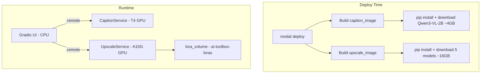
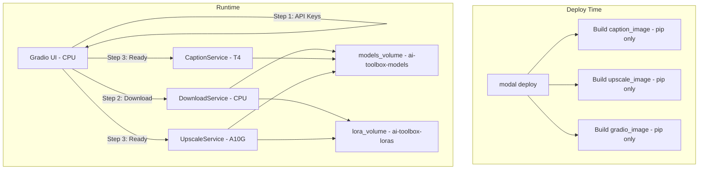
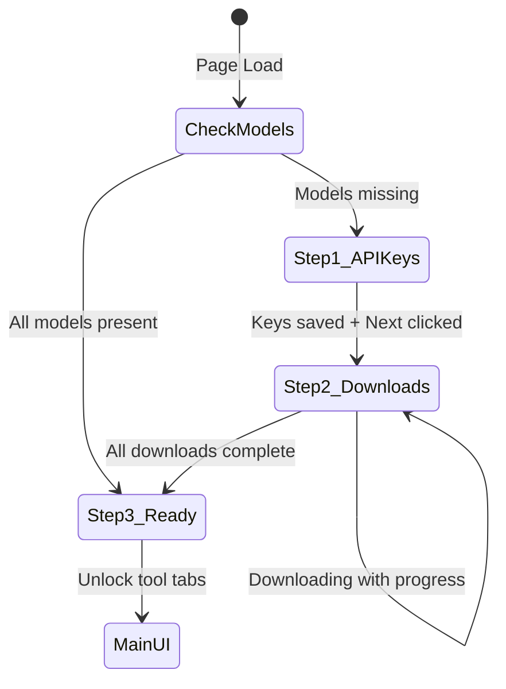
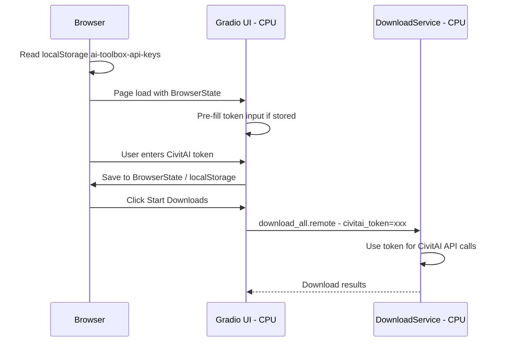

# Setup Wizard Design — AI Assets Toolbox

> **Status:** Draft  
> **Last updated:** 2026-02-22

## Table of Contents

1. [Overview](#overview)
2. [Current Architecture](#current-architecture)
3. [Target Architecture](#target-architecture)
4. [Volume Strategy](#volume-strategy)
5. [Image Simplification](#image-simplification)
6. [Setup Wizard UI](#setup-wizard-ui)
7. [Download Service](#download-service)
8. [GPU Service Changes](#gpu-service-changes)
9. [API Key Management](#api-key-management)
10. [LoRA Key Prefix Fix](#lora-key-prefix-fix)
11. [Concurrency and Idempotency](#concurrency-and-idempotency)
12. [File-by-File Change Summary](#file-by-file-change-summary)
13. [Implementation Plan](#implementation-plan)

---

## Overview

Replace the current "models baked into Docker images" approach with a **setup wizard** in the Gradio UI. Models are downloaded to a **Modal Volume** on first use, and subsequent visits skip straight to the tool if models are already present.

### Goals

- **Faster deploys** — `modal deploy` no longer downloads ~17 GB of models into image layers
- **Shared model storage** — all containers read from the same Volume
- **User-driven setup** — API keys entered in the browser, models downloaded on demand with progress feedback
- **Graceful degradation** — GPU services refuse work if models are missing, rather than crashing

---

## Current Architecture



**Problems:**
- Each `modal deploy` re-downloads ~17 GB if image layers are invalidated
- Models are duplicated: once in the image layer, once potentially on a volume
- No way for users to provide API keys without Modal Secrets
- CivitAI LoRAs are downloaded inside the GPU container's `@modal.enter`, wasting GPU time

---

## Target Architecture



---

## Volume Strategy

### Two Volumes

| Volume Name | Mount Point | Contents | Rationale |
|---|---|---|---|
| `ai-toolbox-models` | `/vol/models` | All base models: Illustrious-XL, ControlNet Tile, SDXL VAE, IP-Adapter, CLIP ViT-H, Qwen3-VL-2B | Shared across Caption + Upscale services; immutable after download |
| `ai-toolbox-loras` | `/vol/loras` | LoRA .safetensors files: hardcoded defaults + user uploads | Already exists; mutable at runtime |

**Why two volumes instead of one:**
- LoRAs are mutable (user uploads/deletes); base models are immutable after setup
- Separate volumes allow independent lifecycle management
- The existing `ai-toolbox-loras` volume is already in production with user data

### Volume Directory Layout

```
/vol/models/                          ← models_volume mount
├── illustrious-xl/
│   └── Illustrious-XL-v2.0.safetensors    (~6.5 GB)
├── controlnet-tile/
│   ├── config.json
│   └── diffusion_pytorch_model.safetensors (~2.5 GB)
├── sdxl-vae/
│   ├── config.json
│   └── diffusion_pytorch_model.safetensors (~335 MB)
├── ip-adapter/
│   └── ip-adapter-plus_sdxl_vit-h.safetensors (~100 MB)
├── clip-vit-h/
│   ├── config.json
│   ├── model.safetensors                   (~3.5 GB)
│   └── preprocessor_config.json
├── qwen3-vl-2b/
│   └── <all HF snapshot files>             (~4 GB)
└── .manifest.json                          ← tracks download status

/vol/loras/                           ← lora_volume mount
├── lora_929497.safetensors           ← Aesthetic Quality
├── lora_1231943.safetensors          ← Detailer IL
└── <user-uploaded>.safetensors
```

### Manifest File

A `.manifest.json` at the volume root tracks which models have been fully downloaded:

```json
{
  "version": 1,
  "models": {
    "illustrious-xl": {
      "status": "complete",
      "size_bytes": 6979321856,
      "downloaded_at": "2026-02-22T14:00:00Z"
    },
    "controlnet-tile": {
      "status": "complete",
      "size_bytes": 2502345678,
      "downloaded_at": "2026-02-22T14:05:00Z"
    }
  }
}
```

This prevents treating partially-downloaded files as complete after an interrupted download.

---

## Image Simplification

### Before: Models Baked In

[`caption_image`](src/app_config.py:42) and [`upscale_image`](src/app_config.py:80) each contain `.run_commands()` steps that download models at build time.

### After: Pip-Only Images

```python
# src/app_config.py — simplified

caption_image = (
    modal.Image.debian_slim(python_version="3.11")
    .apt_install("libgl1", "libglib2.0-0")
    .pip_install(
        "torch>=2.2.0",
        "torchvision>=0.17.0",
        "transformers>=4.53.0",
        "accelerate>=0.30.0",
        "safetensors>=0.4.0",
        "Pillow>=10.0.0",
        "qwen-vl-utils",
        "sentencepiece",
        "huggingface_hub",
    )
    .add_local_python_source("src")
)

upscale_image = (
    modal.Image.debian_slim(python_version="3.11")
    .apt_install("libgl1", "libglib2.0-0")
    .pip_install(
        "torch>=2.2.0",
        "torchvision>=0.17.0",
        "diffusers>=0.31.0",
        "transformers>=4.51.0",
        "accelerate>=0.30.0",
        "safetensors>=0.4.0",
        "Pillow>=10.0.0",
        "peft>=0.12.0",
        "controlnet-aux",
        "compel>=2.0.2",
        "huggingface_hub",
        "requests",
    )
    .add_local_python_source("src")
)

# Download service reuses the gradio_image (CPU, lightweight)
# but adds huggingface_hub and requests for downloading
gradio_image = (
    modal.Image.debian_slim(python_version="3.11")
    .pip_install(
        "gradio>=6.0.0",
        "fastapi",
        "Pillow>=10.0.0",
        "numpy",
        "modal",
        "huggingface_hub",
        "requests",
    )
    .add_local_python_source("src")
)
```

**Key changes:**
- Remove all `.run_commands()` that download models
- Remove `wget` from `apt_install` in `upscale_image`
- Add `huggingface_hub` and `requests` to `gradio_image` for the download service
- All model path constants change from `/app/models/...` to `/vol/models/...`

### New Volume + Constants in `app_config.py`

```python
# Volumes
models_volume = modal.Volume.from_name("ai-toolbox-models", create_if_missing=True)
lora_volume = modal.Volume.from_name("ai-toolbox-loras", create_if_missing=True)

# Model paths — now on the volume, not baked into the image
MODELS_DIR = "/vol/models"
ILLUSTRIOUS_XL_PATH = f"{MODELS_DIR}/illustrious-xl/Illustrious-XL-v2.0.safetensors"
CONTROLNET_TILE_PATH = f"{MODELS_DIR}/controlnet-tile"
SDXL_VAE_PATH = f"{MODELS_DIR}/sdxl-vae"
IP_ADAPTER_PATH = f"{MODELS_DIR}/ip-adapter/ip-adapter-plus_sdxl_vit-h.safetensors"
CLIP_VIT_H_PATH = f"{MODELS_DIR}/clip-vit-h"
CAPTION_MODEL_PATH = f"{MODELS_DIR}/qwen3-vl-2b"
LORAS_DIR = "/vol/loras"
```

---

## Setup Wizard UI

### Wizard Flow



### Gradio Implementation

The wizard is implemented as **conditional visibility** within the existing [`create_gradio_app()`](src/ui/gradio_app.py:764) function. No separate pages — just show/hide groups.

```python
def create_gradio_app() -> gr.Blocks:
    with gr.Blocks(title="AI Assets Toolbox") as demo:
        gr.Markdown("# AI Assets Toolbox")

        # --- Wizard state ---
        setup_complete = gr.State(value=False)
        api_keys_state = gr.BrowserState(
            storage_key="ai-toolbox-api-keys",
            default_value={"civitai_token": ""},
        )

        # --- Step 1: API Keys ---
        with gr.Group(visible=True) as step1_group:
            gr.Markdown("## Step 1: API Keys")
            gr.Markdown("Enter your CivitAI API token. ...")
            civitai_token_input = gr.Textbox(
                label="CivitAI API Token",
                type="password",
                placeholder="Paste your token here...",
            )
            step1_next_btn = gr.Button("Next →", variant="primary")

        # --- Step 2: Model Downloads ---
        with gr.Group(visible=False) as step2_group:
            gr.Markdown("## Step 2: Download Models")
            # One row per model with name, size, progress bar, status
            download_status_html = gr.HTML(value="")
            download_progress = gr.Progress()
            start_download_btn = gr.Button("Start Downloads", variant="primary")
            step2_status = gr.Textbox(label="Status", interactive=False)

        # --- Step 3: Ready / Main UI ---
        with gr.Group(visible=False) as step3_group:
            gr.Markdown("## Ready!")
            with gr.Tabs():
                _build_upscale_tab()
                _build_model_manager_tab()

        # --- Event wiring ---
        # On page load: check if models exist on volume
        demo.load(
            fn=_check_setup_status,
            outputs=[step1_group, step2_group, step3_group, setup_complete],
        )

        # Step 1 → Step 2
        step1_next_btn.click(
            fn=_save_api_keys,
            inputs=[civitai_token_input],
            outputs=[step1_group, step2_group, api_keys_state],
        )

        # Step 2: Start downloads
        start_download_btn.click(
            fn=_run_downloads,
            inputs=[api_keys_state],
            outputs=[download_status_html, step2_group, step3_group],
        )
```

### `gr.BrowserState` for API Keys

Gradio 6.x provides [`gr.BrowserState`](https://www.gradio.app/docs/gradio/browserstate) which persists data in the browser's `localStorage`. This is used to store the CivitAI API token so it survives page refreshes and browser restarts.

```python
api_keys_state = gr.BrowserState(
    storage_key="ai-toolbox-api-keys",
    default_value={"civitai_token": ""},
)
```

On page load, the stored token is read and pre-filled into the input. On save, the token is written back to `BrowserState`. The token is passed to backend functions as a regular Python dict argument — no Modal Secrets needed for user-provided keys.

### Progress Feedback

Gradio supports streaming progress via `gr.Progress()`. The download function yields progress updates:

```python
def _run_downloads(api_keys: dict, progress=gr.Progress()):
    """Download all required models with progress feedback."""
    civitai_token = api_keys.get("civitai_token", "")

    models = get_model_registry()  # list of model descriptors
    for i, model in enumerate(models):
        progress((i, len(models)), desc=f"Downloading {model.name}...")
        # Call the DownloadService to download this model
        DownloadService().download_model.remote(
            model_key=model.key,
            civitai_token=civitai_token,
        )

    return "<p>All models downloaded!</p>", gr.update(visible=False), gr.update(visible=True)
```

**Limitation:** `gr.Progress()` shows overall progress across models but not byte-level progress within a single model download. For byte-level progress, we would need to use `gr.HTML` with polling — see the detailed approach below.

### Detailed Per-Model Progress with Polling

For a richer UX with per-model byte-level progress bars:

1. The download service writes progress to a JSON file on the models volume: `/vol/models/.progress.json`
2. The Gradio UI polls this file every 2 seconds using `gr.Timer`
3. The HTML is re-rendered with updated progress bars

```python
# In the Gradio UI
progress_timer = gr.Timer(value=2, active=False)  # 2-second polling

progress_timer.tick(
    fn=_poll_download_progress,
    outputs=[download_status_html, progress_timer, step2_group, step3_group],
)

def _poll_download_progress():
    """Read progress from the volume and render HTML progress bars."""
    progress = DownloadService().get_progress.remote()
    html = _render_progress_html(progress)
    all_done = all(m["status"] == "complete" for m in progress["models"].values())
    if all_done:
        return html, gr.update(active=False), gr.update(visible=False), gr.update(visible=True)
    return html, gr.update(active=True), gr.update(visible=True), gr.update(visible=False)
```

---

## Download Service

A new **CPU-only** Modal class that handles model downloads. This avoids wasting GPU time on network I/O.

### New File: `src/services/download.py`

```python
@app.cls(
    image=gradio_image,  # lightweight CPU image with huggingface_hub + requests
    volumes={
        "/vol/models": models_volume,
        "/vol/loras": lora_volume,
    },
    timeout=1800,  # 30 min max for large downloads
    scaledown_window=60,
)
class DownloadService:
    """CPU-only service for downloading models to the shared volume."""

    @modal.method()
    def check_status(self) -> dict:
        """Check which models are downloaded and return status dict."""
        models_volume.reload()
        manifest = _read_manifest()
        return manifest

    @modal.method()
    def download_model(self, model_key: str, civitai_token: str = "") -> dict:
        """Download a single model to the volume. Idempotent."""
        models_volume.reload()
        registry = get_model_registry()
        model = registry[model_key]

        if _is_model_complete(model_key):
            return {"status": "already_complete"}

        # Download with progress tracking
        _download_with_progress(model, civitai_token)

        # Update manifest
        _mark_complete(model_key)
        models_volume.commit()
        return {"status": "complete"}

    @modal.method()
    def download_all(self, civitai_token: str = "") -> dict:
        """Download all required models. Idempotent per model."""
        results = {}
        for key in get_model_registry():
            results[key] = self.download_model(key, civitai_token)
        return results

    @modal.method()
    def get_progress(self) -> dict:
        """Return current download progress for all models."""
        models_volume.reload()
        return _read_progress()
```

### Model Registry

A centralized registry of all required models with their download sources:

```python
# src/services/model_registry.py

MODEL_REGISTRY = {
    "illustrious-xl": {
        "name": "Illustrious-XL v2.0",
        "size_bytes": 6_979_321_856,
        "dest_dir": "illustrious-xl",
        "dest_file": "Illustrious-XL-v2.0.safetensors",
        "source": "url",
        "url": "https://huggingface.co/OnomaAIResearch/Illustrious-XL-v2.0/resolve/main/Illustrious-XL-v2.0.safetensors",
    },
    "controlnet-tile": {
        "name": "ControlNet Tile SDXL",
        "size_bytes": 2_502_345_678,
        "dest_dir": "controlnet-tile",
        "source": "hf_repo",
        "hf_repo": "xinsir/controlnet-tile-sdxl-1.0",
        "hf_files": ["config.json", "diffusion_pytorch_model.safetensors"],
    },
    "sdxl-vae": {
        "name": "SDXL VAE fp16-fix",
        "size_bytes": 335_000_000,
        "dest_dir": "sdxl-vae",
        "source": "hf_repo",
        "hf_repo": "madebyollin/sdxl-vae-fp16-fix",
        "hf_files": ["config.json", "diffusion_pytorch_model.safetensors"],
    },
    "ip-adapter": {
        "name": "IP-Adapter Plus SDXL ViT-H",
        "size_bytes": 100_000_000,
        "dest_dir": "ip-adapter",
        "dest_file": "ip-adapter-plus_sdxl_vit-h.safetensors",
        "source": "url",
        "url": "https://huggingface.co/h94/IP-Adapter/resolve/main/sdxl_models/ip-adapter-plus_sdxl_vit-h.safetensors",
    },
    "clip-vit-h": {
        "name": "CLIP ViT-H-14",
        "size_bytes": 3_500_000_000,
        "dest_dir": "clip-vit-h",
        "source": "hf_repo",
        "hf_repo": "laion/CLIP-ViT-H-14-laion2B-s32B-b79K",
        "hf_files": ["config.json", "model.safetensors", "preprocessor_config.json"],
    },
    "qwen3-vl-2b": {
        "name": "Qwen3-VL-2B-Instruct",
        "size_bytes": 4_000_000_000,
        "dest_dir": "qwen3-vl-2b",
        "source": "hf_snapshot",
        "hf_repo": "Qwen/Qwen3-VL-2B-Instruct",
    },
    "lora-aesthetic-quality": {
        "name": "Aesthetic Quality LoRA",
        "size_bytes": 50_000_000,
        "dest_dir": None,  # goes to lora_volume
        "dest_file": "lora_929497.safetensors",
        "source": "civitai",
        "civitai_model_id": 929497,
        "volume": "loras",
    },
    "lora-detailer-il": {
        "name": "Detailer IL LoRA",
        "size_bytes": 50_000_000,
        "dest_dir": None,
        "dest_file": "lora_1231943.safetensors",
        "source": "civitai",
        "civitai_model_id": 1231943,
        "volume": "loras",
    },
}
```

### Download Logic

```python
def _download_with_progress(model: dict, civitai_token: str = ""):
    """Download a model and write progress to .progress.json."""
    base_dir = "/vol/loras" if model.get("volume") == "loras" else "/vol/models"

    if model["source"] == "url":
        _download_url(model["url"], base_dir, model["dest_dir"], model["dest_file"])
    elif model["source"] == "hf_repo":
        _download_hf_files(model["hf_repo"], model["hf_files"], base_dir, model["dest_dir"])
    elif model["source"] == "hf_snapshot":
        _download_hf_snapshot(model["hf_repo"], base_dir, model["dest_dir"])
    elif model["source"] == "civitai":
        _download_civitai(model["civitai_model_id"], base_dir, model["dest_file"], civitai_token)


def _download_url(url: str, base_dir: str, dest_dir: str, dest_file: str):
    """Stream-download a URL with progress tracking."""
    import requests

    dest = os.path.join(base_dir, dest_dir, dest_file) if dest_dir else os.path.join(base_dir, dest_file)
    os.makedirs(os.path.dirname(dest), exist_ok=True)

    # Use .partial suffix to avoid treating incomplete files as done
    partial_path = dest + ".partial"

    resp = requests.get(url, stream=True, timeout=600)
    resp.raise_for_status()
    total = int(resp.headers.get("content-length", 0))

    with open(partial_path, "wb") as f:
        downloaded = 0
        for chunk in resp.iter_content(chunk_size=1024 * 1024):  # 1 MB chunks
            f.write(chunk)
            downloaded += len(chunk)
            _write_progress(model_key, downloaded, total)

    # Atomic rename: partial → final
    os.rename(partial_path, dest)
```

### Resume Support

For interrupted downloads:
- Files are written with a `.partial` suffix
- On restart, if a `.partial` file exists, the download restarts from scratch (HTTP range requests are unreliable across CDNs)
- The `.manifest.json` only marks a model as `"complete"` after the final rename succeeds
- `huggingface_hub` has built-in resume support via its cache mechanism

---

## GPU Service Changes

### UpscaleService Changes

In [`src/gpu/upscale.py`](src/gpu/upscale.py:104):

1. **Mount the models volume** alongside the lora volume:

```python
@app.cls(
    gpu="A10G",
    image=upscale_image,
    volumes={
        "/vol/models": models_volume,
        "/vol/loras": lora_volume,
    },
    scaledown_window=300,
    timeout=600,
)
```

2. **Update model path constants** from `/app/models/...` to `/vol/models/...`:

```python
MODELS_DIR = "/vol/models"
ILLUSTRIOUS_XL_PATH = f"{MODELS_DIR}/illustrious-xl/Illustrious-XL-v2.0.safetensors"
# ... etc
```

3. **Guard `@modal.enter()`** against missing models:

```python
@modal.enter()
def load_models(self) -> None:
    models_volume.reload()

    # Check that all required model files exist
    required_files = [
        ILLUSTRIOUS_XL_PATH,
        os.path.join(CONTROLNET_TILE_PATH, "diffusion_pytorch_model.safetensors"),
        os.path.join(SDXL_VAE_PATH, "diffusion_pytorch_model.safetensors"),
        IP_ADAPTER_PATH,
        os.path.join(CLIP_VIT_H_PATH, "model.safetensors"),
    ]
    missing = [f for f in required_files if not os.path.isfile(f)]
    if missing:
        logger.error("Models not yet downloaded: %s", missing)
        self._models_ready = False
        return

    self._models_ready = True
    # ... proceed with existing model loading logic
```

4. **Guard all `@modal.method()` calls**:

```python
@modal.method()
def upscale_tiles(self, tiles, ...):
    if not self._models_ready:
        raise RuntimeError(
            "Models not downloaded yet. Please complete the setup wizard first."
        )
    # ... existing logic
```

5. **Remove `_ensure_loras_downloaded()`** from `@modal.enter()` — LoRA downloads are now handled by the setup wizard's DownloadService.

### CaptionService Changes

In [`src/gpu/caption.py`](src/gpu/caption.py:65):

1. **Mount the models volume**:

```python
@app.cls(
    gpu="T4",
    image=caption_image,
    volumes={"/vol/models": models_volume},
    scaledown_window=300,
    timeout=600,
)
```

2. **Update model path** from `/app/models/qwen3-vl-2b` to `/vol/models/qwen3-vl-2b`

3. **Guard `@modal.enter()`** against missing model:

```python
@modal.enter()
def load_model(self) -> None:
    models_volume.reload()

    if not os.path.isdir(MODEL_PATH):
        logger.error("Qwen3-VL-2B not found at %s", MODEL_PATH)
        self._model_ready = False
        return

    self._model_ready = True
    # ... existing loading logic
```

4. **Remove `secrets=[modal.Secret.from_name(...)]`** — API keys are now passed from the browser, not from Modal Secrets.

### Removing Modal Secrets Dependency

The `secrets=[modal.Secret.from_name("ai-toolbox-secrets")]` can be removed from both GPU services. The CivitAI token is now:
- Stored in the browser via `gr.BrowserState`
- Passed to `DownloadService` as a function argument
- Never stored server-side (except transiently during download)

---

## API Key Management

### Flow



### Security Considerations

- The CivitAI token is stored **only in the user's browser** via `localStorage`
- It is transmitted to the Modal backend over HTTPS (Modal's default)
- It is used transiently during downloads and never persisted server-side
- If the user clears their browser data, they re-enter the token on next visit

### `gr.BrowserState` Usage

```python
# Define the state component
api_keys = gr.BrowserState(
    storage_key="ai-toolbox-api-keys",
    default_value={"civitai_token": ""},
)

# On page load, populate the input from stored state
demo.load(
    fn=lambda keys: keys.get("civitai_token", ""),
    inputs=[api_keys],
    outputs=[civitai_token_input],
)

# On save, update the BrowserState
save_btn.click(
    fn=lambda token: {"civitai_token": token},
    inputs=[civitai_token_input],
    outputs=[api_keys],
)
```

---

## LoRA Key Prefix Fix

### Problem

The "Aesthetic Quality" LoRA (CivitAI #929497) fails to load via `pipe.load_lora_weights()` because its state dict keys use a non-standard prefix that doesn't match what diffusers expects.

### Solution: Key Remapping on Download

When downloading CivitAI LoRAs, apply a key-remapping step that converts non-standard prefixes to the diffusers-expected format. This is done **once at download time**, not at every load.

```python
def _fix_lora_keys(filepath: str) -> None:
    """Remap LoRA state dict keys to diffusers-compatible prefixes."""
    from safetensors.torch import load_file, save_file

    state_dict = load_file(filepath)

    # Common prefix mappings for SDXL LoRAs
    PREFIX_MAP = {
        "lora_unet_": "unet.",
        "lora_te1_": "text_encoder.",
        "lora_te2_": "text_encoder_2.",
    }

    needs_fix = False
    new_state_dict = {}
    for key, value in state_dict.items():
        new_key = key
        for old_prefix, new_prefix in PREFIX_MAP.items():
            if key.startswith(old_prefix):
                # Convert from A1111/Kohya format to diffusers format
                new_key = _convert_key(key, old_prefix, new_prefix)
                needs_fix = True
                break
        new_state_dict[new_key] = value

    if needs_fix:
        # Back up original, save fixed version
        backup_path = filepath + ".original"
        os.rename(filepath, backup_path)
        save_file(new_state_dict, filepath)
        logger.info("Fixed LoRA key prefixes in %s", filepath)
```

**Alternative approach:** If key remapping is too fragile, use `diffusers`' built-in `convert_lora_state_dict` utilities or load via `peft` which handles more formats. This should be investigated during implementation.

---

## Concurrency and Idempotency

### Multiple Users Sharing the Same Volume

Since all users share the same Modal deployment and volumes:

1. **Idempotent downloads** — `_is_model_complete()` checks the manifest before downloading. If a model is already marked complete, skip it.

2. **File-level locking** — Use `.partial` suffix files. Only one download writes to a given `.partial` file at a time. The atomic `os.rename()` at the end ensures readers never see a half-written file.

3. **Volume reload before reads** — Always call `volume.reload()` before checking file existence to get the latest state from other containers.

4. **Volume commit after writes** — Always call `volume.commit()` after writing files to make them visible to other containers.

5. **Race condition handling** — If two users trigger downloads simultaneously:
   - Both check the manifest → both see "not complete"
   - Both start downloading → both write to `.partial` files
   - First to finish renames `.partial` → final, updates manifest, commits
   - Second finishes, tries to rename → file already exists, which is fine (overwrite with identical content)
   - Net result: correct, just slightly wasteful

### Preventing Duplicate GPU Spin-Up

The Gradio UI should **not** call GPU services until the setup wizard confirms all models are present. The `_models_ready` guard in `@modal.enter()` provides a safety net.

---

## File-by-File Change Summary

| File | Action | Description |
|---|---|---|
| [`src/app_config.py`](src/app_config.py) | **Modify** | Remove model download steps from images; add `models_volume`; export path constants |
| [`src/gpu/upscale.py`](src/gpu/upscale.py) | **Modify** | Mount `models_volume`; update paths to `/vol/models/...`; add `_models_ready` guard; remove `_ensure_loras_downloaded` from `@modal.enter()`; remove Modal Secrets |
| [`src/gpu/caption.py`](src/gpu/caption.py) | **Modify** | Mount `models_volume`; update path to `/vol/models/qwen3-vl-2b`; add `_model_ready` guard; remove Modal Secrets |
| [`src/ui/gradio_app.py`](src/ui/gradio_app.py) | **Modify** | Add setup wizard steps before main UI; use `gr.BrowserState` for API keys; add download progress polling |
| `src/services/__init__.py` | **Create** | Package init for services module |
| `src/services/download.py` | **Create** | `DownloadService` Modal class — CPU-only model downloader |
| `src/services/model_registry.py` | **Create** | Centralized model registry with download sources and sizes |
| [`src/app.py`](src/app.py) | **Modify** | Import `DownloadService` to register it with the app |

---

## Implementation Plan

### Phase 1: Infrastructure

1. Create `src/services/model_registry.py` with the model registry
2. Create `src/services/download.py` with the `DownloadService` class
3. Create `src/services/__init__.py`
4. Modify `src/app_config.py`:
   - Remove all `.run_commands()` model download steps
   - Add `models_volume` definition
   - Export all model path constants pointing to `/vol/models/...`
   - Add `huggingface_hub` and `requests` to `gradio_image`

### Phase 2: GPU Service Updates

5. Modify `src/gpu/upscale.py`:
   - Mount `models_volume` in `@app.cls()`
   - Update all path constants to use `app_config` exports
   - Add `_models_ready` guard to `@modal.enter()` and all `@modal.method()` calls
   - Remove `_ensure_loras_downloaded()` call from `@modal.enter()`
   - Remove `secrets=` from `@app.cls()`
6. Modify `src/gpu/caption.py`:
   - Mount `models_volume` in `@app.cls()`
   - Update `MODEL_PATH` to use `app_config` export
   - Add `_model_ready` guard
   - Remove `secrets=` from `@app.cls()`

### Phase 3: Setup Wizard UI

7. Modify `src/ui/gradio_app.py`:
   - Add `gr.BrowserState` for API key persistence
   - Add Step 1 (API Keys) group with token input
   - Add Step 2 (Downloads) group with progress display
   - Add Step 3 (Ready) group wrapping existing tabs
   - Wire up page-load check, step transitions, and download polling
   - Add `_check_setup_status()`, `_poll_download_progress()`, `_render_progress_html()` helpers

### Phase 4: Entrypoint + LoRA Fix

8. Modify `src/app.py` to import `DownloadService`
9. Implement LoRA key prefix remapping in `src/services/download.py`
10. Test end-to-end: deploy → wizard → download → upscale

### Phase 5: Cleanup

11. Remove `_ensure_loras_downloaded()` function from `src/gpu/upscale.py`
12. Remove `HARDCODED_LORAS` download logic from `src/gpu/upscale.py` (keep the dict for trigger word lookup)
13. Update `deploy.ps1` / `serve.ps1` if needed
14. Update `README.md` and `docs/MODAL_DEPLOY.md` with new setup flow
