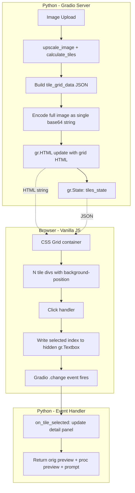
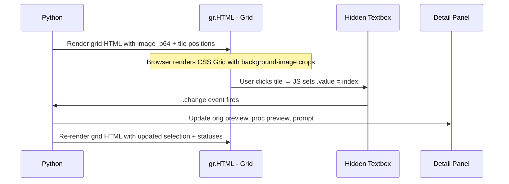
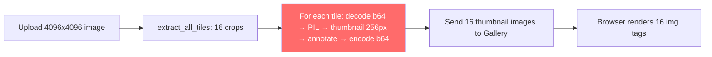
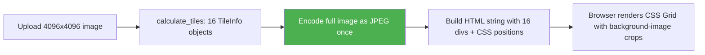

# Custom HTML/JS Tile Grid — Design Document

> **Status:** Draft  
> **Scope:** Replace `gr.Gallery` in [`upscale_tab.py`](../frontend/tabs/upscale_tab.py) with a custom CSS-Grid component rendered via `gr.HTML` + vanilla JS.

---

## 1. Problem Statement

The current tile grid uses [`gr.Gallery`](../frontend/tabs/upscale_tab.py:518) which suffers from:

| Problem | Root Cause |
|---------|-----------|
| Tiles cropped / inconsistent sizing | Gallery uses `object-fit` on individual `` elements; column count set after render via `gr.update(columns=...)` |
| Slow rendering after upload | [`_build_gallery_items()`](../frontend/tabs/upscale_tab.py:168) decodes every tile from base64, generates a 256×256 annotated thumbnail in Python, then re-encodes — all synchronously |
| Poor visual feedback | Selection highlight requires a full gallery rebuild in Python ([`on_gallery_select()`](../frontend/tabs/upscale_tab.py:806) calls `_build_gallery_items()` again) |
| Column count mismatch | `gr.update(columns=grid_cols)` is applied in a `.then()` chain, causing a flash of wrong layout |

---

## 2. High-Level Architecture



### Key Idea

Instead of generating N individual thumbnail images in Python, we send **one** base64-encoded full image to the browser and use CSS `background-image` + `background-position` on each tile `<div>` to show the correct crop. The browser does the cropping — zero Python image processing for display.

---

## 3. Gradio Component Mapping

| Purpose | Gradio Component | Notes |
|---------|-----------------|-------|
| Tile grid display | `gr.HTML` (elem_id=`tile-grid-html`) | Receives full HTML string including inline `<style>` and `<script>` |
| Full image data | `gr.State` | Stores base64 of the upscaled image — passed into the HTML builder |
| Tile metadata | `gr.State` (existing `tiles_state`) | List of dicts with `info`, `tile_id`, `original_b64`, `processed_b64`, `prompt` |
| Grid dimensions | `gr.State` (existing `grid_cols_state`) | Number of columns |
| Selected tile index | Hidden `gr.Textbox` (elem_id=`tile-selected-idx`) | JS writes the clicked index here; Python `.change()` handler reads it |
| Tile status updates | Hidden `gr.Textbox` (elem_id=`tile-status-json`) | Python writes JSON with per-tile status; JS reads on update |

### Communication Flow



---

## 4. HTML Structure

The Python function `_build_tile_grid_html()` returns a single HTML string:

```html
<div id="tile-grid-root"
     data-rows="4"
     data-cols="4"
     data-tile-w="1024"
     data-tile-h="1024"
     data-img-w="4096"
     data-img-h="4096"
     data-selected="-1">

  <div class="tile-grid"
       style="grid-template-columns: repeat(4, 1fr);
              aspect-ratio: 4096 / 4096;">

    <!-- One div per tile, row-major order -->
    <div class="tile"
         data-idx="0"
         data-row="0"
         data-col="0"
         data-status="default"
         style="background-image: url(data:image/jpeg;base64,...);
                background-size: 400% 400%;
                background-position: 0% 0%;">
      <span class="tile-label">0,0</span>
      <span class="tile-status-icon"></span>
    </div>

    <div class="tile"
         data-idx="1"
         data-row="0"
         data-col="1"
         data-status="processed"
         style="background-image: url(data:image/jpeg;base64,...);
                background-size: 400% 400%;
                background-position: 33.33% 0%;">
      <span class="tile-label">0,1 ✓</span>
      <span class="tile-status-icon">✓</span>
    </div>

    <!-- ... more tiles ... -->
  </div>
</div>

<style>
  /* See Section 5 */
</style>

<script>
  /* See Section 6 */
</script>
```

### Background-Position Calculation

For a grid of `C` columns and `R` rows (without overlap for display purposes):

```
background-size: (C * 100)% (R * 100)%;
background-position: (col / (C - 1) * 100)% (row / (R - 1) * 100)%;
```

For tiles with overlap, the position must account for the actual pixel offset:

```
background-position: -${tile.x * scale}px -${tile.y * scale}px;
background-size: ${imgW * scale}px ${imgH * scale}px;
```

Where `scale = displayTileWidth / tile.w` — this ensures each tile div shows exactly the right crop of the full image at the correct scale.

---

## 5. CSS Design

```css
/* ── Grid Container ─────────────────────────────────────── */
.tile-grid {
  display: grid;
  gap: 2px;
  width: 100%;
  border-radius: 8px;
  overflow: hidden;
  background: #1a1b2e;
}

/* ── Individual Tile ────────────────────────────────────── */
.tile {
  position: relative;
  aspect-ratio: 1 / 1;
  background-repeat: no-repeat;
  border: 2px solid transparent;
  border-radius: 4px;
  cursor: pointer;
  transition: border-color 0.15s ease, box-shadow 0.15s ease;
  overflow: hidden;
}

/* ── Tile States ────────────────────────────────────────── */

/* Default — unprocessed */
.tile[data-status=default] {
  border-color: #333;
}

/* Selected — blue highlight */
.tile.selected {
  border-color: #1e6fff;
  box-shadow: 0 0 0 2px rgba(30, 111, 255, 0.35);
  z-index: 1;
}

/* Processed — green border + subtle tint */
.tile[data-status=processed] {
  border-color: #00c853;
}
.tile[data-status=processed]::after {
  content: '';
  position: absolute;
  inset: 0;
  background: rgba(0, 200, 80, 0.08);
  pointer-events: none;
}

/* Processing — pulsing animation */
.tile[data-status=processing] {
  border-color: #ffa726;
  animation: tile-pulse 1.2s ease-in-out infinite;
}
@keyframes tile-pulse {
  0%, 100% { box-shadow: 0 0 0 0 rgba(255, 167, 38, 0.4); }
  50%      { box-shadow: 0 0 0 6px rgba(255, 167, 38, 0); }
}

/* Hover */
.tile:hover {
  border-color: #4a80ff;
}

/* ── Overlay Labels ─────────────────────────────────────── */
.tile-label {
  position: absolute;
  top: 3px;
  left: 3px;
  background: rgba(0, 0, 0, 0.7);
  color: #fff;
  font-size: 11px;
  padding: 1px 5px;
  border-radius: 3px;
  pointer-events: none;
  font-family: monospace;
}

.tile-status-icon {
  position: absolute;
  bottom: 3px;
  right: 3px;
  font-size: 14px;
  pointer-events: none;
}
.tile[data-status=processed] .tile-status-icon::after {
  content: '✓';
  color: #00c853;
  text-shadow: 0 0 3px rgba(0, 0, 0, 0.8);
}
.tile[data-status=processing] .tile-status-icon::after {
  content: '⏳';
}

/* ── Responsive ─────────────────────────────────────────── */
@media (max-width: 900px) {
  .tile-grid {
    gap: 1px;
  }
  .tile-label {
    font-size: 9px;
  }
}
```

---

## 6. JavaScript Logic

The `<script>` block is embedded in the HTML string returned by `_build_tile_grid_html()`. It runs each time the `gr.HTML` component is updated.

```javascript
(function() {
  const root = document.getElementById('tile-grid-root');
  if (!root) return;

  const tiles = root.querySelectorAll('.tile');
  const selectedIdx = parseInt(root.dataset.selected, 10);

  // Apply selected class
  tiles.forEach((tile, i) => {
    tile.classList.toggle('selected', i === selectedIdx);
  });

  // Click handler — write to hidden textbox to notify Python
  root.addEventListener('click', function(e) {
    const tileEl = e.target.closest('.tile');
    if (!tileEl) return;

    const idx = parseInt(tileEl.dataset.idx, 10);

    // Update visual selection immediately (no round-trip)
    tiles.forEach(t => t.classList.remove('selected'));
    tileEl.classList.add('selected');

    // Write to hidden Gradio textbox to trigger Python handler
    const hiddenInput = document.querySelector('#tile-selected-idx textarea');
    if (hiddenInput) {
      // Use Gradio's input event dispatch pattern
      const nativeInputValueSetter =
        Object.getOwnPropertyDescriptor(
          window.HTMLTextAreaElement.prototype, 'value'
        ).set;
      nativeInputValueSetter.call(hiddenInput, String(idx));
      hiddenInput.dispatchEvent(new Event('input', { bubbles: true }));
    }
  });
})();
```

### Key Design Decisions

1. **Immediate visual feedback**: The JS toggles the `selected` class instantly on click, before the Python round-trip completes. This makes the UI feel responsive.

2. **Hidden textbox communication**: We use the native setter + `input` event dispatch pattern because Gradio's textarea components listen for `input` events to detect value changes. This is a well-known pattern for programmatically triggering Gradio events from JS.

3. **No framework**: Pure vanilla JS — no React, no Lit, no dependencies. The script is self-contained in an IIFE to avoid polluting the global scope.

4. **Idempotent re-render**: Each time Python updates the `gr.HTML`, the entire grid HTML is replaced. The script re-runs and re-attaches listeners. This is simple and avoids stale state issues.

---

## 7. Python Integration

### 7.1 New Function: `_build_tile_grid_html()`

This replaces [`_build_gallery_items()`](../frontend/tabs/upscale_tab.py:168).

```python
def _build_tile_grid_html(
    tiles_state: List[Dict],
    selected_idx: int,
    full_image_b64: str,
    img_w: int,
    img_h: int,
) -> str:
    """Build the HTML string for the custom tile grid component."""
```

**Parameters:**
- `tiles_state` — the existing tile state list
- `selected_idx` — currently selected tile index (-1 for none)
- `full_image_b64` — base64-encoded JPEG of the full upscaled image
- `img_w`, `img_h` — pixel dimensions of the full image

**Returns:** A complete HTML string with `<div>`, `<style>`, and `<script>` tags.

**Logic:**
1. Determine `grid_cols` and `grid_rows` from tile infos
2. For each tile, compute `background-position` and `background-size` based on [`TileInfo.x`](../frontend/tiling.py:24), [`TileInfo.y`](../frontend/tiling.py:25), [`TileInfo.w`](../frontend/tiling.py:26), [`TileInfo.h`](../frontend/tiling.py:27) and the display scale
3. Set `data-status` based on `tile["processed_b64"]` presence
4. Embed the CSS and JS inline

### 7.2 New State: `full_image_b64_state`

A new `gr.State` to hold the JPEG-encoded base64 of the full upscaled image. This is set once during [`_on_image_upload()`](../frontend/tabs/upscale_tab.py:205) and reused for every grid re-render.

```python
full_image_b64_state = gr.State(value="")
```

In `_on_image_upload()`, after upscaling:
```python
# Encode full image as JPEG for the grid (much smaller than PNG)
full_image_b64 = _pil_to_b64(upscaled, fmt="JPEG")
```

### 7.3 Replace `gr.Gallery` with `gr.HTML`

```python
# OLD
tile_gallery = gr.Gallery(
    label="Tile Grid",
    columns=4,
    height=380,
    ...
)

# NEW
tile_grid_html = gr.HTML(
    value="<p style='color:#888;'>Upload an image to see the tile grid.</p>",
    elem_id="tile-grid-container",
)
```

### 7.4 Hidden Textbox for Selection

```python
tile_selected_idx_tb = gr.Textbox(
    value="-1",
    visible=False,
    elem_id="tile-selected-idx",
)
```

### 7.5 Updated Event Wiring

```python
# On image upload — now returns HTML instead of gallery items
image_input.upload(
    fn=on_upload,
    inputs=[image_input, resolution_dd, custom_w, custom_h,
            tile_size_num, overlap_num],
    outputs=[tiles_state, selected_idx_state, original_img_state,
             grid_cols_state, full_image_b64_state,
             tile_grid_html, status_text],
)

# On tile click — hidden textbox changes
tile_selected_idx_tb.change(
    fn=on_tile_selected,
    inputs=[tile_selected_idx_tb, tiles_state, full_image_b64_state],
    outputs=[selected_idx_state, tile_orig_preview, tile_proc_preview,
             tile_prompt_box, tile_grid_html],
)
```

---

## 8. Performance Optimization

### Before (Gallery approach)



**Bottleneck**: Step C runs 16× in Python — each involving PIL decode, resize, draw, encode. For a 4×4 grid this takes ~1-2 seconds. For 8×8 it takes ~5+ seconds.

### After (CSS background-image approach)



**Improvement**:
- Step B is pure math — microseconds
- Step C is one JPEG encode — ~100ms for 4096×4096
- Step D is string concatenation — microseconds
- Step E is native browser rendering — near-instant

**Net result**: Grid appears ~10× faster after upload. Selection changes are even faster because we only rebuild the HTML string (no image processing at all).

### Image Size Optimization

The full image base64 for a 4096×4096 JPEG at quality 85 is ~2-4 MB. This is sent once and cached in `gr.State`. For comparison, the old approach sent 16 × 256×256 PNG thumbnails ≈ 16 × ~50KB = ~800KB, but with the Python processing overhead.

To further optimize:
- Use JPEG quality 75 for the grid display image (visual quality is fine at thumbnail scale)
- Optionally downscale the grid display image to 2048×2048 (half resolution) — still plenty for a ~400px-wide grid display

---

## 9. Migration Plan

### Files to Modify

| File | Changes |
|------|---------|
| [`frontend/tabs/upscale_tab.py`](../frontend/tabs/upscale_tab.py) | Replace Gallery with HTML grid; add hidden textbox; update all event handlers |
| [`frontend/app.py`](../frontend/app.py) | Update CSS: remove `.tile-grid-gallery` rules, add new `.tile-grid` / `.tile` rules |

### Functions to Remove

- [`_make_tile_thumbnail()`](../frontend/tabs/upscale_tab.py:113) — no longer needed
- [`_build_gallery_items()`](../frontend/tabs/upscale_tab.py:168) — replaced by `_build_tile_grid_html()`
- `_THUMB_SIZE` constant (line 110)

### Functions to Add

- `_build_tile_grid_html()` — generates the complete HTML/CSS/JS string
- `_encode_grid_image()` — encodes the full image as JPEG base64 for grid display (with optional downscale)

### Functions to Modify

- [`_on_image_upload()`](../frontend/tabs/upscale_tab.py:205) — return HTML string + full_image_b64 instead of gallery items
- [`on_gallery_select()`](../frontend/tabs/upscale_tab.py:806) → rename to `on_tile_selected()` — reads index from hidden textbox instead of `gr.SelectData`
- [`on_upscale_all()`](../frontend/tabs/upscale_tab.py:897) — return HTML string instead of gallery items
- [`on_upscale_selected()`](../frontend/tabs/upscale_tab.py:1055) — return HTML string instead of gallery items
- [`on_caption_all()`](../frontend/tabs/upscale_tab.py:1106) — return HTML string instead of gallery items

### Step-by-Step Migration

1. **Add `_build_tile_grid_html()` and `_encode_grid_image()`** — new functions, no existing code affected
2. **Add `full_image_b64_state` and `tile_selected_idx_tb`** — new Gradio components in the tab builder
3. **Replace `gr.Gallery` with `gr.HTML`** in the layout section
4. **Update `_on_image_upload()`** to return grid HTML + full_image_b64 instead of gallery items
5. **Replace `tile_gallery.select()` handler** with `tile_selected_idx_tb.change()` handler
6. **Update all upscale/caption handlers** to return grid HTML instead of gallery items
7. **Move CSS** from inline `<style>` in the HTML to [`app.py`](../frontend/app.py:45) `_CSS` block (or keep inline — both work)
8. **Remove** `_make_tile_thumbnail()`, `_build_gallery_items()`, and `_THUMB_SIZE`
9. **Test** with various grid sizes (2×2, 4×4, 8×8) and verify selection, processing status, and responsive behavior

---

## 10. Edge Cases and Considerations

### Non-Square Tiles at Edges

[`calculate_tiles()`](../frontend/tiling.py:84) can produce tiles smaller than `tile_size` at the right/bottom edges (see [line 124-125](../frontend/tiling.py:124)). The CSS background-position calculation must account for variable tile dimensions. Each tile div's `aspect-ratio` should be set to `tile.w / tile.h` instead of assuming 1:1.

### Overlap Visualization

Tiles with overlap share pixels. In the grid display, each tile shows its full extent including overlap regions. This is correct behavior — the overlap is only relevant during blending, not display.

### Large Grids

An 8K×8K image with 1024px tiles and 128px overlap produces an 8×8 = 64 tile grid. The HTML string will contain 64 `<div>` elements — trivial for the browser. The single background image is shared across all divs (browser caches it).

### Dark Mode Compatibility

The CSS uses dark-theme colors consistent with the existing [`app.py`](../frontend/app.py:45) theme. The Gradio `Soft()` theme is dark by default in this app.

### Gradio Version Compatibility

The hidden textbox + JS event dispatch pattern works with Gradio 3.x and 4.x. The `gr.HTML` component is stable across versions. No Gradio-internal APIs are used.
