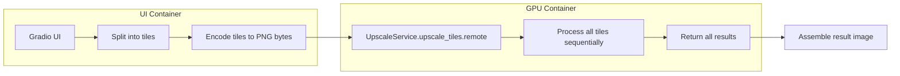
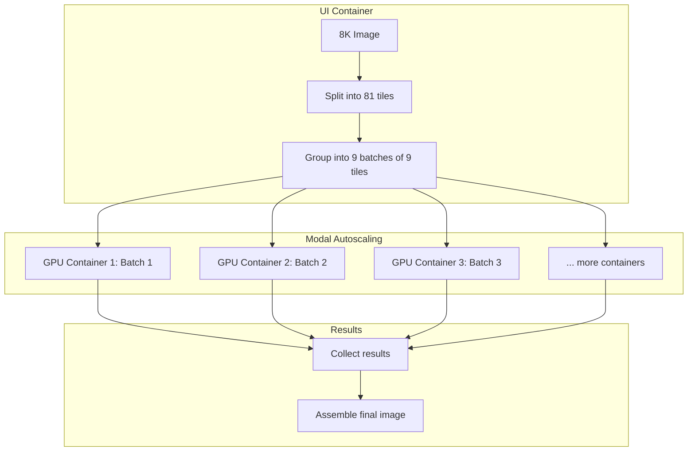
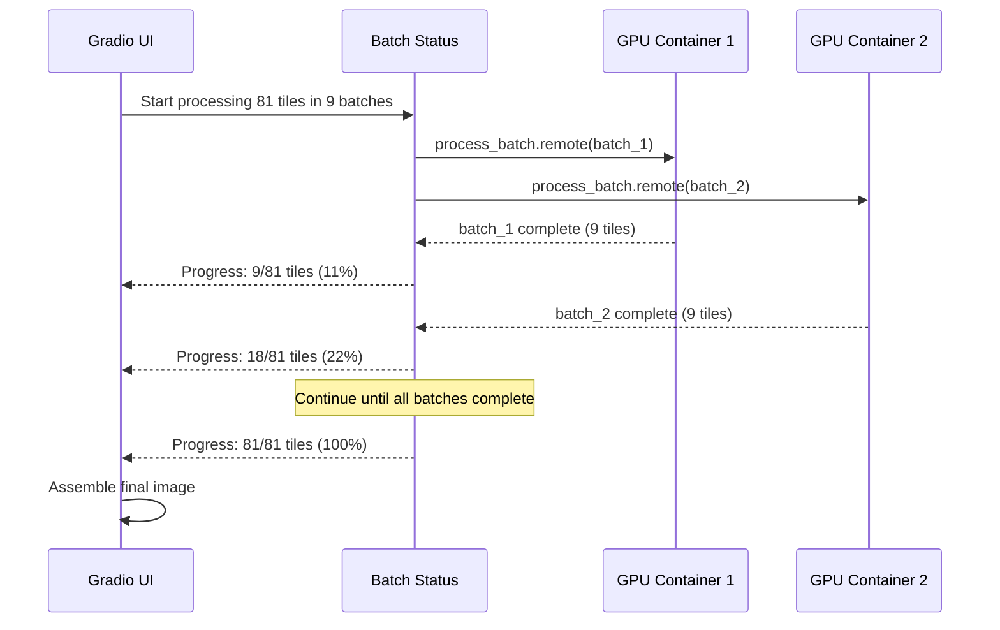

# 8K Image Upscaling Batch Processing Design

## Problem Statement

The current upscaling implementation cannot handle 8K images within Modal's timeout constraints:

| Parameter | Current Value |
|-----------|---------------|
| Timeout | 2400s (40 minutes) |
| Per-tile processing time | ~57 seconds |
| Current capacity | ~35 tiles |
| **8K requirement** | **81 tiles** (8192×8192 with 1024px tiles, 128px overlap) |
| **8K total time** | **~77 minutes** (exceeds timeout) |

## Current Architecture Analysis

### Data Flow



### Key Files

| File | Role | Key Method |
|------|------|------------|
| [`src/gpu/upscale.py`](src/gpu/upscale.py:90) | GPU service | `UpscaleService.upscale_tiles()` |
| [`src/ui/gradio_app.py`](src/ui/gradio_app.py:650) | UI orchestration | `_upscale_tiles_batch()` |
| [`src/tiling.py`](src/tiling.py:78) | Tile generation | `calculate_tiles()` |

### Current Constraints

1. **Single remote call**: All tiles processed in one `.remote()` call
2. **Sequential processing**: Tiles processed one-by-one in a for loop
3. **Container lifecycle**: Models loaded once via `@modal.enter()`, stay resident
4. **GPU memory**: A10G has 24GB VRAM with SDXL + ControlNet + IP-Adapter loaded

---

## Modal Parallel Processing Options

### Option A: `.map()` for Parallel Containers

```python
# Process each tile in a separate container
results = list(process_single_tile.map(tile_payloads))
```

**Pros:**
- True parallelism across containers
- Scales with tile count
- Built-in autoscaling

**Cons:**
- Cold start for each container (~30-60s model loading)
- High overhead for many tiles
- GPU memory underutilization (one tile per GPU)

### Option B: `@modal.concurrent` for Input Concurrency

```python
@app.cls(gpu="A10G")
@modal.concurrent(max_inputs=4)
class UpscaleService:
    ...
```

**Pros:**
- No additional cold starts
- Efficient for I/O-bound workloads

**Cons:**
- GPU memory constraints with SDXL
- Thread-safety concerns with PyTorch
- Not ideal for GPU-bound diffusion workloads

### Option C: Batched Parallel Processing (Recommended)

```python
# Split tiles into batches, process batches in parallel
batch_results = list(process_batch.map(batches))
```

**Pros:**
- Balances parallelism with cold start overhead
- Efficient GPU utilization per container
- Predictable memory usage per batch
- Progress feedback per batch

**Cons:**
- More complex coordination
- Need to determine optimal batch size

---

## Recommended Architecture: Batched Parallel Processing

### Overview

Split tiles into batches of N tiles each, process batches in parallel across multiple GPU containers using `.map()`.



### Batch Size Calculation

**Factors:**
- Cold start time: ~30-60 seconds
- Per-tile time: ~57 seconds
- Timeout per container: 2400s (40 min)
- Target: Complete all processing within reasonable time

**Calculation:**
```
Optimal batch size = min(
    floor(timeout / per_tile_time),  # Max tiles per container
    tiles_count / desired_parallelism  # Distribute across containers
)

For 81 tiles with 40 min timeout:
- Max tiles per container: floor(2400 / 57) = 42 tiles
- With 9 containers in parallel: 81 / 9 = 9 tiles per batch
- Time per batch: 9 * 57 = 513 seconds (~8.5 min)
- Total time with parallelism: ~8.5 min + cold start (~1-2 min)
```

**Recommended batch size: 8-12 tiles** (configurable)

### Progress Tracking



---

## Implementation Design

### 1. New Method: `process_tile_batch()`

Add a new method to `UpscaleService` for processing a single batch of tiles:

**File:** [`src/gpu/upscale.py`](src/gpu/upscale.py:308)

```python
@modal.method()
def process_tile_batch(
    self,
    batch_id: str,
    tiles: list[dict],
    model_config: dict,
    gen_params: dict,
    global_prompt: str = "",
    negative_prompt: str = "",
    ip_adapter_enabled: bool = False,
    ip_adapter_image_bytes: Optional[bytes] = None,
    ip_adapter_scale: float = 0.6,
    target_width: Optional[int] = None,
    target_height: Optional[int] = None,
) -> dict:
    """
    Process a batch of tiles through the SDXL pipeline.
    
    This method is designed to be called via .map() for parallel processing
    across multiple GPU containers.
    
    Parameters
    ----------
    batch_id: str
        Unique identifier for this batch (e.g., "batch_0", "batch_1").
    tiles: list[dict]
        List of tile dicts for this batch only.
    [other params same as upscale_tiles]
    
    Returns
    -------
    dict
        {
            "batch_id": str,
            "results": list[dict],  # Same format as upscale_tiles
            "success": bool,
            "error": Optional[str],
            "tiles_processed": int,
        }
    """
```

### 2. New Function: `_upscale_tiles_parallel()`

Add a new orchestration function in the Gradio UI:

**File:** [`src/ui/gradio_app.py`](src/ui/gradio_app.py:650) (after `_upscale_tiles_batch`)

```python
def _upscale_tiles_parallel(
    tiles_state: List[Dict],
    indices: Optional[List[int]],
    original_img: Optional[Image.Image],
    global_prompt: str,
    negative_prompt: str,
    tile_size: int,
    overlap: int,
    strength: float,
    steps: int,
    cfg_scale: float,
    seed: int,
    controlnet_enabled: bool,
    conditioning_scale: float,
    lora_states: List[Dict],
    ip_adapter_enabled: bool = False,
    ip_adapter_image: Optional[Image.Image] = None,
    ip_adapter_scale: float = 0.6,
    gen_res: int = 0,
    batch_size: int = 10,
    progress_callback: Optional[Callable[[int, int], None]] = None,
) -> Tuple[List[Dict], Optional[Image.Image], str]:
    """
    Process tiles in parallel batches using Modal .map().
    
    This function splits tiles into batches and processes them in parallel
    across multiple GPU containers for large images (8K+).
    """
```

### 3. Batch Splitting Logic

```python
def _split_into_batches(
    tiles_payload: List[dict],
    batch_size: int,
) -> List[List[dict]]:
    """Split tiles into batches of specified size."""
    return [
        tiles_payload[i:i + batch_size]
        for i in range(0, len(tiles_payload), batch_size)
    ]
```

### 4. Parallel Execution with `.map()`

```python
from src.gpu.upscale import UpscaleService

# Prepare batch inputs
batches = _split_into_batches(tiles_payload, batch_size)
batch_inputs = [
    {
        "batch_id": f"batch_{i}",
        "tiles": batch,
        "model_config": model_config,
        "gen_params": gen_params,
        # ... other params
    }
    for i, batch in enumerate(batches)
]

# Execute batches in parallel
service = UpscaleService()
batch_results = list(service.process_tile_batch.map(
    [inp["batch_id"] for inp in batch_inputs],
    [inp["tiles"] for inp in batch_inputs],
    # ... other params (same for all batches)
))

# Collect results
all_results = []
for batch_result in batch_results:
    if batch_result["success"]:
        all_results.extend(batch_result["results"])
    else:
        # Handle partial failure
        logger.warning(f"Batch {batch_result['batch_id']} failed: {batch_result['error']}")
```

### 5. Progress Callback Integration

```python
# In the parallel processing function
completed_tiles = 0
total_tiles = len(tiles_payload)

for batch_result in batch_results:
    if batch_result["success"]:
        completed_tiles += batch_result["tiles_processed"]
        if progress_callback:
            progress_callback(completed_tiles, total_tiles)
```

---

## Configuration Changes

### New Constants

**File:** [`src/ui/gradio_app.py`](src/ui/gradio_app.py:96)

```python
# Batch processing configuration
DEFAULT_BATCH_SIZE = 10  # Tiles per batch
MAX_TILES_FOR_SEQUENTIAL = 30  # Use sequential processing below this threshold
PARALLEL_BATCH_TIMEOUT = 2400  # 40 minutes per batch container
```

### Environment Variable (Optional)

```python
# Allow runtime configuration
BATCH_SIZE = int(os.environ.get("UPSCALE_BATCH_SIZE", DEFAULT_BATCH_SIZE))
```

---

## Error Handling

### Partial Failure Recovery

```python
# Track failed batches
failed_batches = []
successful_results = []

for batch_result in batch_results:
    if batch_result["success"]:
        successful_results.extend(batch_result["results"])
    else:
        failed_batches.append(batch_result["batch_id"])
        # Optionally: retry failed batches

if failed_batches:
    # Return partial results with warning
    status_msg = f"⚠️ Completed {len(successful_results)}/{total_tiles} tiles. Failed batches: {failed_batches}"
else:
    status_msg = f"✅ Successfully processed {len(successful_results)} tiles"
```

### Timeout Handling

Each batch container has its own timeout. If a batch times out:
1. The batch is marked as failed
2. Other batches continue processing
3. User receives partial results with clear indication of failure

---

## Code Changes Summary

| File | Change | Lines |
|------|--------|-------|
| [`src/gpu/upscale.py`](src/gpu/upscale.py:308) | Add `process_tile_batch()` method | ~80 lines |
| [`src/ui/gradio_app.py`](src/ui/gradio_app.py:650) | Add `_upscale_tiles_parallel()` function | ~120 lines |
| [`src/ui/gradio_app.py`](src/ui/gradio_app.py:1550) | Update upscale workflow to use parallel processing for large images | ~30 lines |
| [`src/ui/gradio_app.py`](src/ui/gradio_app.py:96) | Add batch configuration constants | ~10 lines |

---

## Implementation Steps

### Phase 1: Core Implementation
1. [ ] Add `process_tile_batch()` method to `UpscaleService`
2. [ ] Add `_split_into_batches()` helper function
3. [ ] Add `_upscale_tiles_parallel()` orchestration function
4. [ ] Add batch configuration constants

### Phase 2: Integration
5. [ ] Update upscale workflow to choose sequential vs parallel based on tile count
6. [ ] Add progress callback integration
7. [ ] Test with various image sizes

### Phase 3: Error Handling & Polish
8. [ ] Implement partial failure handling
9. [ ] Add retry logic for failed batches
10. [ ] Add user-facing progress indicator

---

## Performance Estimates

### 8K Image (8192×8192, 81 tiles)

| Metric | Sequential | Parallel (9 batches) |
|--------|------------|---------------------|
| Cold starts | 1 | 9 (parallel) |
| Processing time | ~77 min | ~8.5 min |
| Total time | ~78 min | ~10 min (with cold starts) |
| Timeout risk | HIGH | LOW |

### 4K Image (4096×4096, 25 tiles)

| Metric | Sequential | Parallel (3 batches) |
|--------|------------|---------------------|
| Cold starts | 1 | 3 (parallel) |
| Processing time | ~24 min | ~8 min |
| Total time | ~25 min | ~9 min |
| Timeout risk | LOW | NONE |

---

## Alternative Approaches Considered

### Alternative 1: Increase Timeout Only
- **Rejected**: Modal has hard timeout limits; doesn't scale to larger images

### Alternative 2: Single Container with `.spawn()`
- **Rejected**: Still limited by single container timeout; no true parallelism

### Alternative 3: `@modal.concurrent` Input Concurrency
- **Rejected**: GPU memory constraints with SDXL; thread-safety concerns

### Alternative 4: Dynamic Batching (`@modal.batched`)
- **Rejected**: Designed for request aggregation, not batch job processing

---

## Questions for User

1. **Batch size preference**: Should batch size be configurable by the user, or determined automatically based on image size?

2. **Progress feedback**: How should progress be displayed? (Progress bar, percentage, tile count?)

3. **Failure handling**: Should failed batches be automatically retried, or should the user decide?

4. **Cost consideration**: Parallel processing uses more GPU containers simultaneously. Is this acceptable?

---

## Next Steps

1. Review this design document
2. Clarify any questions above
3. Switch to Code mode for implementation
