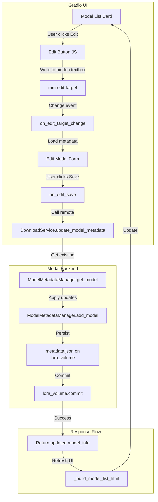

# LoRA Metadata Editing Design

> **Status:** Draft  
> **Date:** 2026-02-23  
> **Scope:** Add UI for editing LoRA metadata (trigger words, clip skip, etc.)

---

## 1. Executive Summary

This design adds the ability to edit LoRA metadata directly in the UI. Users will be able to modify trigger words, clip skip values, and other metadata fields for installed LoRAs through an intuitive editing interface.

### Key Features

1. **Edit button on LoRA cards** — Opens an editing modal/inline form
2. **Editable fields** — Trigger words, clip skip, default weight, display name
3. **Backend API** — New Modal method to update metadata
4. **Consistent storage** — Uses existing `.metadata.json` via `ModelMetadataManager`

---

## 2. Current Architecture Analysis

### 2.1 Data Model

The [`ModelInfo`](src/services/model_metadata.py:16) dataclass stores metadata for each model:

```python
@dataclass
class ModelInfo:
    filename: str                          # e.g. "lora_929497.safetensors"
    model_type: str                        # "lora" or "checkpoint"
    name: str                              # Display name
    
    # CivitAI metadata (optional)
    civitai_model_id: Optional[int] = None
    civitai_version_id: Optional[int] = None
    
    # Content metadata
    trigger_words: list[str] = field(default_factory=list)
    description: str = ""
    base_model: str = ""                   # e.g. "Illustrious", "SDXL 1.0"
    
    # Recommended settings
    default_weight: float = 1.0
    recommended_weight_min: float = 0.0
    recommended_weight_max: float = 2.0
    
    # Tags for filtering
    tags: list[str] = field(default_factory=list)
    
    # Source URL
    source_url: str = ""
    
    # File info
    size_bytes: int = 0
```

**Note:** The current `ModelInfo` does not include `clip_skip`. This needs to be added.

### 2.2 Storage Layer

Metadata is stored in `.metadata.json` on the LoRA volume via [`ModelMetadataManager`](src/services/model_metadata.py:47):

| Method | Purpose |
|--------|---------|
| `list_models(model_type)` | List all models, optionally filtered |
| `get_model(filename)` | Get metadata for a specific model |
| `add_model(info)` | Add or update model metadata |
| `remove_model(filename)` | Remove model metadata |

### 2.3 UI Components

The model list is rendered by [`_build_model_list_html()`](src/ui/gradio_app.py:1814):

```python
def _build_model_list_html(models: List[Dict], filter_type: str = "All") -> str:
    # Renders each model as a card with:
    # - Delete button (JS writes to hidden textbox)
    # - Name, type, base model, size
    # - Trigger words display
```

Current card structure (simplified):

```html
<div class="mm-model-card">
  <button class="mm-delete-btn" onclick="...">🗑️ Delete</button>
  <div class="mm-model-name">{name}</div>
  <div class="mm-model-meta">{mtype} · {base} · {size_str}</div>
  <div class="mm-model-triggers">Triggers: {trigger_str}</div>
</div>
```

### 2.4 Backend Service

The [`DownloadService`](src/services/download.py:160) provides:

| Method | Purpose |
|--------|---------|
| `list_user_models(model_type)` | Returns list of models with metadata |
| `delete_user_model(filename, model_type)` | Deletes model file and metadata |
| `_save_civitai_metadata(info)` | Saves CivitAI metadata (internal) |

---

## 3. Proposed Changes

### 3.1 Data Model Extension

Add `clip_skip` field to [`ModelInfo`](src/services/model_metadata.py:16):

```python
@dataclass
class ModelInfo:
    # ... existing fields ...
    
    # Generation settings
    clip_skip: int = 0                     # 0 = disabled, 1-12 = layers to skip
```

**Why 0 for disabled?** CLIP skip of 0 means "use default behavior" (no skipping). Values 1-12 indicate how many layers to skip from the end.

### 3.2 Backend API: `update_model_metadata`

Add a new method to [`DownloadService`](src/services/download.py:160):

```python
@modal.method()
def update_model_metadata(
    self,
    filename: str,
    updates: dict,
) -> dict:
    """
    Update metadata for an existing model.
    
    Args:
        filename: The model filename to update
        updates: Dict with fields to update, e.g.:
            {
                "name": "New Display Name",
                "trigger_words": ["trigger1", "trigger2"],
                "clip_skip": 2,
                "default_weight": 0.8,
            }
    
    Returns:
        {"success": bool, "model_info": dict | None, "error": str | None}
    """
```

Implementation:

```python
@modal.method()
def update_model_metadata(self, filename: str, updates: dict) -> dict:
    from src.app_config import lora_volume
    
    mgr = ModelMetadataManager(LORAS_MOUNT_PATH)
    
    # Get existing metadata
    existing = mgr.get_model(filename)
    if existing is None:
        return {
            "success": False,
            "model_info": None,
            "error": f"Model not found: {filename}",
        }
    
    # Apply updates (only allowed fields)
    allowed_fields = {
        "name", "trigger_words", "clip_skip", 
        "default_weight", "description", "tags",
        "recommended_weight_min", "recommended_weight_max",
    }
    
    updated = asdict(existing)
    for key, value in updates.items():
        if key in allowed_fields:
            updated[key] = value
    
    # Validate
    if updated.get("clip_skip", 0) not in range(0, 13):
        return {
            "success": False,
            "model_info": None,
            "error": "clip_skip must be 0-12",
        }
    
    # Save
    new_info = ModelInfo(**updated)
    mgr.add_model(new_info)
    lora_volume.commit()
    
    return {
        "success": True,
        "model_info": updated,
        "error": None,
    }
```

### 3.3 UI Design: Edit Modal

#### Option A: Gradio Modal (Recommended)

Use Gradio's built-in modal support for a clean editing experience:

```
┌─────────────────────────────────────────────────────────┐
│  Edit LoRA Metadata                               [X]   │
├─────────────────────────────────────────────────────────┤
│                                                         │
│  File: lora_929497.safetensors                          │
│                                                         │
│  Display Name:                                          │
│  [Aesthetic Quality_________________________]           │
│                                                         │
│  Trigger Words (comma-separated):                       │
│  [masterpiece, best quality, very aesthetic__]          │
│                                                         │
│  Default Weight:                                        │
│  [1.0_____________]                                     │
│                                                         │
│  CLIP Skip (0-12, 0=disabled):                          │
│  [0_______________]                                     │
│                                                         │
│  Description:                                           │
│  [_________________________________________]            │
│  [_________________________________________]            │
│                                                         │
│              [Cancel]  [Save Changes]                   │
└─────────────────────────────────────────────────────────┘
```

#### Option B: Inline Editing

Edit directly in the card with expand/collapse:

```
┌─────────────────────────────────────────────────────────┐
│  🗑️ Delete  ✏️ Edit    Aesthetic Quality               │
│  LoRA · Illustrious XL · 176 MB                         │
│  Triggers: masterpiece, best quality, very aesthetic    │
├─────────────────────────────────────────────────────────┤ ← expanded
│  Display Name: [Aesthetic Quality____]                  │
│  Triggers: [masterpiece, best quality___]               │
│  Weight: [1.0]  CLIP Skip: [0]                          │
│                          [Cancel] [Save]                │
└─────────────────────────────────────────────────────────┘
```

**Recommendation:** Option A (Modal) is cleaner and works better with Gradio's reactive model.

### 3.4 UI Implementation

#### 3.4.1 Add Edit Button to Model Cards

Modify [`_build_model_list_html()`](src/ui/gradio_app.py:1814):

```python
def _build_model_list_html(models: List[Dict], filter_type: str = "All") -> str:
    # ... existing code ...
    
    # JS for edit button - writes filename to hidden textbox
    edit_target_val = f"{filename}|{model_type_raw}"
    edit_js = (
        f"document.getElementById('mm-edit-target').querySelector('textarea').value"
        f" = '{edit_target_val}'; "
        f"document.getElementById('mm-edit-target').querySelector('textarea').dispatchEvent(new Event('input'));"
    )
    
    cards.append(
        f'<div class="mm-model-card">'
        f'  <div class="mm-card-actions">'
        f'    <button class="mm-edit-btn" onclick="{edit_js}">✏️ Edit</button>'
        f'    <button class="mm-delete-btn" onclick="{delete_js}">🗑️ Delete</button>'
        f'  </div>'
        f'  <div class="mm-model-name">{name}</div>'
        f'  <div class="mm-model-meta">{mtype} · {base} · {size_str}</div>'
        f'  <div class="mm-model-triggers">Triggers: {trigger_str}</div>'
        f'</div>'
    )
```

#### 3.4.2 Add Edit Modal Components

In [`_build_model_manager_tab()`](src/ui/gradio_app.py:2016):

```python
# Hidden textbox to receive edit target from JS
mm_edit_target = gr.Textbox(
    value="",
    visible=False,
    elem_id="mm-edit-target",
)

# Edit modal (using Gradio's gr.Group styling as modal)
with gr.Group(visible=False, elem_id="edit-modal") as edit_modal:
    gr.Markdown("### Edit Model Metadata")
    
    edit_filename_state = gr.State(value="")
    edit_name = gr.Textbox(label="Display Name")
    edit_triggers = gr.Textbox(
        label="Trigger Words",
        info="Comma-separated list",
    )
    edit_weight = gr.Number(
        label="Default Weight",
        value=1.0,
        minimum=0.0,
        maximum=2.0,
        step=0.1,
    )
    edit_clip_skip = gr.Slider(
        label="CLIP Skip",
        info="0 = disabled, 1-12 = layers to skip",
        minimum=0,
        maximum=12,
        step=1,
        value=0,
    )
    edit_description = gr.Textbox(
        label="Description",
        lines=2,
    )
    
    with gr.Row():
        edit_cancel_btn = gr.Button("Cancel", variant="secondary")
        edit_save_btn = gr.Button("Save Changes", variant="primary")
    
    edit_feedback = gr.HTML(value="")
```

#### 3.4.3 Event Handlers

```python
def on_edit_target_change(edit_target: str):
    """Load model data into edit form when user clicks Edit."""
    if not edit_target:
        return {
            edit_modal: gr.Group(visible=False),
            edit_filename_state: "",
        }
    
    filename, model_type = edit_target.split("|")
    
    # Fetch model metadata
    from src.services.download import DownloadService
    models = DownloadService().list_user_models.remote()
    model = next((m for m in models if m["filename"] == filename), None)
    
    if not model:
        return {
            edit_modal: gr.Group(visible=False),
            edit_filename_state: "",
        }
    
    triggers = ", ".join(model.get("trigger_words", []))
    
    return {
        edit_modal: gr.Group(visible=True),
        edit_filename_state: filename,
        edit_name: model.get("name", ""),
        edit_triggers: triggers,
        edit_weight: model.get("default_weight", 1.0),
        edit_clip_skip: model.get("clip_skip", 0),
        edit_description: model.get("description", ""),
        edit_feedback: "",
    }

mm_edit_target.change(
    fn=on_edit_target_change,
    inputs=[mm_edit_target],
    outputs=[
        edit_modal,
        edit_filename_state,
        edit_name,
        edit_triggers,
        edit_weight,
        edit_clip_skip,
        edit_description,
        edit_feedback,
    ],
)

def on_edit_save(filename: str, name: str, triggers: str, weight: float, 
                 clip_skip: int, description: str):
    """Save edited metadata."""
    if not filename:
        return {edit_feedback: "<span style='color:red'>No model selected</span>"}
    
    # Parse triggers
    trigger_list = [t.strip() for t in triggers.split(",") if t.strip()]
    
    # Call backend
    from src.services.download import DownloadService
    result = DownloadService().update_model_metadata.remote(
        filename=filename,
        updates={
            "name": name,
            "trigger_words": trigger_list,
            "default_weight": weight,
            "clip_skip": clip_skip,
            "description": description,
        },
    )
    
    if result["success"]:
        # Refresh model list
        models = DownloadService().list_user_models.remote()
        html = _build_model_list_html(models, "All")
        return {
            edit_feedback: "<span style='color:#4CAF50'>✓ Saved successfully</span>",
            models_html: html,
        }
    else:
        return {
            edit_feedback: f"<span style='color:red'>Error: {result['error']}</span>",
        }

edit_save_btn.click(
    fn=on_edit_save,
    inputs=[
        edit_filename_state,
        edit_name,
        edit_triggers,
        edit_weight,
        edit_clip_skip,
        edit_description,
    ],
    outputs=[edit_feedback, models_html],
)

def on_edit_cancel():
    """Close edit modal without saving."""
    return {edit_modal: gr.Group(visible=False)}

edit_cancel_btn.click(
    fn=on_edit_cancel,
    inputs=[],
    outputs=[edit_modal],
)
```

---

## 4. Data Flow Diagram



---

## 5. CSS Additions

Add styles for the edit button and modal:

```css
/* Edit button styling */
.mm-edit-btn {
    background: #2196F3;
    color: white;
    border: none;
    padding: 4px 8px;
    border-radius: 4px;
    cursor: pointer;
    font-size: 0.85em;
    margin-right: 8px;
}
.mm-edit-btn:hover {
    background: #1976D2;
}

/* Card actions container */
.mm-card-actions {
    float: right;
    display: flex;
    gap: 4px;
}

/* Modal styling */
#edit-modal {
    position: fixed;
    top: 50%;
    left: 50%;
    transform: translate(-50%, -50%);
    z-index: 1000;
    background: #1a1a1a;
    border: 1px solid #444;
    border-radius: 8px;
    padding: 20px;
    max-width: 500px;
    width: 90%;
    box-shadow: 0 4px 20px rgba(0,0,0,0.5);
}
```

---

## 6. Implementation Steps

### Phase 1: Data Model Update
- [ ] Add `clip_skip: int = 0` field to [`ModelInfo`](src/services/model_metadata.py:16) dataclass
- [ ] Update `_civitai_to_dict()` in [`DownloadService`](src/services/download.py:581) to include clip_skip

### Phase 2: Backend API
- [ ] Add `update_model_metadata()` method to [`DownloadService`](src/services/download.py:160)
- [ ] Add validation for allowed fields and value ranges
- [ ] Test with Modal serve

### Phase 3: UI Components
- [ ] Add edit button to model cards in [`_build_model_list_html()`](src/ui/gradio_app.py:1814)
- [ ] Add hidden textbox `mm-edit-target` for JS communication
- [ ] Add edit modal form in [`_build_model_manager_tab()`](src/ui/gradio_app.py:2016)
- [ ] Add CSS for edit button and modal

### Phase 4: Event Handlers
- [ ] Implement `on_edit_target_change()` to load model data
- [ ] Implement `on_edit_save()` to save changes
- [ ] Implement `on_edit_cancel()` to close modal
- [ ] Wire up all Gradio event handlers

### Phase 5: Testing
- [ ] Test edit flow end-to-end
- [ ] Test validation (clip skip range, etc.)
- [ ] Test with orphan files (no existing metadata)
- [ ] Test concurrent edits (edge case)

---

## 7. Future Considerations

### 7.1 LLM Parsing Integration

The next task mentions LLM parsing for metadata. This could:
- Auto-suggest trigger words from model description
- Parse pasted CivitAI descriptions to extract metadata
- Suggest optimal weight ranges based on model type

**Integration point:** Add an "AI Suggest" button in the edit modal that calls an LLM to parse/fill fields.

### 7.2 Batch Editing

Future enhancement to edit multiple LoRAs at once:
- Select multiple models with checkboxes
- Apply same trigger words or settings to all selected
- Useful for LoRA packs with shared triggers

### 7.3 Metadata History

Track metadata changes for audit/debugging:
- Store previous values in a `history` array
- Allow reverting to previous versions
- Useful when experimenting with different trigger word combinations

---

## 8. Open Questions

1. **Modal vs. Inline:** Should we use a true modal overlay or an inline expansion? Gradio modals can be tricky — we may need to use a custom HTML/CSS approach.

2. **Orphan File Handling:** When editing an orphan file (no existing metadata), should we create a full metadata entry or just the minimal fields?

3. **CivitAI Sync:** If a model was originally from CivitAI, should we allow re-fetching metadata from the API to "reset" to original values?

4. **Validation Strictness:** Should we validate trigger words against a dictionary or allow any text?

---

## 9. File Changes Summary

### Modified Files

| File | Changes |
|------|---------|
| [`src/services/model_metadata.py`](src/services/model_metadata.py) | Add `clip_skip` field to `ModelInfo` dataclass |
| [`src/services/download.py`](src/services/download.py) | Add `update_model_metadata()` method; update `_civitai_to_dict()` |
| [`src/ui/gradio_app.py`](src/ui/gradio_app.py) | Add edit button to cards; add edit modal; add event handlers; add CSS |

### No New Files Required

All changes fit within existing files.
