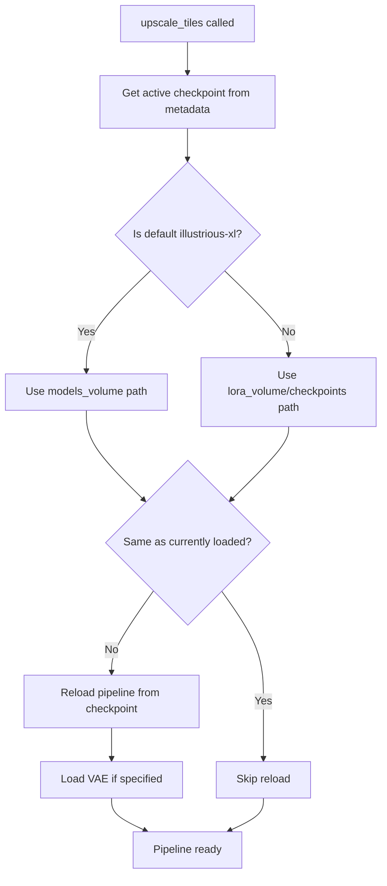

# Multi-Model Types Support Architecture

> **Status:** Draft  
> **Date:** 2026-02-23  
> **Scope:** Extending model support beyond LoRAs to include SDXL Checkpoints, Embeddings, and VAEs

---

## 1. Executive Summary

The current system supports:
- **Base models** from HuggingFace (downloaded via setup wizard)
- **LoRAs** from CivitAI (downloadable via Model Manager)

This design extends support to:
- **SDXL Checkpoints** - Full base models from CivitAI (e.g., DreamShaper, NoobAI)
- **Embeddings** - Textual Inversion embeddings
- **VAEs** - Custom Variational Autoencoders

Key requirements:
1. Users can download any model type from CivitAI
2. Users can select which SDXL checkpoint to use for generation
3. Setup wizard offers to download a base model if none exists
4. Generation is blocked without a selected checkpoint
5. Embedded components in checkpoints are used automatically

---

## 2. Model Type Schema

### 2.1 ModelType Enum

```python
from enum import Enum

class ModelType(str, Enum):
    """Supported model types for SDXL pipeline."""
    CHECKPOINT = "checkpoint"    # Full SDXL base models
    LORA = "lora"                # LoRA adapters
    EMBEDDING = "embedding"      # Textual Inversion embeddings
    VAE = "vae"                  # Variational Autoencoders
```

### 2.2 Extended ModelInfo Dataclass

The existing [`ModelInfo`](src/services/model_metadata.py:16) dataclass needs extension:

```python
@dataclass
class ModelInfo:
    """Metadata for a single model."""
    # Identity
    filename: str                          # e.g. "dreamshaper_xl.safetensors"
    model_type: ModelType                  # checkpoint, lora, embedding, vae
    name: str                              # Display name
    
    # CivitAI metadata
    civitai_model_id: int | None = None
    civitai_version_id: int | None = None
    
    # Content metadata
    trigger_words: list[str] = field(default_factory=list)
    description: str = ""
    base_model: str = ""                   # "SDXL 1.0", "Illustrious", "Pony", etc.
    
    # Model-specific settings
    default_weight: float = 1.0            # For LoRAs
    clip_skip: int = 0                     # For embeddings/checkpoints
    
    # Embedded components (checkpoints may include these)
    embedded_vae: str | None = None        # Filename of embedded VAE
    embedded_loras: list[dict] = field(default_factory=list)  # Embedded LoRAs with weights
    
    # Tags for filtering
    tags: list[str] = field(default_factory=list)
    
    # Source and file info
    source_url: str = ""
    size_bytes: int = 0
    
    # VAE-specific
    is_fp16_fixed: bool = False            # Whether VAE has fp16 fix
```

### 2.3 CivitAI Model Type Mapping

CivitAI uses different type names. Map them to our internal types:

| CivitAI Type | Internal ModelType | Notes |
|--------------|-------------------|-------|
| `Checkpoint` | `CHECKPOINT` | Full SDXL models |
| `LORA` / `LoRA` | `LORA` | LoRA adapters |
| `TextualInversion` / `Embedding` | `EMBEDDING` | Textual Inversion |
| `VAE` | `VAE` | Variational Autoencoders |

---

## 3. Storage Structure

### 3.1 Volume Layout

```
/vol/loras/                              ← lora_volume (ai-toolbox-loras)
├── .metadata.json                       ← unified metadata index
├── checkpoints/                         ← SDXL checkpoint files
│   ├── dreamshaper_xl.safetensors
│   ├── noobai_xl_v10.safetensors
│   └── illustrious_xl.safetensors       # Optional copy of default
├── loras/                               ← LoRA files
│   ├── aesthetic_quality.safetensors
│   └── detail_tweaker.safetensors
├── embeddings/                          ← Textual Inversion embeddings
│   ├── easy_negative.safetensors
│   └── bad_hand.safetensors
└── vae/                                 ← Custom VAEs
    ├── sdxl_vae_fp16.safetensors
    └── pony_vae.safetensors

/vol/models/                             ← models_volume (ai-toolbox-models)
├── illustrious-xl/                      ← Default base model (setup wizard)
├── controlnet-tile/
├── sdxl-vae/                            ← Default VAE (fp16-fix)
├── ip-adapter/
├── clip-vit-h/
└── qwen2.5-vl-3b/
```

### 3.2 Rationale

- **Separate subdirectories** by model type for clear organization
- **Same volume** for user content (checkpoints, loras, embeddings, vae)
- **models_volume** remains for infrastructure models managed by setup wizard
- **Default checkpoint** stored in models_volume, user checkpoints in lora_volume

---

## 4. Metadata Schema Changes

### 4.1 Enhanced .metadata.json

```json
{
  "version": 2,
  "active_checkpoint": "illustrious-xl",
  "active_vae": null,
  "models": {
    "dreamshaper_xl.safetensors": {
      "model_type": "checkpoint",
      "name": "DreamShaper XL",
      "civitai_model_id": 112902,
      "civitai_version_id": 254786,
      "trigger_words": [],
      "base_model": "SDXL 1.0",
      "embedded_vae": null,
      "embedded_loras": [],
      "size_bytes": 6938000000
    },
    "aesthetic_quality.safetensors": {
      "model_type": "lora",
      "name": "Aesthetic Quality",
      "civitai_model_id": 929497,
      "trigger_words": ["masterpiece", "best quality"],
      "default_weight": 1.0,
      "base_model": "Illustrious",
      "size_bytes": 184549376
    },
    "easy_negative.safetensors": {
      "model_type": "embedding",
      "name": "EasyNegative",
      "civitai_model_id": 7808,
      "trigger_words": ["EasyNegative"],
      "base_model": "SD 1.5",
      "size_bytes": 7864320
    },
    "pony_vae.safetensors": {
      "model_type": "vae",
      "name": "Pony VAE",
      "base_model": "Pony",
      "is_fp16_fixed": false,
      "size_bytes": 335000000
    }
  }
}
```

### 4.2 Active Model Tracking

Add special keys to track active selections:

| Key | Type | Description |
|-----|------|-------------|
| `active_checkpoint` | `str \| null` | Filename of active checkpoint, or `"illustrious-xl"` for default |
| `active_vae` | `str \| null` | Filename of custom VAE, or `null` to use checkpoint's VAE |

---

## 5. Download Service Modifications

### 5.1 Extended CivitAI Integration

The existing [`fetch_model_info()`](src/services/civitai.py:72) needs to handle all model types:

```python
def _map_civitai_type(civitai_type: str) -> ModelType:
    """Map CivitAI type string to internal ModelType."""
    type_map = {
        "checkpoint": ModelType.CHECKPOINT,
        "lora": ModelType.LORA,
        "loha": ModelType.LORA,
        "locon": ModelType.LORA,
        "textualinversion": ModelType.EMBEDDING,
        "embedding": ModelType.EMBEDDING,
        "vae": ModelType.VAE,
    }
    return type_map.get(civitai_type.lower(), ModelType.LORA)
```

### 5.2 Download Path Resolution

```python
def get_model_subdir(model_type: ModelType) -> str:
    """Get the subdirectory for a model type."""
    subdir_map = {
        ModelType.CHECKPOINT: "checkpoints",
        ModelType.LORA: "loras",
        ModelType.EMBEDDING: "embeddings",
        ModelType.VAE: "vae",
    }
    return subdir_map[model_type]
```

### 5.3 Checkpoint Download with Embedded Components

Some CivitAI checkpoints include embedded VAEs or LoRAs. The download service should:

1. **Detect embedded components** from CivitAI API response
2. **Extract metadata** about embedded VAE/LoRA
3. **Store in ModelInfo** for pipeline integration

```python
def _extract_embedded_components(version_data: dict) -> dict:
    """Extract embedded VAE/LoRA info from CivitAI version data."""
    # CivitAI may indicate embedded components in metadata
    # This is model-specific and may require parsing model description
    return {
        "embedded_vae": None,
        "embedded_loras": [],
    }
```

---

## 6. Pipeline Integration

### 6.1 Checkpoint Loading Strategy



### 6.2 Pipeline Reload Implementation

```python
def _ensure_checkpoint(self) -> None:
    """Reload pipeline if active checkpoint changed."""
    mgr = ModelMetadataManager(LORAS_MOUNT_PATH)
    active = mgr.get_active_checkpoint()
    
    if active == self._current_checkpoint:
        return
    
    # Determine checkpoint path
    if active == "illustrious-xl" or active is None:
        checkpoint_path = get_model_file_path("illustrious-xl")
    else:
        checkpoint_path = os.path.join(
            LORAS_MOUNT_PATH, "checkpoints", active
        )
    
    # Get checkpoint metadata for embedded components
    checkpoint_info = mgr.get_model(active) if active else None
    
    # Reload pipeline
    self._reload_pipeline(checkpoint_path, checkpoint_info)
    self._current_checkpoint = active or "illustrious-xl"
```

### 6.3 VAE Loading

```python
def _load_vae(self, vae_name: str | None, checkpoint_info: ModelInfo | None) -> None:
    """Load VAE - either custom or from checkpoint or default."""
    if vae_name:
        # User-specified custom VAE
        vae_path = os.path.join(LORAS_MOUNT_PATH, "vae", vae_name)
    elif checkpoint_info and checkpoint_info.embedded_vae:
        # Checkpoint has embedded VAE (already in checkpoint file)
        return  # Use checkpoint's VAE
    else:
        # Default SDXL VAE fp16-fix
        vae_path = get_model_path("sdxl-vae")
    
    self._pipe.vae = AutoencoderKL.from_pretrained(
        vae_path, torch_dtype=torch.float16
    )
```

### 6.4 Embedding Integration

```python
def _load_embeddings(self, embedding_names: list[str]) -> None:
    """Load Textual Inversion embeddings into the pipeline."""
    for name in embedding_names:
        embedding_path = os.path.join(LORAS_MOUNT_PATH, "embeddings", name)
        # Load embedding and add to text encoder
        self._pipe.load_textual_inversion(
            embedding_path,
            token=name.rsplit(".", 1)[0],  # Use filename as token
        )
```

---

## 7. UI/UX Flow

### 7.1 Model Manager Tab Redesign

```
┌─────────────────────────────────────────────────────────────────┐
│ Model Manager                                                   │
├─────────────────────────────────────────────────────────────────┤
│ ┌─────────┬─────────┬────────────┬───────┐                     │
│ │Checkpts │  LoRAs  │ Embeddings │ VAEs  │ ← Type tabs         │
│ └─────────┴─────────┴────────────┴───────┘                     │
│                                                                 │
│ ┌─────────────────────────────────────────────────────────────┐│
│ │ Download from CivitAI                                        ││
│ │ ┌───────────────────────────────────────┐ ┌──────────────┐ ││
│ │ │ https://civitai.com/models/...        │ │ Preview      │ ││
│ │ └───────────────────────────────────────┘ └──────────────┘ ││
│ │ Model: DreamShaper XL                                      ││
│ │ Type: Checkpoint • Size: 6.9 GB • Base: SDXL 1.0          ││
│ │ ┌─────────────────────────────────────────────────────────┐││
│ │ │ [Download]                                              │││
│ │ └─────────────────────────────────────────────────────────┘││
│ └─────────────────────────────────────────────────────────────┘│
│                                                                 │
│ ┌─────────────────────────────────────────────────────────────┐│
│ │ Your Checkpoints                              [Set Active]  ││
│ │ ┌─────────────────────────────────────────────────────────┐││
│ │ │ ○ Illustrious-XL v2.0 (default)        6.9 GB   [Delete]│││
│ │ │ ● DreamShaper XL                       6.9 GB   [Delete]│││
│ │ │ ○ NoobAI XL v1.0                       6.9 GB   [Delete]│││
│ │ └─────────────────────────────────────────────────────────┘││
│ └─────────────────────────────────────────────────────────────┘│
└─────────────────────────────────────────────────────────────────┘
```

### 7.2 Generation Tab Integration

Add checkpoint selector to the generation UI:

```
┌─────────────────────────────────────────────────────────────────┐
│ Generation Settings                                             │
├─────────────────────────────────────────────────────────────────┤
│ Base Model: [DreamShaper XL ▼]                                  │
│ VAE:        [Default (from checkpoint) ▼]                       │
│ LoRAs:      [Aesthetic Quality, Detail Tweaker]                 │
│ Embeddings: [EasyNegative]                                      │
└─────────────────────────────────────────────────────────────────┘
```

### 7.3 Generation Blocking

When no checkpoint is available:

```
┌─────────────────────────────────────────────────────────────────┐
│ ⚠️ No Checkpoint Available                                      │
│                                                                 │
│ You need to download a checkpoint before you can generate.     │
│                                                                 │
│ [Download Illustrious-XL (recommended)]  [Go to Model Manager] │
└─────────────────────────────────────────────────────────────────┘
```

---

## 8. Setup Wizard Changes

### 8.1 Current Flow

1. Step 1: API Keys
2. Step 2: Download Models (HuggingFace only)
3. Step 3: Ready

### 8.2 Enhanced Flow

1. **Step 1: API Keys** (unchanged)
2. **Step 2: Core Models** (HuggingFace - ControlNet, VAE, IP-Adapter, etc.)
3. **Step 2b: Base Checkpoint** (NEW)
   - Offer to download Illustrious-XL from HuggingFace (default)
   - OR allow user to skip and download from CivitAI later
   - OR allow user to paste a CivitAI checkpoint URL
4. **Step 3: Ready**

### 8.3 Step 2b UI

```
┌─────────────────────────────────────────────────────────────────┐
│ Step 2b of 4 — Base Model                                       │
│                                                                 │
│ You need an SDXL checkpoint for generation. Choose an option:  │
│                                                                 │
│ ┌─────────────────────────────────────────────────────────────┐│
│ │ ○ Download Illustrious-XL (recommended for anime styles)   ││
│ │   6.9 GB • Great for illustration and anime styles         ││
│ └─────────────────────────────────────────────────────────────┘│
│                                                                 │
│ ┌─────────────────────────────────────────────────────────────┐│
│ │ ○ Download from CivitAI                                    ││
│ │   ┌─────────────────────────────────────────────────────┐  ││
│ │   │ Paste CivitAI URL or model ID...                    │  ││
│ │   └─────────────────────────────────────────────────────┘  ││
│ └─────────────────────────────────────────────────────────────┘│
│                                                                 │
│ ┌─────────────────────────────────────────────────────────────┐│
│ │ ○ Skip for now (you can download later in Model Manager)   ││
│ └─────────────────────────────────────────────────────────────┘│
│                                                                 │
│                              [Continue →]                       │
└─────────────────────────────────────────────────────────────────┘
```

---

## 9. Implementation Phases

### Phase 1: Core Infrastructure
- [ ] Add `ModelType` enum to `model_metadata.py`
- [ ] Extend `ModelInfo` dataclass with new fields
- [ ] Update `ModelMetadataManager` to handle all types
- [ ] Add subdirectory structure to lora_volume

### Phase 2: Download Service
- [ ] Extend CivitAI type mapping
- [ ] Add type-specific download paths
- [ ] Implement embedded component detection
- [ ] Add checkpoint download method

### Phase 3: Pipeline Integration
- [ ] Implement checkpoint switching in `UpscaleService`
- [ ] Add VAE loading logic
- [ ] Add embedding loading logic
- [ ] Handle embedded components

### Phase 4: UI Updates
- [ ] Add model type tabs to Model Manager
- [ ] Add checkpoint selector to generation UI
- [ ] Implement generation blocking
- [ ] Add active model indicators

### Phase 5: Setup Wizard
- [ ] Add checkpoint selection step
- [ ] Allow CivitAI checkpoint download
- [ ] Allow skipping with warning

---

## 10. Technical Considerations

### 10.1 Cold Start Impact

- **Checkpoint reload**: ~15-20 seconds on A10G
- **Mitigation**: Keep track of active checkpoint, only reload when changed
- **User feedback**: Show loading indicator during reload

### 10.2 Memory Constraints

- **A10G VRAM**: 24 GB
- **SDXL + ControlNet + IP-Adapter**: ~16 GB
- **Additional LoRAs**: ~100-300 MB each
- **Embeddings**: ~10-100 MB each
- **Custom VAE**: Loaded in place of default (no extra memory)

### 10.3 CivitAI Format IDs

CivitAI uses format IDs for different file types within a model version:

| Format | Description |
|--------|-------------|
| `SafeTensor` | Primary format for all model types |
| `PickleTensor` | Legacy format (avoid if possible) |
| `Diffusers` | Directory format (for full pipelines) |

Always prefer `SafeTensor` format when available.

### 10.4 Embedding Compatibility

- **SDXL embeddings**: Work with SDXL checkpoints
- **SD 1.5 embeddings**: NOT compatible with SDXL
- **Detection**: Check `base_model` field in metadata
- **Warning**: Show warning when incompatible embedding is selected

---

## 11. Error Handling

### 11.1 Missing Checkpoint

```python
if not self._current_checkpoint:
    raise RuntimeError(
        "No checkpoint loaded. Please download a checkpoint in Model Manager."
    )
```

### 11.2 Incompatible Model

```python
if embedding.base_model == "SD 1.5" and checkpoint.base_model.startswith("SDXL"):
    logger.warning(
        "Embedding %s is designed for SD 1.5, may not work correctly with SDXL",
        embedding.name,
    )
```

### 11.3 Checkpoint Load Failure

```python
try:
    self._reload_pipeline(checkpoint_path)
except Exception as e:
    logger.error("Failed to load checkpoint %s: %s", checkpoint_path, e)
    # Fall back to default
    self._reload_pipeline(get_model_file_path("illustrious-xl"))
    self._current_checkpoint = "illustrious-xl"
```

---

## 12. Testing Strategy

### 12.1 Unit Tests

- Model type parsing and mapping
- Metadata serialization/deserialization
- Path resolution for each type

### 12.2 Integration Tests

- Download each model type from CivitAI
- Verify correct storage location
- Verify metadata extraction

### 12.3 Pipeline Tests

- Checkpoint switching
- VAE loading
- Embedding injection
- Generation with various model combinations

---

## 13. Future Considerations

### 13.1 Model Versioning

- Support multiple versions of same model
- Allow version switching
- Track version-specific metadata

### 13.2 Model Browsing

- CivitAI search integration
- Preview gallery
- One-click download from search results

### 13.3 Model Sharing

- Export model configurations
- Share LoRA combinations
- Preset management
