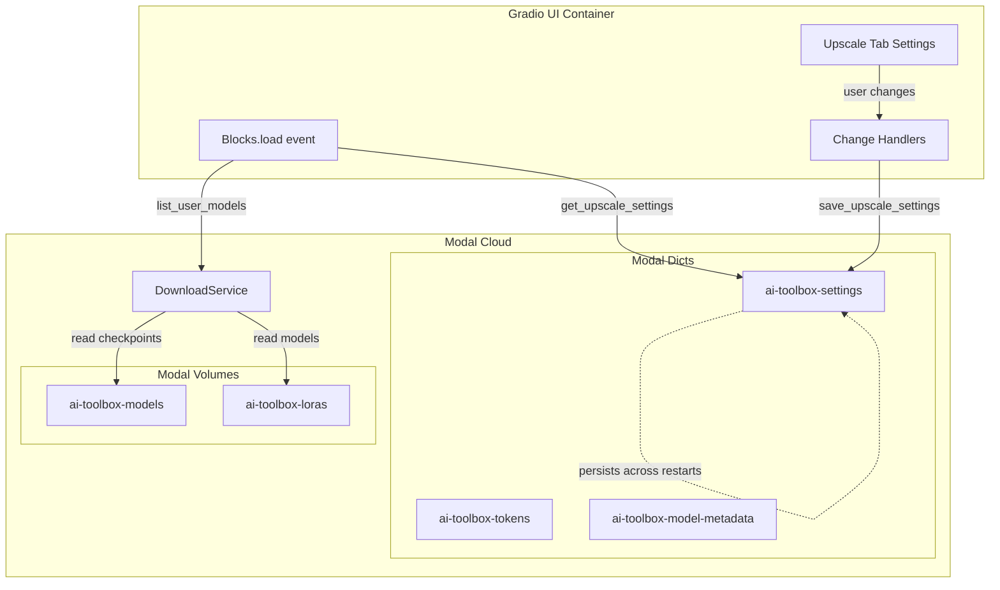

# Settings Persistence and Auto-Refresh Design Document

## Overview

This document outlines the design for implementing two features in the AI Assets Toolbox:
1. **Settings Persistence**: Save upscale tab generation settings to Modal Dict for persistence across sessions
2. **Auto-Refresh on Startup**: Automatically populate checkpoints and LoRAs when the UI loads

---

## Part 1: Upscale Tab Settings Analysis

### Settings Identified for Persistence

Based on analysis of [`src/ui/gradio_app.py`](src/ui/gradio_app.py), the following settings should be persisted:

#### Grid Settings (lines 1400-1429)
| Component | Variable Name | Type | Default | Persist? |
|-----------|---------------|------|---------|----------|
| Tile Size | `tile_size_num` | Number | 1024 | ✅ Yes |
| Overlap | `overlap_num` | Number | 128 | ✅ Yes |
| Generation Resolution | `gen_res_dd` | Dropdown | "1536×1536 ✨ Recommended" | ✅ Yes |

#### Generation Settings (lines 1432-1499)
| Component | Variable Name | Type | Default | Persist? |
|-----------|---------------|------|---------|----------|
| Checkpoint | `checkpoint_dropdown` | Dropdown | None | ✅ Yes |
| Global Prompt | `global_prompt` | Textbox | "" | ✅ Yes |
| Negative Prompt | `negative_prompt` | Textbox | "" | ✅ Yes |
| Denoise Strength | `strength_sl` | Slider | 0.35 | ✅ Yes |
| Steps | `steps_sl` | Slider | 30 | ✅ Yes |
| CFG Scale | `cfg_sl` | Slider | 7.0 | ✅ Yes |
| Seed | `seed_num` | Number | -1 | ❌ No (intentional randomness) |

#### LoRA Controls (lines 1501-1543)
| Component | Variable Name | Type | Default | Persist? |
|-----------|---------------|------|---------|----------|
| LoRA Selections | `lora_selection_tb` | Hidden Textbox | "[]" | ✅ Yes (JSON) |

#### ControlNet Settings (lines 1544-1555)
| Component | Variable Name | Type | Default | Persist? |
|-----------|---------------|------|---------|----------|
| Enable ControlNet | `controlnet_cb` | Checkbox | True | ✅ Yes |
| Conditioning Scale | `cond_scale_sl` | Slider | 0.7 | ✅ Yes |

#### IP-Adapter Settings (lines 1557-1579)
| Component | Variable Name | Type | Default | Persist? |
|-----------|---------------|------|---------|----------|
| Enable IP-Adapter | `ip_adapter_cb` | Checkbox | False | ✅ Yes |
| Style Image | `ip_style_image` | Image | None | ❌ No (binary data) |
| IP-Adapter Scale | `ip_scale_sl` | Slider | 0.6 | ✅ Yes |

#### Seam Fix Settings (lines 1581-1605)
| Component | Variable Name | Type | Default | Persist? |
|-----------|---------------|------|---------|----------|
| Enable Seam Fix | `seam_fix_cb` | Checkbox | False | ✅ Yes |
| Seam Fix Strength | `seam_fix_strength_sl` | Slider | 0.35 | ✅ Yes |
| Feather Size | `seam_fix_feather_sl` | Slider | 32 | ✅ Yes |

### Settings to Exclude from Persistence
- **Seed** (`seed_num`): Intentionally random each run (-1)
- **IP-Adapter Style Image** (`ip_style_image`): Binary image data, user-specific per session

---

## Part 2: Existing Persistence Patterns

### Token Store Pattern ([`src/services/token_store.py`](src/services/token_store.py))

```python
# Simple functional approach with dataclass
@dataclass
class TokenData:
    hf_token: Optional[str] = None
    civitai_token: Optional[str] = None

def get_tokens() -> TokenData:
    data = token_store.get(TOKENS_KEY, {})
    return TokenData(
        hf_token=data.get("hf_token"),
        civitai_token=data.get("civitai_token"),
    )

def save_tokens(hf_token: Optional[str] = None, civitai_token: Optional[str] = None) -> None:
    data = token_store.get(TOKENS_KEY, {})
    if hf_token is not None:
        data["hf_token"] = hf_token
    if civitai_token is not None:
        data["civitai_token"] = civitai_token
    token_store[TOKENS_KEY] = data
```

**Key characteristics:**
- Uses `modal.Dict.from_name("ai-toolbox-tokens", create_if_missing=True)`
- Single key `"tokens"` stores all token data
- Functional API with `get_tokens()` and `save_tokens()`
- Dataclass for type-safe return values

### Metadata Store Pattern ([`src/services/metadata_store.py`](src/services/metadata_store.py))

```python
# Class-based approach with multiple keys
class MetadataStore:
    def __init__(self):
        self._dict = metadata_dict
    
    def get_manifest(self) -> dict:
        return self._dict.get(MANIFEST_KEY, {})
    
    def set_manifest(self, manifest: dict) -> None:
        self._dict[MANIFEST_KEY] = manifest
    
    # Also has get_active_checkpoint() and set_active_checkpoint()
```

**Key characteristics:**
- Uses `modal.Dict.from_name("ai-toolbox-model-metadata", create_if_missing=True)`
- Multiple keys for different data types (manifest, progress, active_checkpoint)
- Class-based API with instance methods
- Already has checkpoint selection methods

### Dict Definition in app_config.py

```python
# src/app_config.py line 141
token_store = modal.Dict.from_name("ai-toolbox-tokens", create_if_missing=True)

# src/services/metadata_store.py line 18
metadata_dict = modal.Dict.from_name("ai-toolbox-model-metadata", create_if_missing=True)
```

---

## Part 3: Current Refresh Mechanism Analysis

### Current Implementation (lines 1872-1913)

```python
def on_upscale_tab_select():
    """Refresh both LoRAs and checkpoints when the upscale tab is selected."""
    # Get LoRAs
    loras: List[Dict] = DownloadService().list_user_models.remote(model_type="lora")
    # ... build HTML ...
    
    # Get checkpoints
    checkpoints: List[Dict] = DownloadService().list_user_models.remote(model_type="checkpoint")
    # ... build dropdown choices ...
    
    return html, loras, default_sels, gr.update(choices=cp_choices, value=None), checkpoints

upscale_tab.select(
    fn=on_upscale_tab_select,
    inputs=[],
    outputs=[lora_controls_html, available_loras_state, lora_selections_state, 
             checkpoint_dropdown, available_checkpoints_state],
)
```

### Problem Identified

The `upscale_tab.select()` event **only fires when the tab is clicked/selected**, not on initial page load. Since the Upscale tab is the first/default tab, users may never trigger this event if they don't click away and back.

**Current behavior:**
1. Page loads with Upscale tab visible
2. LoRA list shows placeholder: "Loading LoRA list… click 🔄 Refresh LoRA List if it doesn't appear."
3. Checkpoint dropdown only has default option: `[("Default (Illustrious-XL)", None)]`
4. User must manually click refresh buttons or switch tabs

---

## Part 4: Design Recommendations

### 4.1 Settings Store Implementation

#### Create New File: `src/services/settings_store.py`

```python
"""
Settings storage service using Modal Dict for server-side persistence.

Stores upscale tab generation settings that persist across server restarts.
Uses the same pattern as token_store.py for consistency.
"""
from __future__ import annotations

import logging
from dataclasses import dataclass, field, asdict
from typing import Optional, List, Dict, Any

import modal

logger = logging.getLogger(__name__)

# Get or create the Modal Dict
settings_dict = modal.Dict.from_name("ai-toolbox-settings", create_if_missing=True)

# Key within the Dict for upscale settings
UPSCALE_SETTINGS_KEY = "upscale_settings"


@dataclass
class UpscaleSettings:
    """Container for upscale tab generation settings."""
    
    # Grid Settings
    tile_size: int = 1024
    overlap: int = 128
    gen_resolution: str = "1536×1536 ✨ Recommended"
    
    # Generation Settings
    checkpoint_name: Optional[str] = None
    global_prompt: str = ""
    negative_prompt: str = ""
    denoise_strength: float = 0.35
    steps: int = 30
    cfg_scale: float = 7.0
    
    # LoRA Selections (JSON-serializable list)
    lora_selections: List[Dict[str, Any]] = field(default_factory=list)
    
    # ControlNet Settings
    controlnet_enabled: bool = True
    conditioning_scale: float = 0.7
    
    # IP-Adapter Settings
    ip_adapter_enabled: bool = False
    ip_adapter_scale: float = 0.6
    
    # Seam Fix Settings
    seam_fix_enabled: bool = False
    seam_fix_strength: float = 0.35
    seam_fix_feather: int = 32


def get_upscale_settings() -> UpscaleSettings:
    """
    Retrieve upscale settings from the Modal Dict.
    
    Returns:
        UpscaleSettings with all values (defaults if not set)
    """
    try:
        data = settings_dict.get(UPSCALE_SETTINGS_KEY, {})
        
        if not data:
            logger.debug("get_upscale_settings: no saved settings, using defaults")
            return UpscaleSettings()
        
        settings = UpscaleSettings(
            tile_size=data.get("tile_size", 1024),
            overlap=data.get("overlap", 128),
            gen_resolution=data.get("gen_resolution", "1536×1536 ✨ Recommended"),
            checkpoint_name=data.get("checkpoint_name"),
            global_prompt=data.get("global_prompt", ""),
            negative_prompt=data.get("negative_prompt", ""),
            denoise_strength=data.get("denoise_strength", 0.35),
            steps=data.get("steps", 30),
            cfg_scale=data.get("cfg_scale", 7.0),
            lora_selections=data.get("lora_selections", []),
            controlnet_enabled=data.get("controlnet_enabled", True),
            conditioning_scale=data.get("conditioning_scale", 0.7),
            ip_adapter_enabled=data.get("ip_adapter_enabled", False),
            ip_adapter_scale=data.get("ip_adapter_scale", 0.6),
            seam_fix_enabled=data.get("seam_fix_enabled", False),
            seam_fix_strength=data.get("seam_fix_strength", 0.35),
            seam_fix_feather=data.get("seam_fix_feather", 32),
        )
        
        logger.debug("get_upscale_settings: loaded settings from Dict")
        return settings
        
    except Exception:
        logger.exception("get_upscale_settings: error retrieving settings")
        return UpscaleSettings()


def save_upscale_settings(settings: UpscaleSettings) -> None:
    """
    Save upscale settings to the Modal Dict.
    
    Args:
        settings: UpscaleSettings dataclass instance
    """
    try:
        data = asdict(settings)
        settings_dict[UPSCALE_SETTINGS_KEY] = data
        logger.info("save_upscale_settings: saved settings to Dict")
    except Exception:
        logger.exception("save_upscale_settings: error saving settings")


def save_upscale_setting(key: str, value: Any) -> None:
    """
    Save a single setting to the Modal Dict.
    
    This is useful for incremental updates without loading/saving all settings.
    
    Args:
        key: Setting name (must match UpscaleSettings field)
        value: Setting value
    """
    try:
        data = settings_dict.get(UPSCALE_SETTINGS_KEY, {})
        data[key] = value
        settings_dict[UPSCALE_SETTINGS_KEY] = data
        logger.debug("save_upscale_setting: saved %s", key)
    except Exception:
        logger.exception("save_upscale_setting: error saving setting")
```

#### Update `src/app_config.py`

Add the new Dict definition alongside existing ones:

```python
# ---------------------------------------------------------------------------
# Settings storage (Modal Dict for UI settings persistence)
# ---------------------------------------------------------------------------
# Stores upscale tab settings that persist across server restarts.

settings_store = modal.Dict.from_name("ai-toolbox-settings", create_if_missing=True)
```

### 4.2 Auto-Refresh Implementation

#### Option A: Use Gradio's `load` Event (Recommended)

Add a `load` event handler to the Blocks that fires when the page loads:

```python
def create_gradio_app() -> gr.Blocks:
    with gr.Blocks(...) as blocks:
        # ... existing UI code ...
        
        # Define the load handler
        def on_load():
            """Initialize UI on page load."""
            # Get LoRAs
            try:
                from src.services.download import DownloadService
                loras = DownloadService().list_user_models.remote(model_type="lora")
            except Exception:
                loras = []
            
            # Get checkpoints
            try:
                checkpoints = DownloadService().list_user_models.remote(model_type="checkpoint")
            except Exception:
                checkpoints = []
            
            # Get saved settings
            from src.services.settings_store import get_upscale_settings
            settings = get_upscale_settings()
            
            # Build LoRA HTML
            default_sels = [
                {
                    "name": m.get("name") or m.get("filename", ""),
                    "filename": m.get("filename", ""),
                    "enabled": True,
                    "weight": m.get("default_weight", 1.0),
                }
                for m in loras
            ]
            html = _build_lora_controls_html(loras, default_sels)
            
            # Build checkpoint choices
            cp_choices = [("Default (Illustrious-XL)", None)]
            for cp in checkpoints:
                name = cp.get("name") or cp.get("filename", "Unknown")
                filename = cp.get("filename", "")
                cp_choices.append((name, filename))
            
            # Return all updates
            return (
                html,                                    # lora_controls_html
                loras,                                   # available_loras_state
                default_sels,                            # lora_selections_state
                gr.update(choices=cp_choices, value=settings.checkpoint_name),  # checkpoint_dropdown
                checkpoints,                             # available_checkpoints_state
                settings.tile_size,                      # tile_size_num
                settings.overlap,                        # overlap_num
                settings.gen_resolution,                 # gen_res_dd
                settings.global_prompt,                  # global_prompt
                settings.negative_prompt,                # negative_prompt
                settings.denoise_strength,               # strength_sl
                settings.steps,                          # steps_sl
                settings.cfg_scale,                      # cfg_sl
                settings.controlnet_enabled,             # controlnet_cb
                settings.conditioning_scale,             # cond_scale_sl
                settings.ip_adapter_enabled,             # ip_adapter_cb
                settings.ip_adapter_scale,               # ip_scale_sl
                settings.seam_fix_enabled,               # seam_fix_cb
                settings.seam_fix_strength,              # seam_fix_strength_sl
                settings.seam_fix_feather,               # seam_fix_feather_sl
            )
        
        # Register load event
        blocks.load(
            fn=on_load,
            inputs=[],
            outputs=[
                lora_controls_html,
                available_loras_state,
                lora_selections_state,
                checkpoint_dropdown,
                available_checkpoints_state,
                tile_size_num,
                overlap_num,
                gen_res_dd,
                global_prompt,
                negative_prompt,
                strength_sl,
                steps_sl,
                cfg_sl,
                controlnet_cb,
                cond_scale_sl,
                ip_adapter_cb,
                ip_scale_sl,
                seam_fix_cb,
                seam_fix_strength_sl,
                seam_fix_feather_sl,
            ],
        )
    
    return blocks
```

#### Option B: Use `gr.State` with Default Factory

Create state components with factory functions that load data on initialization:

```python
def _init_loras() -> List[Dict]:
    """Factory function to load LoRAs on state initialization."""
    try:
        from src.services.download import DownloadService
        return DownloadService().list_user_models.remote(model_type="lora")
    except Exception:
        return []

available_loras_state = gr.State(value=_init_loras)
```

**Note:** This approach is less reliable because Gradio State initialization timing can be unpredictable.

### 4.3 Settings Persistence Event Handlers

Add change handlers to save settings when users modify them:

```python
# Create a single save handler that collects all settings
def on_settings_change(
    tile_size, overlap, gen_res,
    checkpoint, global_prompt, negative_prompt,
    strength, steps, cfg,
    controlnet_enabled, cond_scale,
    ip_enabled, ip_scale,
    seam_enabled, seam_strength, seam_feather,
    lora_selections,
):
    """Save all settings when any setting changes."""
    from src.services.settings_store import UpscaleSettings, save_upscale_settings
    
    settings = UpscaleSettings(
        tile_size=int(tile_size),
        overlap=int(overlap),
        gen_resolution=gen_res,
        checkpoint_name=checkpoint,
        global_prompt=global_prompt,
        negative_prompt=negative_prompt,
        denoise_strength=strength,
        steps=int(steps),
        cfg_scale=cfg,
        controlnet_enabled=controlnet_enabled,
        conditioning_scale=cond_scale,
        ip_adapter_enabled=ip_enabled,
        ip_adapter_scale=ip_scale,
        seam_fix_enabled=seam_enabled,
        seam_fix_strength=seam_strength,
        seam_fix_feather=int(seam_feather),
        lora_selections=lora_selections,
    )
    save_upscale_settings(settings)
    return None  # No UI update needed

# Wire up change events (can use a single handler for all)
settings_inputs = [
    tile_size_num, overlap_num, gen_res_dd,
    checkpoint_dropdown, global_prompt, negative_prompt,
    strength_sl, steps_sl, cfg_sl,
    controlnet_cb, cond_scale_sl,
    ip_adapter_cb, ip_scale_sl,
    seam_fix_cb, seam_fix_strength_sl, seam_fix_feather_sl,
    lora_selections_state,
]

for component in settings_inputs:
    component.change(
        fn=on_settings_change,
        inputs=settings_inputs,
        outputs=[],
    )
```

---

## Part 5: Implementation Checklist

### Files to Create
- [ ] `src/services/settings_store.py` - New settings persistence service

### Files to Modify
- [ ] `src/app_config.py` - Add `settings_store` Dict definition
- [ ] `src/ui/gradio_app.py` - Add load handler and settings persistence

### Implementation Steps

1. **Create Settings Store**
   - Create `src/services/settings_store.py` with `UpscaleSettings` dataclass
   - Implement `get_upscale_settings()` and `save_upscale_settings()` functions
   - Add `settings_store` Dict to `src/app_config.py`

2. **Implement Auto-Refresh**
   - Add `blocks.load()` event handler in `create_gradio_app()`
   - Load LoRAs, checkpoints, and saved settings on page load
   - Update all relevant UI components with loaded values

3. **Implement Settings Persistence**
   - Add change event handlers to all settings components
   - Save settings to Modal Dict when any setting changes
   - Ensure settings are loaded on page load

4. **Testing**
   - Test first-run scenario (no saved settings)
   - Test settings persistence across page reloads
   - Test settings persistence across server restarts
   - Test auto-refresh of LoRA and checkpoint lists

---

## Part 6: Architecture Diagram



---

## Part 7: Edge Cases and Considerations

### First Run Scenario
- No settings exist in Dict → `get_upscale_settings()` returns default `UpscaleSettings()`
- No LoRAs/checkpoints installed → Empty lists, dropdown shows only default option

### Missing Values
- Use `.get()` with defaults when reading from Dict
- Dataclass provides fallback defaults for all fields

### Backward Compatibility
- New Dict `ai-toolbox-settings` doesn't affect existing Dicts
- Existing `ai-toolbox-model-metadata` can coexist

### Performance
- Modal Dict reads are fast (in-memory)
- Single load event on page load, not continuous polling
- Settings save only on change, not on interval

### Multi-User Consideration
- Current design assumes single-user deployment
- If multi-user needed later, add session ID key prefix (like token_store originally had)
